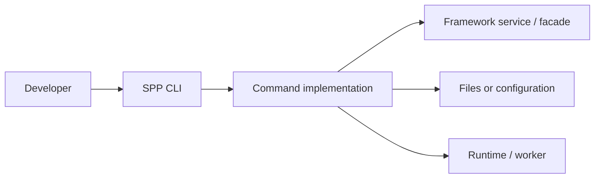
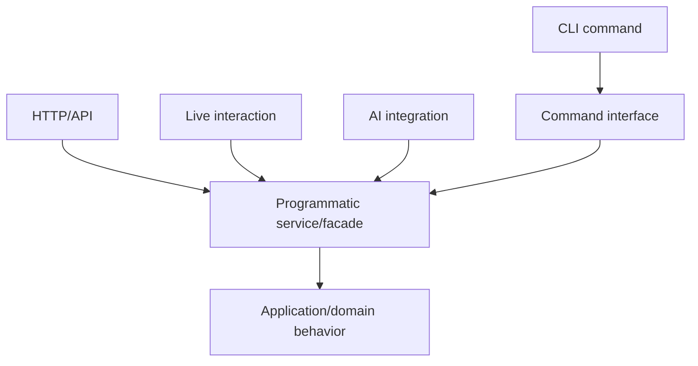
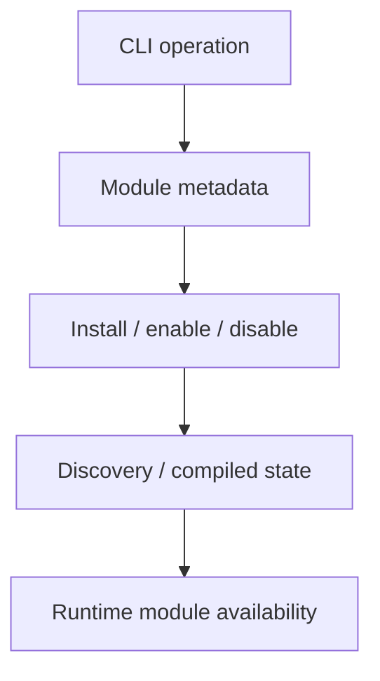
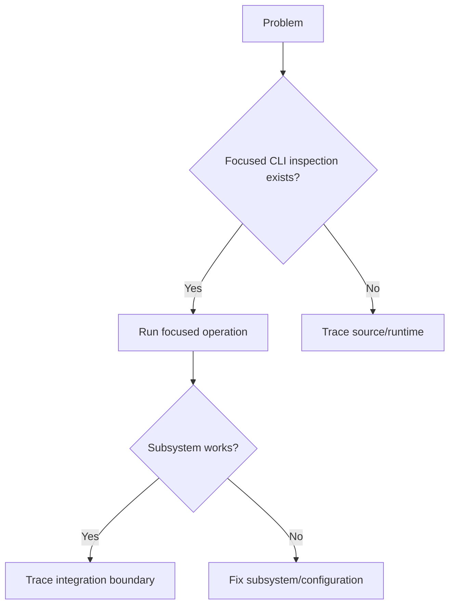

# Volume XIII — Developer Tooling

## Chapter 19 — The SPP CLI and Development Workflow

**Evidence:** current repository CLI documentation and command implementations. Command names and options must be verified against the current command implementation before being copied into production procedures.

A framework becomes easier to work with when you understand the CLI as an **interface to the framework**, not as the framework itself.

SPP has commands for application creation, modules, middleware, events, views, LiveComponents, SPPUX components, database work, testing, documentation, cache management, deployment, and other framework services.

---

## 19.1 What is a CLI?

CLI means **Command-Line Interface**. It lets a developer interact with a framework from a terminal.

A useful architectural model is:



A command is an entry point. It is not automatically the internal API used by every other SPP subsystem.

---

## 19.2 The important distinction: command versus service

This distinction matters throughout the current SPP architecture.



A CLI command may call a service, but application code should not assume that invoking the command manager is the universal way to invoke the underlying capability.

When source inspection shows a live or AI path calling a facade/service directly, that is evidence of a real programmatic boundary. Teach that boundary directly.

---

## 19.3 Why use generators?

Generators create conventional starting structures for applications and framework resources.

Examples in the repository include commands for creating applications, controllers, services, middleware, events, modules, entities, forms, LiveComponents, SPPUX components, views, Blade resources, and commands.

A generator is **scaffolding**, not architecture knowledge.

After generation, understand:

- where the file lives;
- which namespace it uses;
- how SPP discovers it;
- which configuration is required; and
- which lifecycle invokes it.

---

## 19.4 Application creation

SPP provides an application-generation command. The beginner curriculum should still teach the resulting application structure manually first, because understanding the generated output makes troubleshooting substantially easier.

| Approach | Best use |
|---|---|
| Manual structure | Learning and source tracing |
| Generator | Rapid project creation |

A strong SPP developer should be able to read the generated structure without treating it as magic.

---

## 19.5 Module commands

Module-management commands operate on the same module architecture taught in the foundations chapters.

Conceptually:



A source file existing on disk does not necessarily prove that the module is active in the current runtime.

---

## 19.6 Event and middleware commands

Event and middleware commands are useful for isolating framework subsystems.

For debugging, prefer a focused command when one exists rather than immediately testing the entire HTTP application. This can establish whether the event, middleware, or registration layer works independently of the presentation layer.

---

## 19.7 Live and reactive commands

The CLI includes development operations around live and UI capabilities. These belong to the broader LiveComponent/SPP Live/SPPUX architecture.

The architectural rule remains:

> **The command manipulates or exercises a resource; the runtime still owns application execution.**

---

## 19.8 Database and storage commands

SPP exposes commands for database, migration, XDB, and storage administration.

Because these areas have different architectural layers, command syntax should be treated as a reference concern. The deeper handbook chapters should explain the underlying SPPDB/XDB/storage model rather than duplicating every CLI option.

---

## 19.9 Testing commands

The CLI provides testing entry points, including module and route-oriented operations.

Testing commands are another way to execute framework behavior without a browser. For subsystem diagnosis, that makes them valuable even when the final application is primarily HTTP/API/live.

The testing architecture itself is documented in the Parikshak chapters.

---

## 19.10 Deployment commands

The repository contains deployment-oriented commands. Treat these as **operational tooling**, not as proof that one command sequence is appropriate for every production topology.

Before using a deployment command operationally, inspect:

1. what files it changes;
2. what configuration it reads;
3. whether it creates backups;
4. whether it changes maintenance/traffic state;
5. whether it launches or restarts workers; and
6. how rollback is actually implemented.

A command name such as `deploy:rollback` is not itself evidence of a complete transactional rollback guarantee.

---

## 19.11 Documentation and generated artifacts

SPP's tooling includes documentation-related commands and generated API/OpenAPI/PHPDoc surfaces.

Generated documentation is useful evidence, but the source-first hierarchy remains:

**executable source → tests/fixtures → consumed configuration → repository docs → interpretation.**

Generated documentation should therefore be used to locate and understand APIs, while high-impact behavioral claims are confirmed in source/tests.

---

## 19.12 Environment and configuration

CLI tooling can make environment and configuration changes convenient. That convenience does not remove deployment security requirements.

Never place production secrets into source control simply because a configuration command can write them. Use the deployment's secret-management mechanism and verify which configuration source the runtime actually consumes.

---

## 19.13 A useful CLI debugging workflow



This is especially effective when debugging modules, events, middleware, configuration, database adapters, and workers.

---

## 19.14 Coming from other frameworks

### Laravel / Symfony

The SPP CLI plays a role similar to Artisan or Symfony Console. The exact command implementations and runtime integrations are SPP-specific.

### Django

Think of Django management commands: the terminal provides another framework entry point.

### Spring Boot

The closest mental model is operational/development tooling around the application runtime rather than a replacement for application services.

---

## 19.15 Why the CLI belongs in an architecture handbook

Commands reveal framework boundaries.

For example, a module-generation operation can flow through:

```text
CLI
 ↓
module files / manifest
 ↓
module discovery
 ↓
compiled registry
 ↓
runtime activation
```

That is architecture, not merely syntax.

At the same time, the reverse assumption is unsafe: **not every internal caller should execute a CLI command**. The current architecture distinguishes command interfaces from reusable service/facade APIs.

---

## Kernel Hacker note

When tracing a command, identify its command class first. Then determine whether it:

- edits files;
- changes configuration;
- calls a reusable framework service;
- mutates persistent state;
- starts a worker/service; or
- composes several of these operations.

This produces a much more accurate architectural picture than treating all commands as equivalent wrappers.

### Source map

- current CLI documentation under `docs/`
- command implementations under the repository's command surface
- corresponding service/facade implementations
- Parikshak testing documentation and implementation
