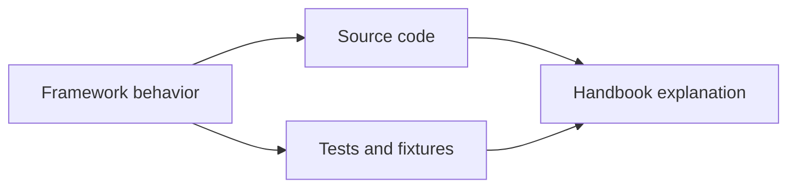
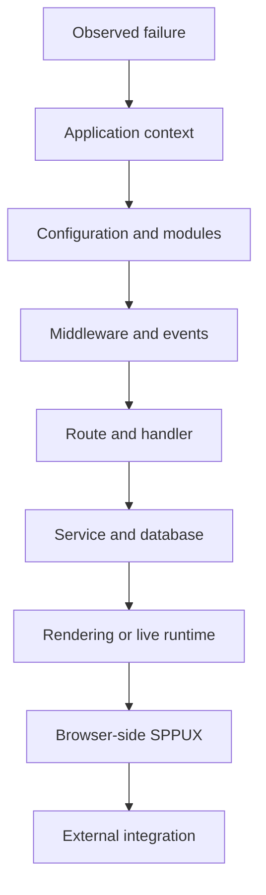

# Volume XIV — Quality and Diagnostics

## Chapter 20 — Testing, Debugging, and Source-Driven Diagnosis

**Evidence:** `spp/tests/`, module tests, `docs/spp-cli-manual.md`, debugging utilities under `spp/core/`, and the framework/runtime classes referenced by the handbook.

A framework can make an application easier to build, but it also makes the runtime larger. When something fails, the number of possible layers increases.

The answer is not to memorize every class.

The answer is to learn how to **reduce the problem to one subsystem at a time**.

---

## 20.1 What is a test?

A test is a repeatable program that checks whether a piece of behavior gives the expected result.

For example:

```php
assert(2 + 2 === 4);
```

Real application tests are more useful because they verify application behavior:

```text
Given a logged-in user
When the user submits a valid request
Then the service returns the expected result
```

SPP's repository contains framework and module test suites. Those tests are important documentation because executable tests show what the code is expected to do.

---

## 20.2 Why source and tests both matter

The source tells us **what the program currently does**.

Tests tell us **what behavior the project is actively asserting**.

When documenting a framework feature, use both.



A repository document can still be useful, but when an old document conflicts with executable behavior, the source/tests should win.

---

## 20.3 Start debugging from the symptom

Do not begin by reading the entire framework.

Suppose the symptom is:

```text
The browser shows a 403 response.
```

Possible causes include:

- authentication middleware;
- route middleware;
- authorization;
- an application event;
- a controller/service decision; or
- an external integration response.

The correct first move is to identify the earliest layer that could produce the symptom.

---

## 20.4 The SPP debugging ladder

A useful debugging order is:



Do not jump to the bottom of the stack when the failure is caused near the top.

---

## 20.5 Example: the wrong application is handling the request

If `/reports` is displaying the wrong site's output, do not begin debugging the template.

First check:

```php
\SPP\Scheduler::getContext();
```

Then inspect the application's `base_url` configuration and the Scheduler context-detection path.

Only after the correct application context is confirmed should route and rendering debugging begin.

---

## 20.6 Example: the service cannot be resolved

If an exception says that a service cannot be created, inspect the dependency-injection layer before debugging the controller.

Ask:

1. Does the class exist?
2. Is the class instantiable?
3. Are constructor parameters class-typed and resolvable?
4. Is an explicit binding required?
5. Is the application container the one you expected?

Chapter 3 explains the actual `Container::resolve()` behavior in detail.

---

## 20.7 Example: a middleware stops the request

A middleware can intentionally short-circuit a request.

Therefore a missing controller log does not necessarily mean routing failed.

Add temporary diagnostics before and after `$next()` in the relevant middleware:

```php
error_log('before middleware');
$response = $next($request);
error_log('after middleware');
return $response;
```

If `before` appears but `after` does not, the nested pipeline did not return normally. That immediately narrows the search.

---

## 20.8 Example: an event does not run

When an event listener fails to execute, check these layers in order:

| Question | Layer |
|---|---|
| Is the event defined? | Event definition/configuration |
| Was the event system booted? | `SPPEvent::boot()` |
| Was the listener discovered? | YAML/attribute discovery |
| Is the listener registered? | Listener registry |
| Was propagation stopped? | `EventParams` |
| Did the listener throw? | Listener execution |

This is more effective than repeatedly changing the listener code itself.

---

## 20.9 Example: a view is missing

A view problem can exist at several levels:

```text
Wrong application source directory
        ↓
Wrong configured view path
        ↓
View router/locator failure
        ↓
Compiler failure
        ↓
Template execution failure
```

First determine which level failed.

The SPPView chapter explains the distinction between locating a view, compiling a view, and executing a view.

---

## 20.10 Example: LiveComponent works initially but not later

That symptom is highly diagnostic.

If the initial page renders but a later component action fails, the server-side initial rendering path is probably working.

The next suspects are:

1. browser live request generation;
2. SPP Live transport;
3. component state hydration/signature validation;
4. component action execution; and
5. response/update handling.

This is why the LiveComponent and SPP Live layers are documented separately.

---

## 20.11 Example: SPPUX state is wrong

If PHP and LiveComponent state appear correct but the browser UI is wrong, move the investigation into SPPUX.

The relevant runtime areas include:

- reactive signals/computed state;
- scheduler/batching;
- event delegation;
- templates; and
- DOM reconciliation.

Do not automatically debug the PHP controller for a client-side reconciliation bug.

---

## 20.12 Query logging and performance diagnosis

Where the framework provides query logging, enable it during controlled diagnostics.

SPP XDB, for example, has query logging support through `SPP_XDB::enableQueryLog()` and `getQueryLog()`.

The useful question is not simply:

> “Is the database slow?”

It is:

> “Which query took how long, with which parameters, and how often was it executed?”

That turns a vague performance complaint into measurable evidence.

---

## 20.13 Cache-related debugging

Caching introduces another diagnostic possibility: the application may be correct but displaying an old cached value.

When debugging stale output, ask:

1. Is the data source correct?
2. Is cache enabled?
3. What cache key is used?
4. How long is the cache valid?
5. Is the relevant tag invalidated after a mutation?

Never rewrite business logic simply to hide a caching bug.

---

## 20.14 Testing at the right layer

A healthy SPP project uses different tests for different responsibilities.

| Test type | What it should prove |
|---|---|
| Unit test | One class/rule behaves correctly |
| Service test | Application behavior works with dependencies |
| Integration test | Framework/database/module boundaries work together |
| Route test | Request dispatch reaches expected behavior |
| UI/live test | Rendering and live interaction behave correctly |
| End-to-end test | A complete user journey works |

Not every feature needs every test type.

The goal is to put a failure near the smallest layer that can explain it.

---

## 20.15 Test data and fixtures

A test should not depend on uncontrolled production data.

Use deterministic fixtures or controlled setup so that:

```text
same input + same environment
        ↓
repeatable result
```

This is especially important for:

- permissions;
- workflows;
- database queries;
- module configuration; and
- LiveComponent state.

---

## 20.16 Debug mode

The SPP bootstrap has explicit debug behavior and runtime log facilities. Debug output is useful during development but should be reviewed before being enabled in a public production environment.

A production debugging system should avoid exposing:

- passwords;
- authentication tokens;
- cookies;
- internal secrets; and
- sensitive user data.

The SPP source itself contains debug logging in several security/runtime classes, so deployment logging configuration deserves deliberate review.

---

## 20.17 The “one layer at a time” rule

When debugging a complex SPP application, use this discipline:

```text
Confirm context
→ confirm config
→ confirm module
→ confirm middleware/event
→ confirm route
→ confirm handler
→ confirm service
→ confirm storage
→ confirm rendering/live runtime
→ confirm browser/runtime integration
```

Do not change five layers at once.

Otherwise, when the problem disappears you will not know which change actually solved it.

---

## 20.18 Coming from other frameworks

### Laravel / Symfony

The debugging strategy is similar: identify the first framework layer that can explain the symptom, then inspect the next layer only after the first is known-good.

### Django

Think in the same way: URL dispatch, middleware, view, service/data layer, template, and browser behavior are separate debugging surfaces.

### React/Vue

The important extra distinction in SPP is that client-side SPPUX and server-side LiveComponent are different runtimes. A browser symptom does not automatically imply a PHP problem.

---

## Kernel Hacker note

The most valuable debugging skill in SPP is **boundary recognition**.

The runtime is deliberately modular: Scheduler, App, Registry, Module, SPPEvent, MiddlewareKernel, SPPView, LiveComponent, SPP Live, SPPUX, database adapters, and integration bridges each own different responsibilities.

When a failure is classified into the correct boundary, the source search becomes dramatically smaller.

### Source map

- `spp/tests/`
- `spp/core/`
- `spp/modules/spp/`
- `docs/spp-cli-manual.md`
- subsystem-specific test suites and diagnostics
