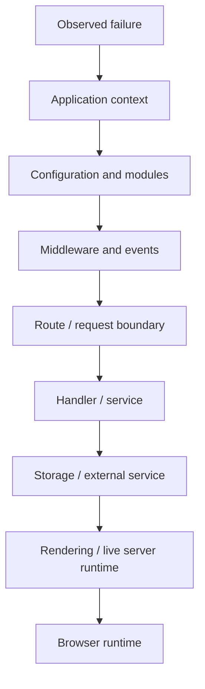
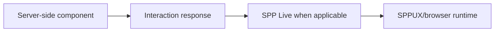

# Volume XIV — Quality and Diagnostics

## Chapter 20 — Testing, Debugging, and Source-Driven Diagnosis

**Evidence:** current tests, subsystem implementations, command tooling, and diagnostics. Exact commands and APIs must be verified against the current repository before use.

SPP contains many runtime boundaries. A failure may therefore originate in application context, configuration, modules, middleware, events, routing, services, persistence, rendering, live transport, browser runtime, or an external integration.

The solution is not to memorize the framework. The solution is to **reduce the problem to the smallest boundary that can explain the symptom**.

---

## 20.1 What is a test?

A test is a repeatable program that checks expected behavior.

A useful application test is closer to:

```text
Given a logged-in user
When the user creates a valid task
Then the task is persisted
And the expected event is triggered
```

Tests are also executable evidence. They show which behavior the project actively chooses to assert.

---

## 20.2 Source, tests, and documentation are different evidence

| Evidence | Best use |
|---|---|
| Executable source | Current implementation behavior |
| Tests/fixtures | Behavior the project actively verifies |
| Configuration/manifests | Runtime inputs consumed by the implementation |
| Documentation | Intended usage and project explanation |
| Architectural interpretation | Derived model; must not override source |

When these disagree, the handbook should not silently choose the most convenient description. Record the discrepancy and follow the source/test evidence for claims about current behavior.

---

## 20.3 Do not debug the whole framework

For a `403 Forbidden`, possible causes include authentication, authorization, middleware, route handling, application logic, an event listener, or an external boundary.

The first diagnostic question is:

> **What is the earliest layer that can produce this symptom?**

That question is more useful than searching the entire repository for `403`.

---

## 20.4 The SPP debugging ladder



Do not necessarily traverse every layer. Stop once the evidence establishes where the failure is.

For example, if the wrong application is selected, template debugging is premature. If server state is correct but the browser DOM is wrong, database debugging is probably premature.

---

## 20.5 Context and configuration diagnosis

If the wrong application responds, first inspect the application context and the scheduler/context-selection path.

Then inspect:

- application configuration;
- discovery;
- base URL/context selection;
- context-enforcement events; and
- route resolution.

Only after the correct application is established should route/controller debugging begin.

---

## 20.6 Module diagnosis

A source file existing on disk does not prove that its module is active.

Check:

1. module metadata;
2. discovery/registration;
3. enabled/disabled state;
4. compiled module state where applicable; and
5. runtime availability.

This is why module commands and source maps are useful diagnostic tools.

---

## 20.7 Service resolution failures

If the container cannot construct a service, ask:

1. Does the class exist?
2. Is it instantiable?
3. Are its constructor dependencies resolvable?
4. Is an explicit binding required?
5. Are you resolving from the intended application/container?

Do not start by changing the service implementation if the failure occurs before the service can be constructed.

---

## 20.8 Middleware short-circuiting

Middleware may return a response without calling the next stage.

Therefore, a controller that never executes may be completely correct.

Use focused logging or a debugger to establish whether the request enters and exits each relevant middleware boundary.

---

## 20.9 Event listener diagnosis

Use this checklist:

| Question | Boundary |
|---|---|
| Is the event defined? | Event definition/configuration |
| Was the event runtime bootstrapped? | SPPEvent |
| Was the listener discovered? | YAML/attribute discovery |
| Was it registered? | Listener registry |
| Was propagation stopped? | Event parameters |
| Did execution throw? | Listener body |

This is much faster than repeatedly modifying listener code without proving that the listener is actually being reached.

---

## 20.10 View and rendering diagnosis

A rendering failure can occur at several distinct stages:

```text
Application/context
    ↓
View lookup
    ↓
Compilation
    ↓
Template execution
    ↓
Response
```

LiveComponent can add another layer because its server-side lifecycle and state handling precede or surround rendering.

---

## 20.11 LiveComponent versus SPP Live versus SPPUX

These must be diagnosed separately.

### Initial render fails

Start with component discovery, lifecycle, PHP execution, state, and rendering.

### Initial render succeeds but interaction fails

Move to:

1. browser request generation;
2. action/response boundary;
3. state hydration/signature validation;
4. live transport if applicable; and
5. browser update handling.

### Server response is correct but DOM is wrong

Move into SPPUX/browser runtime behavior.

The current architecture therefore gives a useful diagnostic split:



Do not automatically blame the WebSocket layer when the defect is in component state or response construction.

---

## 20.12 Database and query diagnosis

When controlled query logging is available, use it to establish facts:

- which query ran;
- which parameters were supplied;
- how long it took; and
- how often it ran.

The question should be **“what evidence do we have?”**, not “which database is slow?”

Also distinguish SPPDB abstraction, adapter behavior, and concrete engine behavior when tracing a query.

---

## 20.13 Cache diagnosis

When output is stale, distinguish:

```text
Wrong authoritative data
```

from:

```text
Correct authoritative data + stale cache
```

Check:

1. cache enablement;
2. key construction;
3. expiration;
4. invalidation/tag behavior; and
5. whether the mutation path invalidated dependent entries.

A cache is an optimization, not the authoritative record.

---

## 20.14 API/security diagnosis

For an API failure, trace the request boundary before the controller:

```text
API request detection
→ authentication
→ API exposure metadata
→ API middleware
→ method dispatch
→ controller
→ service/data
```

For a security failure, separately establish:

```text
identity
→ scopes/roles/rights
→ policy/context
→ authorization decision
→ protected operation
```

Do not treat a successful token parse as proof that the requested operation is authorized.

---

## 20.15 Test at the smallest useful layer

| Test scope | Main question |
|---|---|
| Unit | Does one rule/class behave correctly? |
| Service/integration | Do application dependencies cooperate? |
| Route/API | Does the request reach the intended boundary? |
| Live/UI | Do rendering and interaction behave correctly? |
| End-to-end | Does the complete user journey succeed? |

The goal is diagnostic precision, not maximum test count.

---

## 20.16 Deterministic test data

Tests should control their inputs rather than depending on uncontrolled production state.

This is especially important for:

- identities and permissions;
- workflows;
- database records;
- module configuration; and
- component state.

When a test fails, you want the failure to describe the code—not an unexplained environmental accident.

---

## 20.17 Debug mode and production safety

Development diagnostics can reveal sensitive information. Before enabling broad debug output in production, review whether it can expose credentials, tokens, cookies, internal service details, or personal data.

Debugging facilities should be treated as operational controls, not harmless developer conveniences.

---

## 20.18 The one-layer-at-a-time rule

Use this sequence as a default:

```text
Confirm context
→ confirm configuration
→ confirm modules
→ confirm middleware/events
→ confirm request boundary
→ confirm handler/service
→ confirm storage/external service
→ confirm rendering/live runtime
→ confirm browser integration
```

Change one layer at a time. Otherwise you can make the problem disappear without knowing which change actually fixed it.

---

## 20.19 Coming from other frameworks

### Laravel / Symfony

The strategy is familiar: locate the first framework boundary capable of producing the symptom and test it independently.

### Django

Think application selection → middleware → URL dispatch → view/service → data → template → browser.

### React / Vue

SPP adds an important server/client distinction: LiveComponent is server-side PHP while SPPUX is browser-side runtime code. A browser symptom is therefore not automatically a PHP bug.

---

## Kernel Hacker note

The most effective SPP debugging technique is **boundary reduction**. Scheduler, App, Registry, Module, SPPEvent, MiddlewareKernel, SPPView, SPPAPI, LiveComponent, SPP Live, SPPUX, database adapters, authentication guards, and integration bridges each provide a smaller search space.

Once the failing boundary is known, source search becomes substantially more tractable.

### Source map

- `spp/tests/`
- current framework/module implementations
- CLI/testing documentation and command implementations
- subsystem-specific tests and diagnostics
