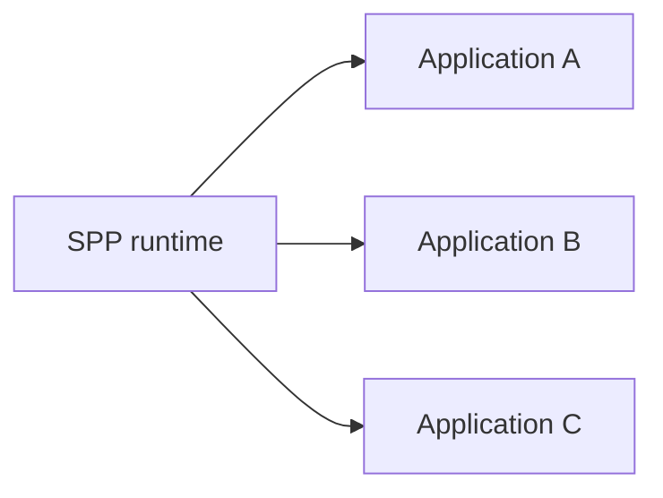
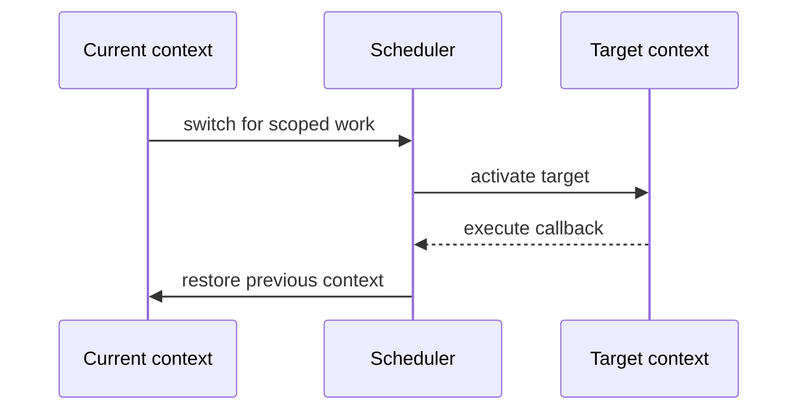
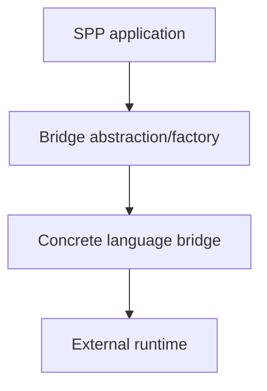
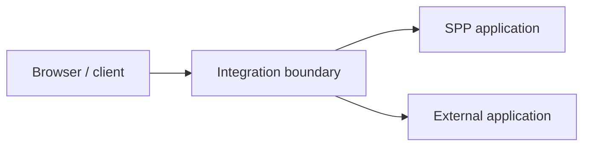
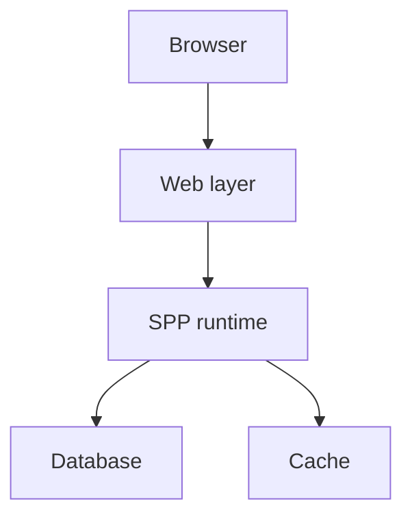
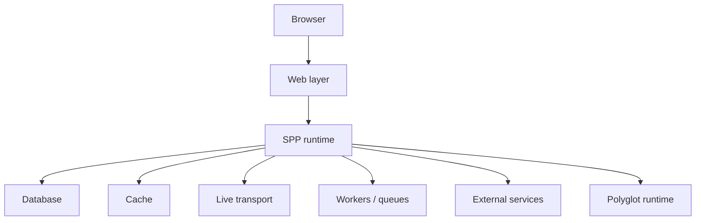
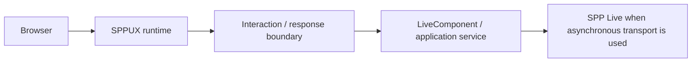

# Volume XV — Enterprise Architecture

## Chapter 21 — Multi-Application, Polyglot, IPC, and Deployment Architecture

**Evidence:** current Scheduler/application source, current polyglot/integration paths, SPP Live/SPPUX runtime, and deployment tooling. Protocol and production guarantees are documented only where implementation evidence supports them.

Enterprise architecture is not synonymous with “more servers”. It is the deliberate selection of **composition boundaries, runtime boundaries, trust boundaries, and failure boundaries**.

---

## 21.1 Start with one application when possible

One application is usually the simplest architecture when one domain, team, configuration boundary, and deployment lifecycle are sufficient.

SPP does not require every feature to become a separate application or service. Begin with modules and ordinary application boundaries; split further only when the required property justifies the added complexity.

---

## 21.2 Multiple SPP applications

The Scheduler can register multiple `App` objects and maintain an active application context.

This is an **in-process application boundary**.

It is not equivalent to operating-system process isolation.

| Boundary | Primary property |
|---|---|
| Module | Feature composition |
| SPP application context | Application/runtime context |
| OS process | Memory and failure isolation |
| Network service | Protocol and deployment boundary |

Do not use an application context as a substitute for process isolation when fault containment or independent resource limits are required.

---

## 21.3 Context switching

`Scheduler::withContext()` allows work to execute under another registered application context and then restores the previous context.

This is a runtime composition feature, not a process boundary.

---

## 21.4 IPC is a category, not a protocol

Inter-process communication can use HTTP, WebSocket, local sockets, queues, Redis coordination, or language-specific bridges.

Therefore an architecture document should always identify the concrete protocol and trust model.

“SPP → IPC → Python” is incomplete architecture documentation until the protocol, authentication, serialization, timeout, and failure behavior are specified.

---

## 21.5 Polyglot architecture

SPP provides a polyglot bridge abstraction and language-specific bridge implementations. The useful architectural model is:

The concrete bridge determines protocol, serialization, worker behavior, timeouts, and error handling. Those properties must be read from the bridge implementation; they should not be inferred from class names alone.

---

## 21.6 External applications

A legacy or independently owned application does not need to become an SPP module merely to participate in an SPP system.

An adapter can provide routing, service, data, or protocol integration while leaving the external system responsible for its own runtime and business rules.

---

## 21.7 Choosing the smallest useful boundary

| Requirement | Candidate boundary |
|---|---|
| Reusable feature | Module |
| Separate SPP application context | Application |
| Different language/runtime | Polyglot/service boundary |
| Legacy platform | Integration adapter |
| Browser/server reactive UI | LiveComponent + SPP Live |
| Browser-local reactive state | SPPUX |
| Strong fault isolation | Separate process/service |

These are architectural choices, not automatic guarantees provided by naming a subsystem.

---

## 21.8 Cross-boundary contracts

Every real process/network boundary should define at least:

- input schema;
- output schema;
- authentication;
- authorization;
- timeout;
- retry policy;
- idempotency;
- error representation; and
- observability/correlation strategy.

A bridge class alone does not establish all of these properties.

---

## 21.9 Data ownership

Avoid multiple applications independently mutating the same domain tables without an explicit ownership model.

Prefer:

This is enterprise guidance, not a hard SPP rule.

---

## 21.10 Deployment topology

A simple deployment can be:

A larger deployment can add live transport, workers, and external runtimes:

These are reference topologies, not mandatory SPP deployment recipes.

---

## 21.11 Failure isolation

Every new boundary introduces new failure modes.

For every external dependency decide explicitly whether failure causes:

- immediate failure;
- degraded/cached response;
- queued retry;
- fallback behavior; or
- maintenance behavior.

Also specify timeout and retry limits. Retrying a non-idempotent operation can create duplicate business effects.

---

## 21.12 Security boundaries

Treat cross-process and cross-runtime communication as a trust boundary even when all components belong to the same organization.

Validate according to the actual protocol and deployment model, including authentication, authorization, input validation, rate limiting, replay protection where required, and audit/observability.

Do not infer security from physical network location alone.

---

## 21.13 Live architecture in enterprise applications

LiveComponent, SPP Live, LiveAction, and SPPUX form different layers of the reactive architecture.

A conventional server-rendered page can coexist with reactive components. Do not make every page live merely because the framework supports live interaction.

---

## 21.14 Observability across boundaries

A distributed operation should be diagnosable from the originating request to its dependencies.

Use a correlation identifier when the concrete transport supports and propagates one. The handbook does not assert a universal built-in SPP correlation protocol unless source evidence establishes one; otherwise this is deployment guidance.

---

## 21.15 Migration and deployment safety

Deployment tooling is an interface to deployment operations, not proof that every deployment topology is safe for a generic command sequence.

For each deployment operation verify:

1. what it changes;
2. what configuration it consumes;
3. what backups it creates;
4. whether it changes traffic/maintenance state;
5. whether workers are restarted; and
6. what rollback actually restores.

Keep **schema migration**, **content promotion**, and **application rollback** conceptually separate. They solve different recovery problems.

---

## 21.16 Coming from other architectures

### Monolith

Start with one SPP application and use modules for feature boundaries.

### Modular monolith

SPP modules plus application contexts map naturally to this model.

### Microservices

Introduce process/network boundaries only when independent ownership, scaling, language/runtime, or failure isolation justifies them.

### Service-oriented architecture

Use explicit protocol contracts and adapters. Polyglot support is a tool for crossing a language/runtime boundary; it is not an architecture by itself.

---

## Kernel Hacker note

The key architectural distinction is:

**composition boundary ≠ runtime boundary ≠ failure boundary ≠ trust boundary.**

A module primarily organizes code. An application context selects runtime/application state. A process provides stronger resource and failure isolation. A network protocol creates an explicit interoperability and trust boundary. The browser is a separate execution environment.

Good architecture chooses the smallest boundary that provides the property actually required.

### Source map

- `spp/core/class.scheduler.php`
- current application/context implementation
- current polyglot bridge implementations
- SPP Live/SPPUX source
- external-application integration material
- deployment commands/configuration
