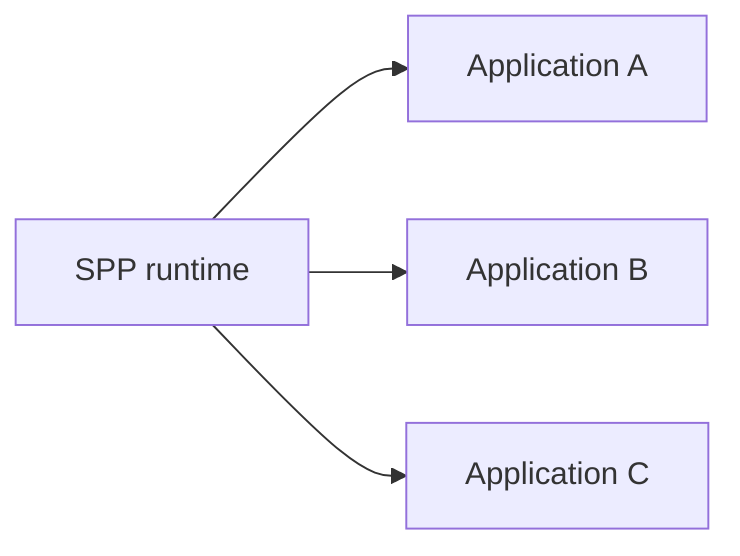
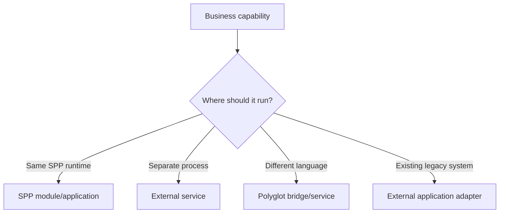
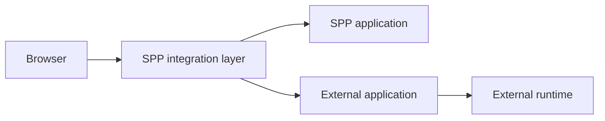
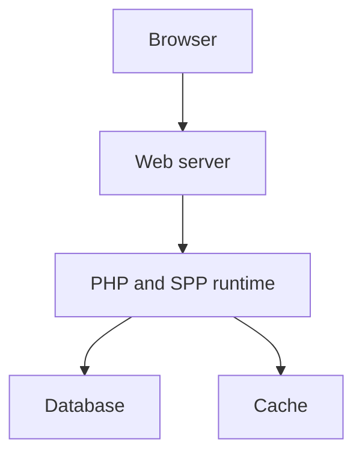
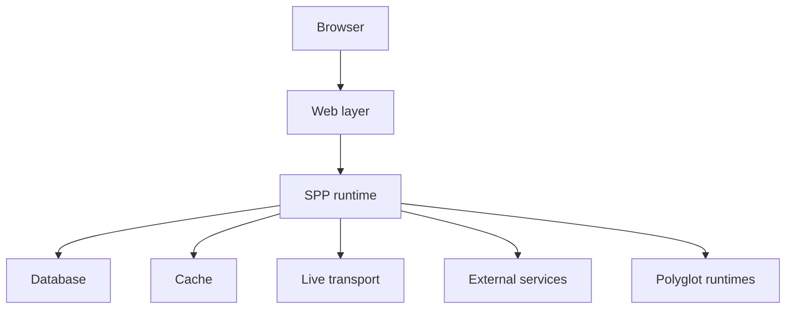
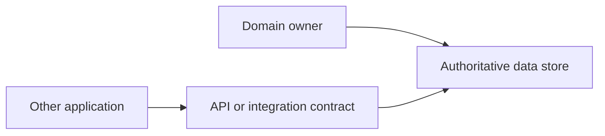

# Volume XV — Enterprise Architecture

## Chapter 21 — Multi-Application, Polyglot, IPC, and Deployment Architecture

**Evidence:** Scheduler/application source, polyglot bridge classes, external-application integration documentation, SPP Live/Drishyam runtime, deployment-related commands and configuration present in the repository.

Enterprise architecture begins with a simple question:

> **What happens when one application is no longer enough?**

A growing system may need multiple applications, different languages, separate services, background workers, external legacy systems, or browser-side runtimes.

SPP contains several mechanisms that can participate in such systems. The important task is to choose the correct boundary for each problem.

---

## 21.1 One application versus many applications

A small system can begin with one SPP application.

As it grows, teams may separate concerns into multiple applications:



These applications can share one runtime while retaining separate application contexts.

The Scheduler is the central mechanism for selecting the active application.

This is different from deploying three completely independent servers.

---

## 21.2 Why split applications?

Separate applications can provide useful boundaries when:

- different teams own different domains;
- configuration needs to be isolated by application;
- modules differ significantly;
- one application has a different lifecycle or URL space; or
- a legacy subsystem needs to coexist with a new SPP application.

Do not split applications merely because multiple folders exist. A boundary should solve an actual ownership or operational problem.

---

## 21.3 In-process application switching

SPP's `Scheduler::withContext()` allows code to run within another registered application context and then restore the caller's context.

This is useful when applications participate in one PHP runtime.

It should **not** be described as process isolation in the operating-system sense.

The distinction is:

| Boundary | Meaning |
|---|---|
| SPP application context | Runtime/application boundary inside the SPP process |
| Operating-system process | Separate executable process with its own memory space |
| Network service | Separate runtime reached through a protocol |

This distinction matters greatly when designing security and failure isolation.

---

## 21.4 When to use IPC

IPC means **inter-process communication**: one process communicating with another.

The protocol can be many things:

- HTTP;
- WebSocket;
- a local socket;
- a queue;
- Redis-backed coordination;
- a language bridge;
- or another explicit transport.

Therefore “IPC” is not a protocol name.

A good architecture names the actual boundary:

```text
PHP process
   ↓ HTTP
Python service
```

or:

```text
PHP process
   ↓ WebSocket
Node service
```

This is more precise than writing “SPP uses IPC”.

---

## 21.5 Native SPP integration versus external runtime integration

A useful distinction is:



Use the smallest boundary that solves the real problem.

---

## 21.6 Polyglot architecture

SPP includes an explicit Polyglot bridge family with a common bridge interface and factory plus concrete bridge implementations.

This provides an abstraction for invoking another runtime without forcing application code to know every implementation-specific detail.

A generic architecture is:


The external runtime may be written in Go, Java, .NET, or another supported integration language.

The source tree also contains runtime/helper libraries and daemon-service directories for additional languages.

---

## 21.7 What a polyglot boundary should contain

A production boundary normally needs explicit contracts for:

| Contract | Question |
|---|---|
| Input schema | What data may cross the boundary? |
| Output schema | What data comes back? |
| Authentication | Who may call the service? |
| Authorization | What may the caller request? |
| Timeout | How long should the caller wait? |
| Retry | Which failures are safe to repeat? |
| Idempotency | Can the same operation be executed twice safely? |
| Error format | How are failures represented? |
| Observability | How is one operation traced across runtimes? |

The exact implementation of each item depends on the transport and bridge.

---

## 21.8 External non-SPP applications

SPP can coexist with an external application without turning that application into an SPP module.

This is important for legacy modernization.

For example:



The external application can retain ownership of its own runtime while SPP manages the surrounding integration boundary.

The repository contains external-application integration material and contributed adapters, including Drupal-related integration.

---

## 21.9 Choosing the integration boundary

Use this decision table:

| Situation | Prefer |
|---|---|
| Reusable SPP feature | SPP module |
| Separate SPP domain/application | SPP application context |
| Different language runtime | Polyglot/service boundary |
| Legacy external platform | Adapter/integration boundary |
| Browser-only interaction | SPPUX |
| Server-driven live interaction | LiveComponent + SPP Live |

This table is architectural guidance. It does not mean every combination is automatically implemented by SPP.

---

## 21.10 Deployment topology

A deployment topology describes where runtime pieces actually execute.

A simple SPP deployment could be:



A larger system can add:



The exact topology should be chosen from the operational requirements rather than inferred from the fact that SPP contains a feature.

---

## 21.11 Failure isolation

The more boundaries a system has, the more failure modes it has.

For example:

```text
Browser
  ↓
SPP
  ↓
External service
```

Now there are at least three failure locations.

An enterprise design should define what happens when the external service is unavailable:

- immediate error;
- cached response;
- queued retry;
- degraded feature;
- fallback implementation; or
- explicit maintenance response.

Failure handling is part of architecture, not an afterthought.

---

## 21.12 Security boundaries

Every cross-process or cross-runtime boundary should be treated as a trust boundary.

Do not rely on:

> “Both services are inside the same company network.”

The receiving side should validate the request according to the actual protocol.

This includes:

- authentication;
- authorization;
- payload validation;
- replay protection where required;
- rate limiting where appropriate; and
- audit/observability.

---

## 21.13 Data ownership

A common enterprise mistake is allowing multiple applications to write the same business tables without a clear owner.

Prefer a clear ownership model:



The other application consumes the owning domain's contract rather than bypassing its business rules through direct table writes.

This is architectural guidance rather than a hard SPP runtime rule.

---

## 21.14 Enterprise observability

Cross-application systems need a way to answer:

> “Which request caused this external operation?”

A production design can use correlation/request identifiers and propagate them across integration boundaries where the protocol supports it.

The handbook will only describe correlation mechanisms as implemented SPP behavior when a concrete source path establishes them. Otherwise they remain enterprise guidance.

---

## 21.15 Coming from other architectural styles

### Monolith

Think of a large SPP application as one deployable runtime, then introduce additional SPP application contexts when a real boundary is needed.

### Microservices

SPP does not require every feature to become a separate network service. Use module/application boundaries first and introduce network boundaries only when they solve a real operational or ownership problem.

### Modular monolith

SPP's module system and multi-application context model can support a modular-monolith style particularly well.

### Service-oriented architecture

SPP's polyglot and external integration facilities provide building blocks for explicit service boundaries, but the actual protocol and operational contract must be defined per integration.

---

## Kernel Hacker note

The strongest architectural insight is that SPP contains **multiple composable boundaries rather than one mandatory deployment style**:

```text
Application context
Module
Process
Protocol
External runtime
Browser runtime
```

An expert SPP architecture chooses the smallest boundary that provides the required isolation, ownership, scalability, or language interoperability.

### Source map

- `spp/core/class.scheduler.php`
- `spp/core/Polyglot/`
- `spp/services/`
- `spp/modules/contrib/`
- `spp/modules/spp/spplive/`
- external application integration documentation
- deployment and CLI tooling under `spp/commands/`
