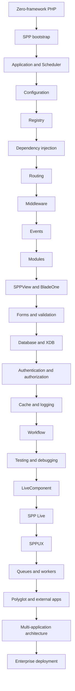
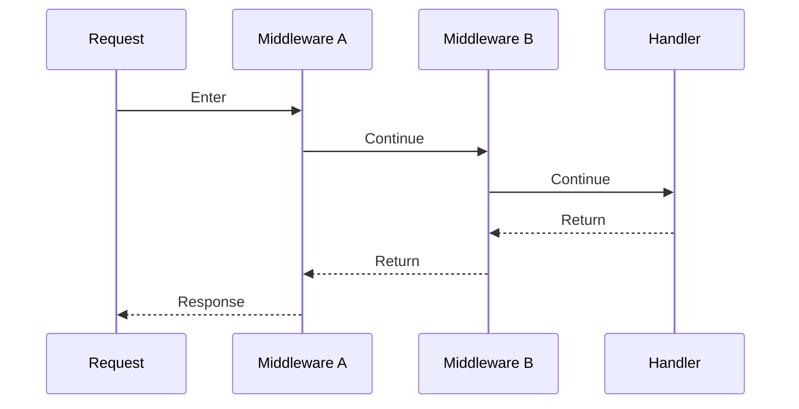
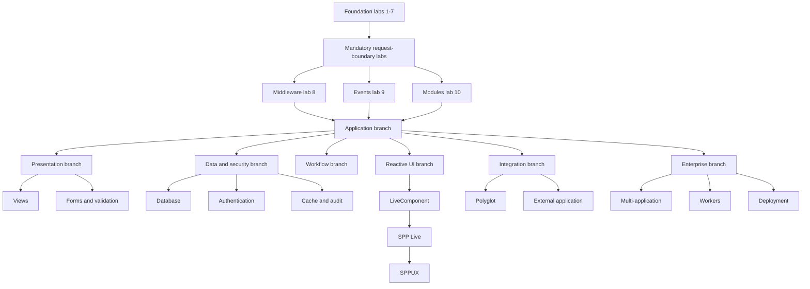

# Volume XVII — Framework Feature Labs

## Chapter 25 — The SPP Feature-Lab Curriculum

This chapter answers a practical question:

> **How do I learn SPP by actually using its framework features rather than merely reading about them?**

The answer is to turn the handbook into a sequence of small laboratories.

A learner should not finish a chapter about middleware merely knowing what middleware means. They should have created middleware, attached it, observed execution order, intentionally broken it, diagnosed the failure, and traced the implementation.

The same rule applies to events, modules, Registry, dependency injection, configuration, routing, SPPView, forms, validation, authentication, database access, workflow, cache, logging, LiveComponent, SPP Live, SPPUX, polyglot integration, queues/workers, testing, and deployment.

---

## 25.1 The golden rule of the labs

Every major SPP feature is learned through five stages:

1. **Build** — create the smallest working example.
2. **Observe** — instrument it and see when/how it executes.
3. **Break** — introduce one controlled failure.
4. **Diagnose** — use SPP's tools/source to find the failure.
5. **Deep dive** — trace the framework implementation behind what you just used.

This prevents documentation from becoming passive reading.

---

## 25.2 The full learning map



The order is deliberate. A beginner first learns the runtime boundary, then the mechanisms used to assemble and process an application, then presentation/data/security, then reactive and distributed capabilities.

---

## 25.3 Lab 1 — What a framework actually saves you from

### Goal

Understand why a framework exists before learning SPP APIs.

### Build

Create a plain PHP page with:

- a manually parsed request;
- a manually created service object;
- a manually rendered response;
- a small JSON data file.

### Observe

Print the steps executed by the script.

### Break

Move the service constructor into another location and intentionally create inconsistent configuration.

### Diagnose

Find every place that now knows too much about infrastructure.

### Deep dive

Compare the result with SPP's bootstrap, `App`, Scheduler, Registry, and container.

---

## 25.4 Lab 2 — Bootstrap and application discovery

### Feature

SPP bootstrap and application discovery.

### Build

Create the smallest valid SPP application with its application definition and initialization entry point.

### Observe

Determine:

- which bootstrap file runs first;
- when the application becomes known;
- when the Scheduler sees it; and
- where application-specific paths are established.

### Break

Temporarily alter one path or application setting.

### Diagnose

Use runtime state, logs, and source tracing to identify exactly where discovery fails.

### Deep dive

Trace `SPP\\App`, `SPP\\Scheduler`, and the bootstrap path.

---

## 25.5 Lab 3 — Scheduler and multi-application context

### Feature

`Scheduler`, registered `App` objects, and context switching.

### Build

Create two tiny SPP applications in one installation.

Use explicit context switching and a small callback.

### Observe

Log:

- current context;
- active app object;
- application status before/after switching.

### Break

Try switching to a non-existent context.

### Diagnose

Trace `setContext()` and `withContext()`.

### Deep dive

Inspect the scheduler's registered process map and context restoration behavior.

---

## 25.6 Lab 4 — Configuration layers

### Feature

Application/global/module configuration.

### Build

Create one configuration value and read it from application code.

Then create a second value at another supported configuration layer.

### Observe

Determine precedence.

### Break

Create an intentional configuration conflict.

### Diagnose

Trace where configuration is loaded, normalized, cached, and exposed.

### Deep dive

Inspect `SPPConfig`, application configuration loading, and the relevant module configuration path.

---

## 25.7 Lab 5 — Registry fundamentals

### Feature

`SPP\\Registry`.

### Build

Register a nested application value and read it back from another class.

### Observe

Inspect the Registry tree before and after registration.

### Break

Use an incorrect path and an unexpected value type.

### Diagnose

Determine whether the failure is a lookup problem, a path problem, or a consumer problem.

### Deep dive

Trace the Registry implementation and its shared namespace behavior.

---

## 25.8 Lab 6 — Dependency injection

### Feature

`SPP\\Core\\Container` and application container APIs.

### Build

Create:

- `TaskRepository`;
- `TaskService`; and
- `TaskController`.

Make `TaskService` depend on `TaskRepository` and let SPP resolve the dependency.

### Observe

Inspect which constructor parameters are resolved automatically.

### Break

Add an unresolvable constructor dependency.

### Diagnose

Trace class lookup, reflection, constructor resolution, and failure handling.

### Deep dive

Inspect singleton bindings, explicit bindings, automatic resolution, and the PSR-11 contract.

---

## 25.9 Lab 7 — Routing and dispatch

### Feature

Route discovery and request dispatch.

### Build

Create one public endpoint and one protected endpoint.

### Observe

Log:

- selected application context;
- selected route;
- selected handler.

### Break

Change the route path and confirm the difference between a context-selection failure and a route-selection failure.

### Diagnose

Trace application context, middleware, route discovery, handler resolution, and rendering separately.

### Deep dive

Inspect the route attributes/router/view routing source actually used by the application.

---

## 25.10 Lab 8 — Middleware: the first mandatory deep lab

### Feature

`MiddlewareInterface`, `Pipeline`, and `MiddlewareKernel`.

### Build

Create a middleware called `RequestTracer`.

It must:

1. record entry;
2. add a marker to the request/context where appropriate;
3. call `$next()`;
4. record the response phase; and
5. return the response.

Register it globally through the supported mechanism.

### Observe

Add logging before and after `$next()`.

Then stack two middleware layers and observe the onion order.



### Break

Create an `AuthorizationGate` middleware that deliberately rejects a request.

Observe that the handler is never reached.

### Diagnose

Determine whether the failure occurs:

- before the pipeline;
- inside middleware;
- in the nested stack; or
- in the handler.

### Deep dive

Trace how `MiddlewareKernel` assembles the stack and how `Pipeline` composes nested closures.

### Advanced extension

Add both global and route-level middleware and document the resulting order from the source implementation.

---

## 25.11 Lab 9 — Events: the second mandatory deep lab

### Feature

`SPPEvent`, `EventHandler`, event listeners, priorities, propagation, and payload mutation.

### Build

Create a `TaskCreated` event.

Create at least three listeners:

- audit listener;
- notification listener;
- analytics listener.

Assign different listener priorities.

### Observe

Record execution order.

Then mutate the event parameters in one listener and show which later listener receives the changed value.

### Break

Use a listener to stop propagation.

### Diagnose

Determine:

- which listeners were registered;
- what priority order was used;
- whether the event was in a before/main/after stage;
- whether the payload was mutated; and
- where propagation stopped.

### Deep dive

Trace event-definition loading, listener registration, priority sorting, `EventParams`, and dispatch.

### Advanced extension

Add an overridable event with a default handler and an override handler. Prove which handler executes and why.

---

## 25.12 Lab 10 — Modules and manifests

### Feature

Module manifests, dependencies, activation, and compiled metadata.

### Build

Create a small `task-audit` module with one dependency.

### Observe

Inspect:

- manifest metadata;
- discovered module state;
- dependency ordering;
- compiled module registry/cache.

### Break

Create:

- a missing dependency;
- a circular dependency;
- an inactive module.

### Diagnose

Use the module CLI and source to identify which phase rejects each case.

### Deep dive

Trace module discovery, dependency resolution, compiler output, and runtime loading.

---

## 25.13 Lab 11 — SPPView and extended BladeOne

### Feature

SPPView, Drishyam, BladeOne-compatible rendering, ViewTags, and view discovery.

### Build

Render the same data in:

1. a minimal PHP-backed view;
2. a Blade-compatible template;
3. a framework component/ViewTag where the repository supports it.

### Observe

Inspect the view path, compiler output, and rendered result.

### Break

Intentionally point the view loader at a wrong path.

### Diagnose

Separate:

- view discovery;
- compilation;
- template execution; and
- output generation.

### Deep dive

Trace the SPPView locator/router/compiler and the extended BladeOne/Drishyam integration.

---

## 25.14 Lab 12 — Forms and validation

### Feature

SPPView forms, validation, and data transformation.

### Build

Create a student registration form with:

- required name;
- normalized email;
- constrained age/date fields;
- error messages.

### Observe

Inspect submitted data before and after validation.

### Break

Submit malformed and unauthorized data.

### Diagnose

Identify which layer rejects each condition.

### Deep dive

Trace form construction, field validation, error collection, transformation, and rendering.

---

## 25.15 Lab 13 — Database and entities

### Feature

SPPDB, adapters, entities, query builder, and XDB.

### Build

Create a `Student` entity/data model and a small query path.

### Observe

Trace:

```text
Application service
→ SPPDB/entity layer
→ adapter
→ concrete engine
```

### Break

Test a missing table/schema and a deliberately stale cache case.

### Diagnose

Use query logging and source tracing.

### Deep dive

Compare the abstract database path with XDB's engine/facade path.

---

## 25.16 Lab 14 — Authentication and authorization

### Feature

SPPAuth, WebGuard, TokenGuard, rights, roles, groups, policy context.

### Build

Create:

- normal user;
- administrator role;
- `students.read` right;
- `students.edit` right.

Protect a route and protect the business operation itself.

### Observe

Trace authentication, permission resolution, and authorization decisions.

### Break

Change the user's role/rights while testing permission caching.

### Diagnose

Determine whether the failure is authentication, permission resolution, policy evaluation, middleware, or business authorization.

### Deep dive

Trace guard selection, session identity, permission caching, role/right resolution, and policy context.

---

## 25.17 Lab 15 — Cache

### Feature

SPP cache abstraction and backend behavior.

### Build

Cache an expensive student report.

### Observe

Measure first-read and cached-read behavior.

### Break

Change the underlying data without invalidating the cache.

### Diagnose

Find the stale-value path.

### Deep dive

Inspect the cache abstraction and one concrete backend, then compare it with XDB's query cache/tag invalidation.

---

## 25.18 Lab 16 — Logging, audit, and diagnostics

### Feature

Framework logging/debugging and audit-related facilities.

### Build

Add:

- request log;
- business-operation log;
- security/audit record.

### Observe

Compare operator diagnostics with durable audit data.

### Break

Trigger an application error and a denied authorization attempt.

### Diagnose

Determine which information should come from logs and which from audit records.

### Deep dive

Trace the actual logging/audit implementations used in the repository.

---

## 25.19 Lab 17 — Workflow and approval chain

### Feature

`SPPWorkflow`, workflow manager, approval-chain components, wizard/process support, and workflow operations.

### Build

Implement a purchase-approval workflow:

```text
Draft → Submitted → SupervisorApproved → FinanceApproved → Completed
```

### Observe

Track legal transitions, responsible actor, and side effects.

### Break

Attempt an illegal transition and a transition by an unauthorized user.

### Diagnose

Separate workflow-state failure from authorization failure.

### Deep dive

Trace the workflow manager, approval-chain classes, process timeout handling, and related CLI operations.

---

## 25.20 Lab 18 — LiveComponent fundamentals

### Feature

Server-side reactive components.

### Build

Turn the student search list into a LiveComponent.

The component must have:

- public state;
- action method;
- validation;
- rendering;
- an emitted/handled event.

### Observe

Capture initial render and subsequent interaction separately.

### Break

Manipulate the state sent by the browser.

### Diagnose

Trace hydration, validation, state integrity, action dispatch, dehydration, and rendering.

### Deep dive

Read the exact LiveComponent lifecycle from source.

---

## 25.21 Lab 19 — SPP Live transport laboratory

### Feature

SPP Live transport engines.

### Build

Run the same LiveComponent through the supported live transport mechanisms relevant to the deployment.

### Observe

Compare:

- connection model;
- request frequency;
- response timing;
- failure behavior;
- state continuity.

### Break

Simulate transport failure.

### Diagnose

Determine whether the failure is in:

- component logic;
- transport selection;
- session/state handling;
- serialization;
- server response;
- browser update path.

### Deep dive

Trace the concrete engine implementation instead of treating all transports as interchangeable.

---

## 25.22 Lab 20 — SPPUX fundamentals

### Feature

Signals, computed state, effects, scheduler, templates, events, and reconciliation.

### Build

Create a client-side dashboard card with:

- signal state;
- computed state;
- batched updates;
- event delegation;
- reactive template rendering.

### Observe

Log dependency changes and rendering frequency.

### Break

Introduce a deliberately unstable reactive update.

### Diagnose

Trace scheduling and reconciliation rather than debugging server PHP.

### Deep dive

Trace the SPPUX runtime modules and their composition.

---

## 25.23 Lab 21 — LiveComponent + SPPUX integration

### Feature

Server authority plus browser-local reactivity.

### Build

Use LiveComponent for authoritative filtering/permissions and SPPUX for local presentation state.

### Observe

Identify which state belongs to which runtime.

### Break

Move one authoritative field accidentally into browser-only state and demonstrate the security/design failure.

### Deep dive

Trace the bridge/transport boundary.

---

## 25.24 Lab 22 — Queues, workers, scheduled tasks, and long-running processes

### Feature

Background execution infrastructure present in the repository.

### Build

Move an expensive report or notification task out of the HTTP request path.

### Observe

Compare synchronous and background execution.

### Break

Simulate worker failure and retry conditions.

### Diagnose

Distinguish scheduler failure from worker failure from business-operation failure.

### Deep dive

Trace the actual queue/worker/scheduler classes and CLI commands before documenting their exact guarantees.

---

## 25.25 Lab 23 — Polyglot integration

### Feature

Polyglot bridge/factory and one concrete supported runtime.

### Build

Call a small external service from the Task Desk application.

### Observe

Trace serialization, bridge selection, invocation, result decoding, and failures.

### Break

Make the external service unavailable.

### Diagnose

Inspect timeout/error behavior and application fallback.

### Deep dive

Trace the common bridge interface/factory and the selected concrete bridge.

---

## 25.26 Lab 24 — External non-SPP application

### Feature

External application integration.

### Build

Integrate a small non-SPP application or repository-supported external application adapter.

### Observe

Determine exactly which part of the request path remains under SPP control and which part belongs to the external application.

### Break

Send a request to the wrong integration path.

### Diagnose

Separate routing bypass, adapter failure, remote application failure, and response translation.

### Deep dive

Trace the actual integration module rather than assuming a generic external-app protocol.

---

## 25.27 Lab 25 — Multi-application SPP architecture

### Feature

Multiple `App` instances and Scheduler contexts.

### Build

Split the system into:

- Task Desk;
- Reporting;
- Administration.

### Observe

Run context-bound operations from one application against another.

### Break

Use a missing context and a misconfigured `base_url`.

### Diagnose

Use Scheduler tracing and application discovery.

### Deep dive

Inspect context switching, application state, module paths, and shared runtime behavior.

---

## 25.28 Lab 26 — Enterprise deployment and failure isolation

### Feature

Deployment/operations architecture.

### Build

Create a deployment topology containing:

- web/PHP runtime;
- database;
- cache;
- live transport where required;
- worker;
- external service.

### Observe

Record which failures affect which user-visible capabilities.

### Break

Take one dependency offline at a time.

### Diagnose

Classify failures as:

- local code;
- framework/runtime;
- storage;
- transport;
- worker;
- integration;
- deployment/configuration.

### Deep dive

Trace the deployment/CLI facilities actually present in SPP and separate verified runtime behavior from enterprise design guidance.

---

## 25.29 The branch structure

The labs can now branch without losing the beginner's common foundation.



The **core foundation is mandatory**. Branches are chosen according to the learner's goals, but all major branches should eventually be completed by an architect-level learner.

---

## 25.30 What “knowing SPP” should mean after the labs

A learner should be able to answer these questions without looking them up:

### Runtime

- What starts SPP?
- What is an `App` object?
- What is the Scheduler context?

### Assembly

- What is the Registry?
- What is dependency injection?
- What is a module?
- How are module dependencies ordered?

### Request handling

- What is middleware?
- What does the Pipeline do?
- What is routing?
- Where can a request be short-circuited?

### Extensibility

- What is an event?
- How are listeners ordered?
- What happens when propagation stops?

### Presentation

- How does SPPView find and render a view?
- Where does extended BladeOne/Drishyam fit?
- Where do forms and ViewTags fit?

### Data/security

- What is the SPPDB abstraction?
- What is XDB?
- How do authentication and authorization differ?
- Where should security checks live?

### Reactive runtime

- What is LiveComponent?
- What does SPP Live transport?
- What does SPPUX own?
- Which runtime is authoritative for which state?

### Integration

- What is a module versus an application versus a process versus an external service?
- What is polyglot integration?
- What is IPC in the specific deployment being discussed?

### Operations

- How are work, cache, logs, workflow, workers, and deployment related?
- How do you debug the system one boundary at a time?

If the learner cannot answer one of these questions, the relevant lab should be considered incomplete.

---

## 25.31 Final principle

The goal is not to say:

> “I have read the SPP handbook.”

The goal is:

> **“I have built SPP applications, deliberately broken them, debugged the runtime, and can explain why each framework subsystem exists and where its boundary begins and ends.”**

That is the level of understanding this curriculum is designed to produce.

### Source map

The feature labs are intentionally distributed across the handbook's subsystem chapters and the SPP implementation/documentation tree. Each lab should cite the exact source files it uses when the corresponding implementation deep dive is finalized.
