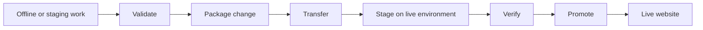
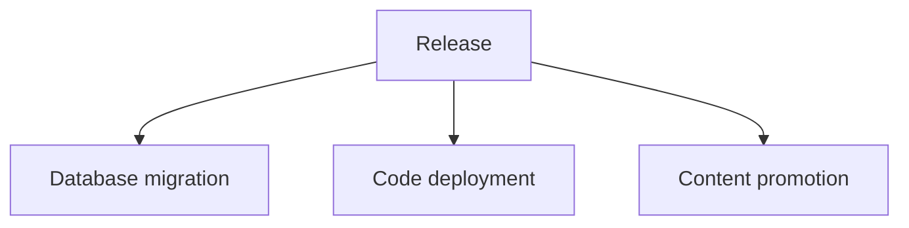
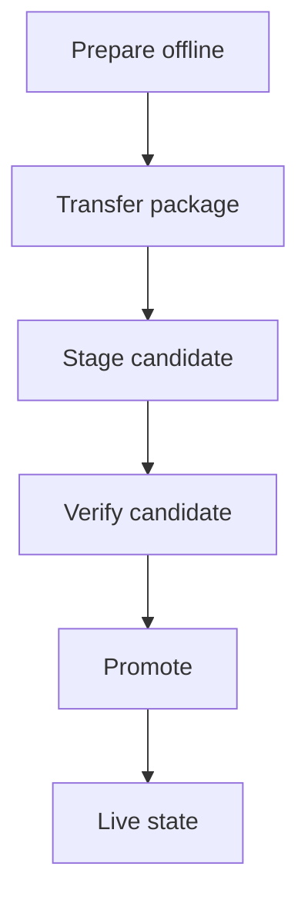
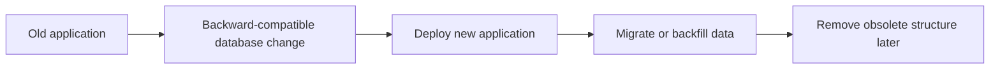
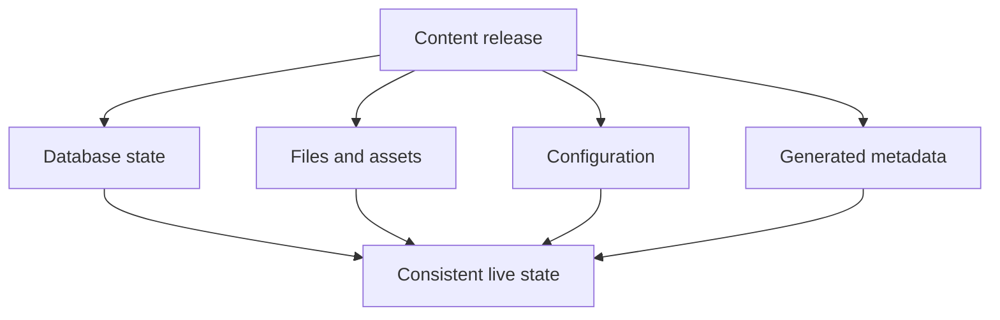
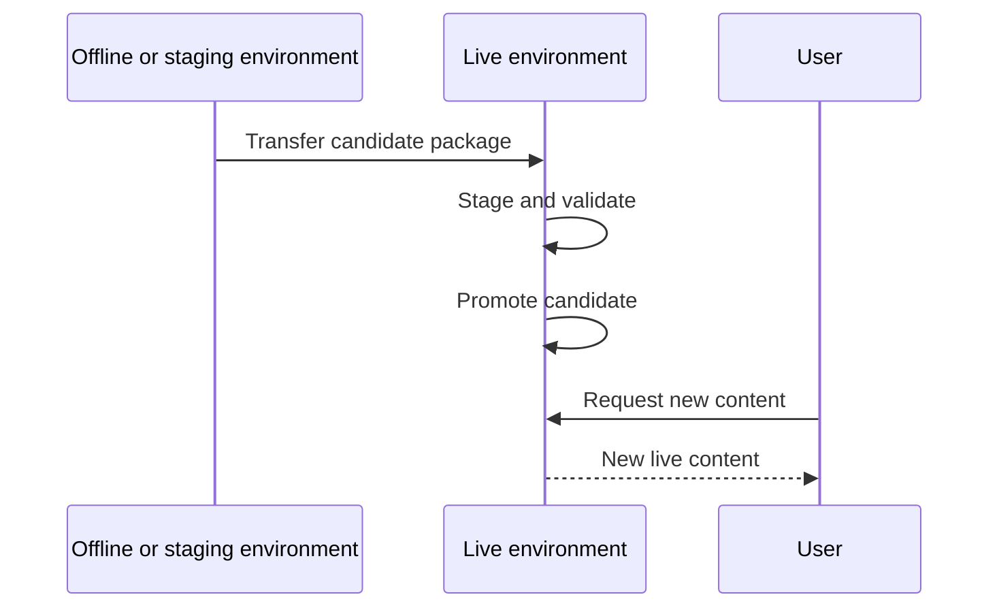
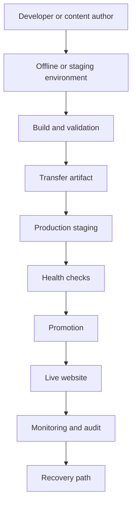

# Chapter 27 — Migration, Transfer, and Live-Content Promotion

**Purpose:** Teach how an SPP system can move prepared changes or content toward a live website without confusing that operation with ordinary database schema migration.

**Evidence:** core migration classes, SPPDB migration classes/managers, SPP XDB migration manager, zero-downtime migration analyzer/tutorial, deployment tooling, transfer/integration tooling, and current implementation paths in the repository.

---

## 27.1 Why this deserves its own chapter

A beginner often hears the word **migration** and assumes it means:

> "Change a database table."

That is only one kind of migration.

An enterprise website may also need to move:

- prepared content;
- configuration;
- static assets;
- application code;
- database changes;
- generated metadata;
- uploaded files;
- or a complete release package

from an offline or staging environment into a live environment.

Those operations have different safety requirements.

The handbook therefore separates two ideas:

| Operation | Main purpose |
|---|---|
| Schema/data migration | Change database structure or controlled data |
| Content/release transfer | Move prepared application/content state toward production |
| Deployment | Activate a new runtime version |
| Live-content promotion | Make prepared content visible while keeping the service operational |

A real production system may perform several of these in one release, but they should remain conceptually distinct.

---

## 27.2 The beginner mental model

Imagine a website is currently live.

Editors prepare new content on a disconnected or staging environment.

The final operation is not simply:

```text
copy files
```

A safer mental model is:



The exact implementation of the transfer mechanism is repository-specific. The architecture is the important first concept.

---

## 27.3 Migration is not deployment

A database migration changes data/schema.

A deployment changes what code is running.

A content promotion changes which prepared content is visible.

They may happen together:



But they are separate failure domains.

If the database migration succeeds and code deployment fails, the system is in a different state than if both succeed.

That is why enterprise release planning treats them as explicit stages.

---

## 27.4 SPP has a real migration architecture

The repository contains several migration layers, including:

- core `Migration` support;
- SPPDB migration classes and managers;
- XDB migration management;
- generated migration files;
- migration commands; and
- a zero-downtime migration analyzer/tutorial.

The existence of these layers means migration is a real framework subsystem rather than an informal script convention.

The learner should therefore understand both:

1. **how a migration is authored and executed**, and
2. **how a live system is moved safely between states**.

---

## 27.5 The offline-content problem

Suppose an editor prepares a new set of website pages while disconnected from the production environment.

The content may exist as files, database records, assets, or a packaged export.

The production environment cannot simply trust the incoming state.

It must answer:

- Is the package complete?
- Is it compatible with the current application version?
- Does it contain conflicting records?
- Are required modules enabled?
- Are required database changes already present?
- Can the change be applied without taking the site down?
- Can the operation be rolled back or recovered if it fails?

These are **promotion** questions, not merely file-copy questions.

---

## 27.6 Prepare, transfer, promote

A useful conceptual split is:

### Prepare

Build and validate the candidate state away from production.

### Transfer

Move the candidate state to the live environment.

### Promote

Switch the production site to using the candidate state.

This distinction allows a large change to be prepared before the short production activation window.



---

## 27.7 Why staging matters

A staging step gives the production environment a chance to receive the package before it becomes authoritative.

That is useful because the application can then test:

- file completeness;
- module compatibility;
- database compatibility;
- generated caches/registries;
- permissions;
- links/assets;
- and startup health.

The exact staging implementation is deployment-specific, but the pattern is broadly applicable to SPP installations.

---

## 27.8 Content versioning

A promotion system benefits from identifying which version is being promoted.

That identifier could be a release number, package identifier, commit identifier, migration version, or another deployment-specific token.

The receiving environment should be able to answer:

> "Exactly which candidate state is live?"

That is one of the most important operational questions in a content-transfer architecture.

---

## 27.9 Data and code compatibility

A common deployment error is to update code and data in an unsafe order.

For example:

```text
Old code expects column A
New migration removes column A
Old code is still running
```

A zero-downtime migration strategy tries to avoid incompatible intermediate states.

The repository includes a zero-downtime migration analyzer/tutorial, so this is a concrete SPP concern rather than only general DevOps advice.

---

## 27.10 Safe migration pattern

A common compatibility-oriented pattern is:



The exact migration primitives available in SPP must be taken from the migration implementation and database backend being used.

Do not assume every SPP database engine provides identical transactional or online-schema-change guarantees.

---

## 27.11 Offline transfer versus synchronization

These terms should also be distinguished.

**Transfer** means moving a defined package/state from one environment to another.

**Synchronization** means repeatedly reconciling state between environments.

An offline publishing workflow may be primarily transfer-oriented:

```text
offline package → production promotion
```

A collaboration or replication workflow may require synchronization:

```text
environment A ↔ environment B
```

Those architectures have different conflict-management requirements.

---

## 27.12 Conflict detection

When content can change in more than one place, the promotion system needs a conflict strategy.

Possible states include:

| Situation | Example response |
|---|---|
| No conflict | Apply automatically |
| Same record changed only in source | Apply |
| Same record changed only in production | Preserve production change |
| Both changed | Require merge/resolution |
| Unknown version | Reject promotion |

The actual SPP transfer implementation should be traced before claiming a specific merge algorithm.

---

## 27.13 Files and database state must be coordinated

A website's content may be split across:

- database records;
- uploaded files;
- generated assets;
- templates;
- configuration;
- and module metadata.

Moving only one category can create an inconsistent live site.

For example:



The enterprise lesson is that a release should be treated as a **coherent state transition**, not a collection of unrelated copy operations.

---

## 27.14 Where SPP XDB fits

SPP XDB has its own migration manager and migration-related classes.

Therefore XDB migrations should be documented separately from generic SPPDB migrations where the implementation semantics differ.

The handbook should teach the learner to ask:

1. Which database abstraction am I using?
2. Which engine is underneath it?
3. Which migration manager is responsible?
4. What transaction/locking behavior is actually implemented?
5. What happens if the migration is interrupted?

This prevents a dangerous assumption that every SPP storage backend has identical migration behavior.

---

## 27.15 Live website promotion

For a continuously served website, the most important operational goal may be:

> **Introduce the new content without breaking requests already in flight.**

A generic promotion model is:



The actual SPP implementation may use a different sequence. The diagram expresses the architecture rather than claiming a particular internal transport.

---

## 27.16 Rollback and recovery

A good transfer architecture plans for failure before it happens.

There are two related concepts:

### Rollback

Return to a known previous application/content state.

### Recovery

Restore a usable state after a failed or partial operation.

These are not always the same thing.

For example, a database migration may be difficult to reverse even when application code can be rolled back.

Therefore the release plan must define rollback/recovery at each layer.

---

## 27.17 Testing a promotion package

The Parikshak testing framework should be used around the promotion workflow where appropriate.

Useful checks include:

- package completeness;
- migration compatibility;
- application startup;
- required modules;
- permissions;
- key routes;
- content integrity;
- and post-promotion smoke tests.

This gives the transfer architecture a testable contract rather than leaving it as a shell/deployment script.

---

## 27.18 Tutorial branch: Offline Publishing Lab

The handbook should teach this architecture through a dedicated project.

The learner builds:

**Phase 1 — Authoring environment**

Prepare content offline.

**Phase 2 — Export**

Package the content and required metadata.

**Phase 3 — Validation**

Validate the package before it reaches the live system.

**Phase 4 — Transfer**

Move the package into a staging area.

**Phase 5 — Promotion**

Make the prepared state active.

**Phase 6 — Verification**

Run Parikshak smoke/integration checks.

**Phase 7 — Recovery**

Deliberately interrupt a promotion and practice recovery.

This is the best way to teach the difference between a migration script and an enterprise content-promotion architecture.

---

## 27.19 Tutorial branch: Zero-Downtime Database Change

A second branch should focus specifically on schema/data changes while the website remains available.

The learner should practice:

1. compatibility-preserving schema change;
2. dual-read/dual-write where actually required by the application design;
3. backfill;
4. application deployment;
5. removal of obsolete structures;
6. verification;
7. rollback/recovery planning.

The repository's zero-downtime migration analyzer/tutorial should be the starting evidence source for the exact SPP capabilities.

---

## 27.20 Transfer architecture and enterprise deployment

The full enterprise release model can be understood as:



This model connects several SPP subsystems without pretending that one SPP class performs the entire operation.

---

## 27.21 Common beginner mistakes

### Mistake 1 — Calling every migration a database migration

Schema migration and content promotion solve different problems.

### Mistake 2 — Copying files directly into production

This can create an inconsistent state when database/configuration/metadata are not updated together.

### Mistake 3 — No verification step

A transfer that succeeds technically can still produce an unusable application.

### Mistake 4 — No recovery plan

The production team should know what happens if promotion fails halfway through.

### Mistake 5 — Claiming zero downtime without proving the compatibility model

Zero downtime is an operational property, not a label that should be attached to a script merely because the website remains reachable during part of the operation.

---

## 27.22 Coming from other ecosystems

### WordPress

Think of staging/publishing content, but distinguish it from a complete application release.

### Laravel/Symfony

Think of migrations/deployment, then add a separate promotion layer for prepared content when the application has editorial/offline workflows.

### Drupal

The separation between content/configuration/code deployment and the production site is especially relevant to this branch.

### Git-based deployment

A Git commit can identify a release, but content promotion may still involve database/files/assets that are not represented by Git alone.

---

## Kernel Hacker note

The advanced implementation questions are:

1. What artifact represents the candidate state?
2. Where is version identity stored?
3. How is compatibility checked?
4. Which migration manager runs database changes?
5. What locking/transaction boundary exists?
6. What is staged before promotion?
7. What mechanism flips the live site to the new state?
8. How is partial failure detected?
9. What is the recovery path?
10. Which Parikshak tests prove the promotion is safe?

These questions should drive the source-level deep dive into SPP's migration, deployment, XDB, and transfer mechanisms.

### Source map

- `spp/core/class.migration.php`
- `spp/modules/spp/sppdb/src/Migration/`
- `spp/modules/spp/sppxdb/class.migrationmanager.php`
- `spp/modules/spp/sppxdb/`
- `docs/tutorials/2-zero-downtime-migration-analyzer.md`
- deployment/transfer-related SPP CLI commands and integration code
