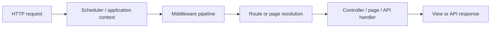
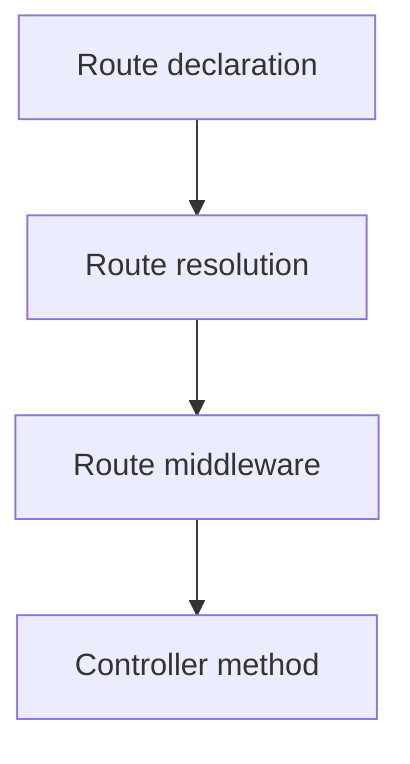
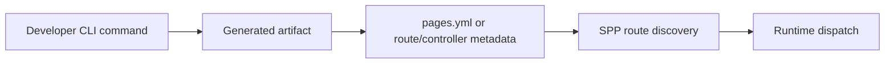
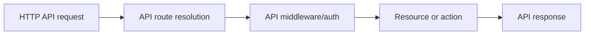
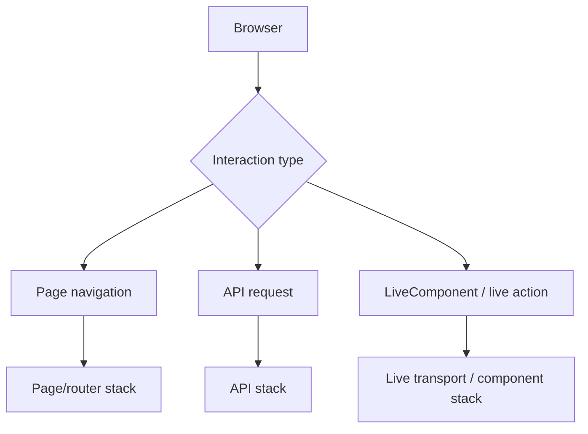
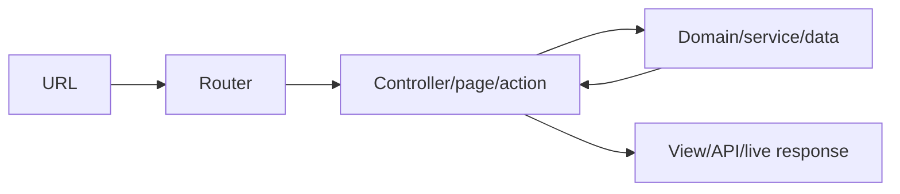
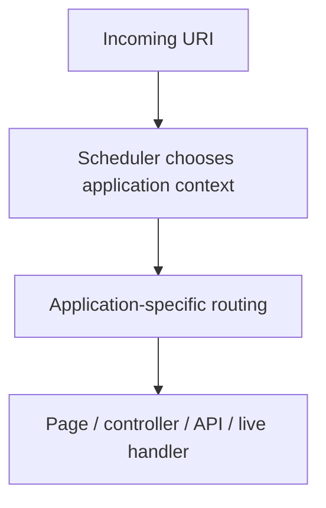

# 37. Routing and Page Paradigms — Build the Same Application Four Ways

Routing is one of the most important parts of SPP because it answers a deceptively simple question:

> **When a browser or API client asks for a URL, how does SPP decide what code should handle it?**

A framework is useful partly because you do not have to write that decision logic yourself for every request. SPP provides several ways to describe that decision, and they are not interchangeable merely because they all eventually reach application code.

This chapter is a practical tutorial. A beginner should finish it knowing both **how to create a route** and **which SPP routing paradigm to choose for a particular application**.

---

## 37.1 Start with plain PHP

Without a framework, you can inspect the request URI directly:

```php
$path = parse_url($_SERVER['REQUEST_URI'] ?? '/', PHP_URL_PATH);

if ($path === '/tasks') {
    require __DIR__ . '/tasks.php';
} elseif ($path === '/about') {
    require __DIR__ . '/about.php';
} else {
    http_response_code(404);
    echo 'Not Found';
}
```

This works, but as an application grows you eventually have to solve more problems:

- different HTTP methods;
- path parameters;
- middleware;
- authentication;
- controller dispatch;
- named routes;
- API responses;
- page rendering;
- multiple applications with different base URLs;
- generated route metadata;
- route caching and discovery;
- testing.

SPP moves those concerns into framework infrastructure.

---

## 37.2 The SPP request path

Conceptually, routing sits after the framework has established the active application context and middleware boundary:



This is why routing should not be taught as an isolated utility class. It participates in the larger application architecture.

---

## 37.3 SPP has more than one routing paradigm

The important SPP paradigms documented in the repository include:

| Paradigm | Typical source | Main idea |
|---|---|---|
| Central page configuration | `pages.yml` | Describe application pages centrally |
| Attribute routing | `#[Route(...)]` | Put route metadata next to controller methods |
| CLI-created routing artifacts | SPP commands/scaffolding | Generate route/page structures rather than hand-writing them |
| API routing | SPPAPI infrastructure | Route API resources/actions separately from page rendering |
| Reactive/live endpoints | LiveAction / LiveComponent infrastructure | Route interactions for live/reactive UI |

A key beginner lesson is:

> **A routing mechanism is not the same thing as the thing that eventually handles the request.**

The same application may use more than one routing paradigm.

---

# Part I — `pages.yml`

## 37.4 What `pages.yml` means

`pages.yml` is a central page-definition model. The repository contains concrete `pages.yml` documentation and application configurations using this style. It is particularly useful when an application is organized around named pages rather than a large collection of controller classes.

A minimal conceptual example is:

```yaml
pages:
  - name: home
    url: /home.php

  - name: about
    url: /about.php

  - name: profile
    url: /user_profile.php
```

Do not think of this as “just YAML.” It is application metadata that the page/routing subsystem consumes.

---

## 37.5 Dynamic page parameters

The repository's page-oriented tutorial documents a page-name-plus-remaining-path model.

For example, if a registered page corresponds to `profile`, a request such as:

```text
/profile/123/edit
```

can expose the trailing values as page parameters to the page handler.

The page subsystem exposes page information through the framework page APIs. A documented access pattern is:

```php
$pageData = \SPPMod\SPPView\Pages::getPage();
$params = $pageData['params'] ?? [];
```

For a beginner, the mental model is:

```text
URL
  ↓
page name
  ↓
remaining path segments
  ↓
page parameters
  ↓
page handler / view
```

---

## 37.6 When `pages.yml` is a good choice

Prefer page configuration when:

- the application is page-centric;
- non-programmers or application operators need a central route/page map;
- the application already uses the SPP page/view stack extensively;
- route metadata is naturally described as configuration;
- you want page definitions grouped independently of controller classes.

Do not assume that configuration-based routing is obsolete just because attribute routing is newer. They solve slightly different organizational problems.

---

# Part II — Attribute Routing

## 37.7 The modern controller-oriented style

SPP also supports attribute-based routing on controller methods.

The documented form is:

```php
namespace App\Controllers;

use SPPMod\SPPView\Attributes\Route;

class TaskController
{
    #[Route('/tasks', method: 'GET', name: 'tasks.index')]
    public function index()
    {
        // Return or render the task list.
    }

    #[Route('/tasks/{id}', method: 'GET', name: 'tasks.show')]
    public function show(string $id)
    {
        // Load and render a single task.
    }
}
```

The route declaration stays beside the code that handles the route.

---

## 37.8 Route attributes and middleware attributes

SPP's routing attributes can be combined with middleware attributes.

```php
use SPPMod\SPPView\Attributes\Middleware;
use SPPMod\SPPView\Attributes\Route;

#[Middleware(\App\Middleware\RequireLogin::class)]
class TaskController
{
    #[Route('/tasks/{id}', method: 'GET', name: 'tasks.show')]
    public function show(string $id)
    {
        // Only authenticated users reach this action.
    }
}
```

The important concept is that route metadata and cross-cutting request policy are related but distinct:



---

## 37.9 Route parameters

A route parameter describes a variable portion of the path:

```text
/tasks/42
```

for:

```text
/tasks/{id}
```

The application then receives the value `42` through the route/controller mechanism used by that routing path.

Do not confuse this with the older page-parameter style. They may carry similar information while belonging to different routing models.

---

# Part III — CLI routing

## 37.10 The CLI is a route creation mechanism

SPP's CLI has route-related scaffolding and stubs. The CLI should therefore be taught as a **developer interface for creating route/page artifacts**, not as a replacement for the runtime router.

The lifecycle is:



The critical distinction is:

> The CLI helps you create the declaration; the runtime consumes the declaration.

---

## 37.11 Learn the generated files, not just the command

A beginner should never stop at:

```bash
php spp/spp.php <route-related-command>
```

After generation, inspect the repository and answer:

1. What file was created?
2. Is the route represented in `pages.yml`, PHP attributes, or another generated artifact?
3. Which handler or controller does it target?
4. Which middleware was generated or referenced?
5. How does the runtime discover it?

This makes the CLI a learning aid instead of a magic button.

---

# Part IV — API routing

## 37.12 API routes are not ordinary page routes

SPPAPI provides a separate API-oriented surface. The repository exposes API resources, responses, pagination, API documentation infrastructure, route-model binding, JWT authentication, API middleware, AJAX/live actions, and related handlers.

The application can therefore have both:

```text
HTML/page routes
API routes
```

without treating them as the same rendering problem.

A conceptual API flow is:



This becomes especially important when the same domain data is used by both an HTML application and SPPUX/browser clients.

---

# Part V — Reactive and live routing

## 37.13 Live interactions are another routing problem

LiveComponent and SPP Live introduce requests that are not ordinary page navigations.

A browser may effectively ask the server to:

- invoke a component action;
- update component state;
- validate input;
- fetch an incremental result;
- subscribe to a stream.

These requests belong to the live/reactive runtime and should not be documented as if they were merely another `pages.yml` page.

The architectural difference is:



---

# Part VI — Building one application with multiple paradigms

## 37.14 The Task Desk example

Use the same small application throughout the handbook.

### Page configuration

Use `pages.yml` for the public pages:

```text
/
/about
/help
```

### Attribute routes

Use controller attributes for application operations:

```text
/tasks
/tasks/{id}
```

### API routes

Use SPPAPI for:

```text
/api/tasks
/api/tasks/{id}
```

### LiveComponent actions

Use the live subsystem for:

```text
inline task status update
instant validation
live filtering
```

This gives the learner one application with four routing paradigms.

---

## 37.15 Why not use one paradigm everywhere?

Because routing expresses more than URL matching. It also expresses the **kind of interaction** being described.

| Interaction | Natural SPP paradigm |
|---|---|
| Static/page-oriented site | `pages.yml` |
| Controller-centric application | Attributes |
| REST/JSON API | SPPAPI |
| Reactive UI interaction | LiveComponent/SPP Live |
| Developer creation workflow | CLI/scaffolding |

The goal is not to maximize the number of routing systems. The goal is to use the mechanism whose semantics best match the interaction.

---

# Part VII — Routing and MVC

## 37.16 Routing does not equal MVC

MVC explains responsibility separation:

- Model/domain/data;
- View/presentation;
- Controller/request coordination.

Routing answers:

> Which application entry point should receive this request?

The two ideas meet here:



A page-oriented SPP application can be structured without every route becoming a classical controller method. That is why the handbook must teach the paradigms separately.

---

# Part VIII — Routing and application contexts

## 37.17 Base URLs and multiple SPP applications

SPP applications have their own `base_url` and active context.

For example:

```text
/portal      → portal application
/admin       → admin application
/api         → API application
```

The routing problem therefore has an architectural stage before ordinary route matching:



This becomes important in the multi-application and enterprise branches later in the handbook.

---

# Part IX — Debugging routing

## 37.18 A route exists but does not work

Work from the outside inward:

1. Is the correct SPP application context active?
2. Is the URL under that application's base URL?
3. Is the route/page declaration in the expected file or class?
4. Was the route generated correctly?
5. Was route/page discovery performed?
6. Is middleware rejecting the request before dispatch?
7. Is the handler class/method discoverable?
8. Does the handler produce the expected response type?
9. Is a competing route/page more specific or earlier in resolution?
10. Did route caching/compiled metadata become stale?

When a generated route fails, inspect the generated source before inspecting the framework internals.

---

# Part X — Test routing with Parikshak

Routing should be tested as behavior, not as a configuration file snapshot.

At minimum, cover:

```text
known route resolves
unknown route returns expected failure
method mismatch is rejected
path parameters are captured
middleware is executed
unauthorized routes are blocked
API responses use the correct route
live actions reach the correct subsystem
```

A robust route test tells you what a user/client experiences, while a source-level routing test tells you how SPP resolved the route.

Use both at the appropriate tutorial stage.

---

# Part XI — Coming from other frameworks

## Laravel

The closest mental mapping is:

```text
Laravel routes/web.php or attributes
        ↓
SPP pages.yml / attributes / API routes
```

But do not assume SPP has one universal route file equivalent to Laravel's `web.php`.

## Symfony

Symfony users will recognize attribute routing immediately. The important new concept is that SPP also has a page/configuration-oriented paradigm.

## Django

Django users are accustomed to URL configuration routing. `pages.yml` will feel more familiar than attribute routing, while controller-style SPP applications are structurally different.

## Rails

Rails developers should recognize the centralized routing idea, but SPP's page system and multi-paradigm routing do not map one-to-one to Rails routes.

---

# Kernel Hacker section

The source map for routing should be read in this order:

1. `spp/core/attributes/Route.php`
2. the routing-engine implementation/documentation;
3. the page subsystem and `pages.yml` handling;
4. route discovery/scanning;
5. middleware integration;
6. API routing;
7. application-context selection.

The architectural question to answer in source is:

> **Where does SPP stop deciding which application is active and start deciding which route/page/action inside that application should run?**

That boundary is more important than memorizing any single route class.

---

## Practical assignment

Build the Task Desk application using all four routing styles:

1. public pages with `pages.yml`;
2. task operations with attribute routes;
3. `/api/tasks` with SPPAPI;
4. live task filtering with LiveComponent/SPP Live.

Then deliberately break one route in each style and diagnose it.

Do not continue to the next tutorial until you can explain the difference between **application selection, page resolution, route resolution, middleware authorization, and handler execution**.
