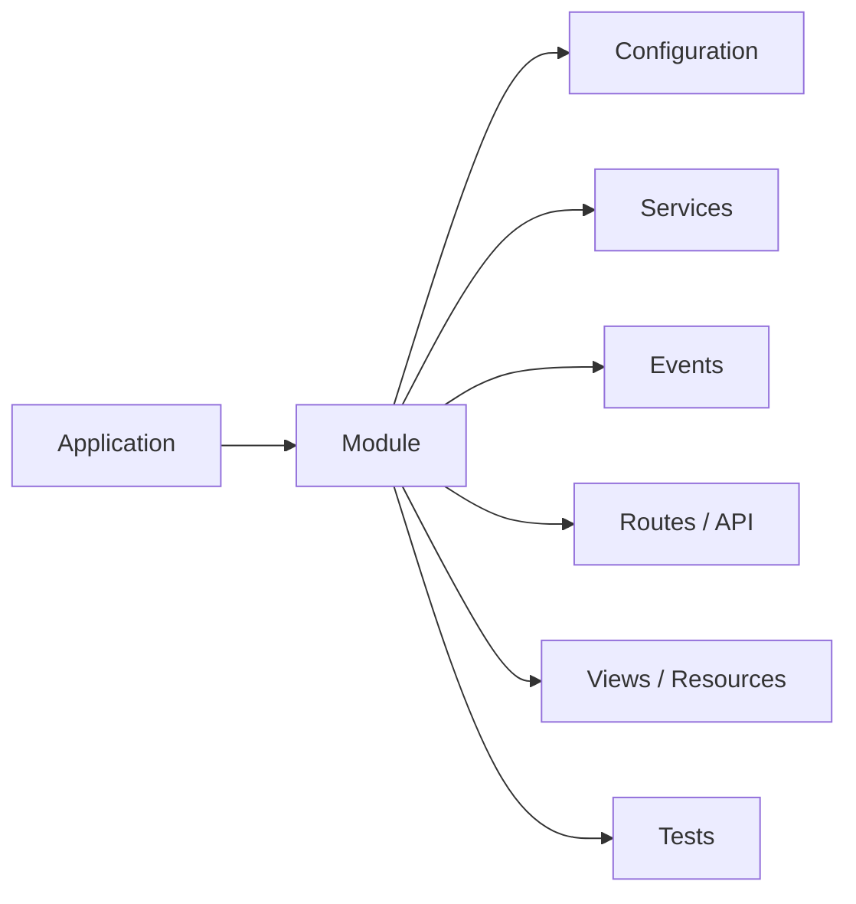
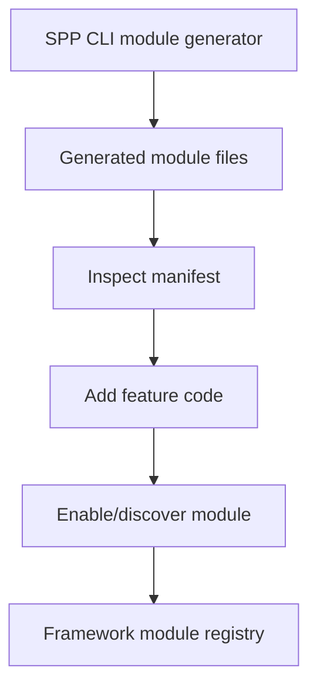
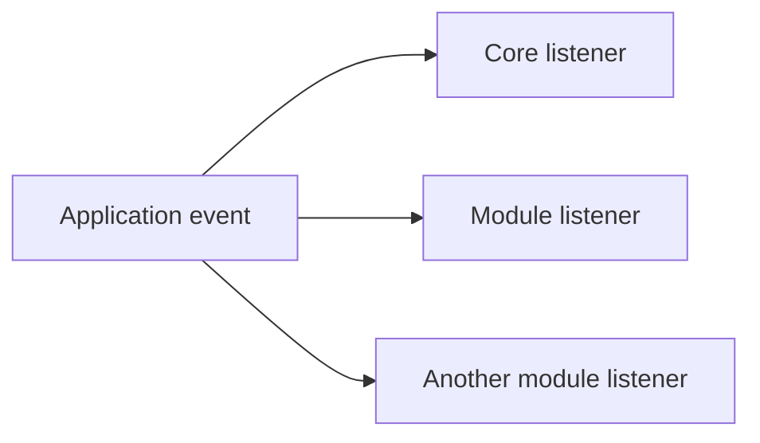
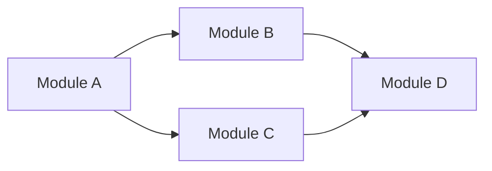
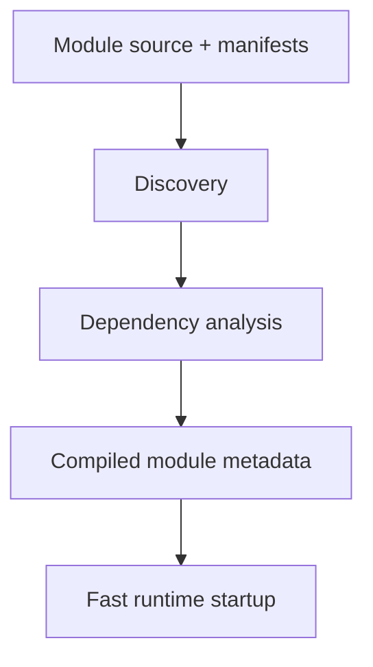
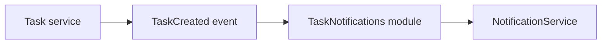

# 38. Modules, Scaffolding, and Feature Packaging

A module is one of the most important ideas to understand in SPP after routing.

A beginner may initially think:

> “Why not just put all my PHP files in `src/`?”

You can write a small application that way. A framework becomes much more useful when a feature can be **packaged, discovered, configured, activated, tested, and reused** as a unit.

SPP uses modules for that purpose.

---

## 38.1 A module is a feature boundary

Think of a module as a package of related behavior.



A module may contain only some of these pieces. There is no requirement that every module contain every possible directory.

The useful idea is:

> **A module owns a coherent capability.**

---

## 38.2 Core modules and application modules

The repository distinguishes framework-level modules from application-level modules.

Core modules live under:

```text
spp/modules/spp/
```

Application-specific modules can live inside an application source tree, for example:

```text
src/myapp/modules/
```

This gives a natural separation:

| Kind | Purpose |
|---|---|
| Framework module | Reusable SPP capability |
| Application module | Capability specific to one application |
| Contributed module | Reusable extension outside the minimal kernel |

---

## 38.3 Why not simply use a folder?

A folder is only a filesystem concept.

A module adds framework metadata and lifecycle semantics around that folder.

The framework can then answer questions such as:

- Is the feature enabled?
- Which modules does it depend on?
- Which configuration belongs to it?
- Which event listeners does it contribute?
- Which services should it expose?
- Which routes/API resources does it add?
- Which resources/views belong to it?
- Is its compiled metadata stale?

That is why a module is an architectural boundary rather than merely a directory.

---

# Part I — Create a module

## 38.4 Start manually so you understand the anatomy

Before using a generator, create a tiny application module by hand.

Conceptually:

```text
src/myapp/modules/task-notifications/
    module.yml
    config.yml
    src/
    events/
    resources/
    tests/
```

The exact files needed depend on what the module provides.

A module that only contributes one service does not need a large hierarchy.

---

## 38.5 The module manifest

`module.yml` is the module's identity/metadata document.

Do not think of the manifest as application business logic. It is closer to a package declaration.

A manifest may describe things such as:

```text
module identity
description
enabled state
dependencies
bootstrap/module entry points
configuration locations
```

The exact schema should always be taken from the version of SPP installed in the repository rather than copied from another framework.

---

## 38.6 Generate the module with the SPP CLI

SPP provides a module scaffolding command in its CLI surface.

The important learning sequence is:



Do not treat the generator as magic. After generation, open every generated file and ask what runtime contract it represents.

---

# Part II — Module contents

## 38.7 Services

A module can provide reusable services.

Example conceptual structure:

```text
modules/task-notifications/src/NotificationService.php
```

The service can then be resolved through the application's dependency-management mechanisms.

This is one reason modules and the Registry/container are related but different concepts:

```text
Module = packages the feature
Container = constructs/provides runtime objects
```

---

## 38.8 Configuration

Module configuration should be separate from application configuration when the configuration belongs specifically to the module.

Typical arrangements include:

```text
src/myapp/etc/modsconf/<module>/config.yml
```

or framework/module configuration under the module itself, depending on the module's design.

The beginner rule is:

> Keep configuration close to the component that owns the setting, but use the SPP configuration APIs rather than inventing a private configuration loader.

---

## 38.9 Events

Modules commonly contribute event listeners.

This is a major reason modules and events belong close together in the learning path.

A module can add behavior to the application without modifying the code that originally emits an event.



This is one of the mechanisms that lets SPP remain extensible.

---

## 38.10 Routes and APIs

A module may contribute application entry points such as:

```text
page routes
attribute controllers
API resources
Live actions
admin endpoints
```

The exact routing mechanism depends on the type of module, but the architectural idea stays the same:

> A module can contribute entry points to an application without becoming the application itself.

---

## 38.11 Views and resources

Modules can own their own resources:

```text
resources/views
resources/js
resources/css
resources/admin
```

SPPView and related rendering systems can resolve module-owned resources according to their module/resource conventions.

This lets a reusable module ship its own UI instead of requiring every application to copy template files.

---

# Part III — Dependencies and activation

## 38.12 Why dependency declarations matter

Suppose module B calls a service from module A.

It is not enough for A to happen to be installed on the developer's laptop.

The module system needs to express:

```text
B depends on A
```

The dependency graph can then be reasoned about explicitly.



This also lets the framework detect missing or incompatible activation order rather than failing much later with an unrelated runtime error.

---

## 38.13 Enabled is not the same as installed

Keep these concepts separate:

| State | Meaning |
|---|---|
| Source exists | Files are present |
| Installed | Framework recognizes the module as available |
| Enabled | Runtime is allowed to use it |
| Bootstrapped | Its runtime contribution has been loaded |
| Cached/compiled | Discovery metadata has been prepared for fast startup |

A module may exist on disk while still not participating in the current application.

---

## 38.14 Compiled module metadata

SPP uses compiled/cached metadata in several parts of the runtime.

Module discovery can therefore be separated conceptually into:



The important performance idea is the same as with event and route discovery:

> expensive filesystem/reflection work should not have to be repeated unnecessarily on every request.

---

# Part IV — Scaffolding is part of the framework

## 38.15 Why SPP has many generators

The repository includes a broad family of generators/scaffolds, including commands for application creation, modules, services, commands, events, entities/models, forms, seeders, views, Blade/SPPView resources, partials, streams, and polyglot targets.

These generators are not all equally important to a beginner.

Use them in this order:

```text
understand the runtime contract
    ↓
create one artifact manually
    ↓
create the same artifact with SPP CLI
    ↓
compare the generated files
    ↓
customize the generated artifact
```

That sequence prevents “copy this generator command” learning.

---

## 38.16 The generated code is documentation

The scaffold is often one of the best examples of how SPP expects a developer to structure a component.

For example, generating an event should lead to questions like:

```text
Which namespace did SPP choose?
Which interface/base class did it choose?
Where did it place configuration?
How is discovery performed?
Which test file was generated?
```

This turns the generator output into a learning tool.

---

# Part V — Module laboratory

## 38.17 Build `TaskNotifications`

Create an application module called:

```text
TaskNotifications
```

Its job is to react when a task is created.

The module should contribute:

```text
one event listener
one notification service
one module configuration value
one test
```

The application should emit a `TaskCreated` event. The module should listen for it.

This is the first practical demonstration of two framework features cooperating:



---

## 38.18 Test the module with Parikshak

The module test should verify behavior, not just class existence.

At minimum:

```text
module is discoverable
event listener is active
TaskCreated invokes notification behavior
disabling the module removes the behavior
```

Now deliberately break the module dependency or configuration and observe how startup/runtime behavior changes.

---

# Part VI — When to create a module

Create a module when a feature has a coherent identity and may reasonably own:

- configuration;
- services;
- events;
- routes/API;
- resources;
- tests;
- dependencies.

Do not create a module merely to put three related PHP functions into a different folder.

A useful threshold is:

> **Would this feature be easier to enable, disable, test, reuse, or replace if it had its own framework boundary?**

If yes, a module is worth considering.

---

# Part VII — Coming from other frameworks

### Laravel Packages / Modules

SPP modules are conceptually similar to reusable packages or modular application structures, but the SPP module registry/activation model is more tightly coupled to framework boot and application discovery.

### Symfony Bundles

A Symfony developer will find the module idea familiar. Pay particular attention to SPP's own manifest/discovery/cache rules instead of assuming Symfony bundle lifecycle semantics.

### Django Apps

Django apps are a useful mental comparison: a feature has its own code and often its own models/views/configuration. SPP modules add a framework-level activation/discovery layer on top of that idea.

---

# Kernel Hacker section

When debugging module startup, trace these questions in order:

1. Where is the module manifest read?
2. How is the module identity normalized?
3. Where are dependencies collected?
4. How is the dependency order computed?
5. Where is enabled/disabled state applied?
6. Where is module configuration loaded?
7. Which registry/cache is compiled?
8. How are module classes made available to the autoloader/container?
9. Which module lifecycle hooks execute during boot?
10. What invalidates the compiled metadata?

Useful source landmarks include:

```text
spp/core/class.module.php
spp/modules/spp/* module directories
module manifests and module.yml files
spp/commands module-generation documentation/stubs
module discovery/cache artifacts
```

Use the source as the final authority for exact lifecycle semantics.

---

## Practical assignment

Build the `TaskNotifications` module twice:

1. manually;
2. using the SPP module generator.

Compare the two implementations.

Then add a second module called `TaskAudit` and make it depend conceptually on the task module's event contract.

Use Parikshak to prove that enabling/disabling modules changes runtime behavior as expected.

Do not continue until you can explain the difference between **an application, a module, a service, a route, an event listener, and a generated scaffold**.
