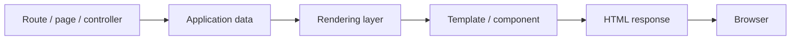
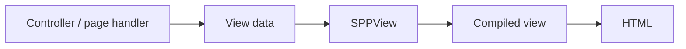
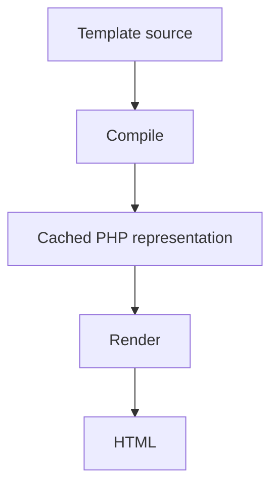
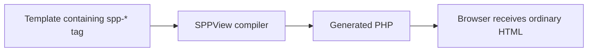
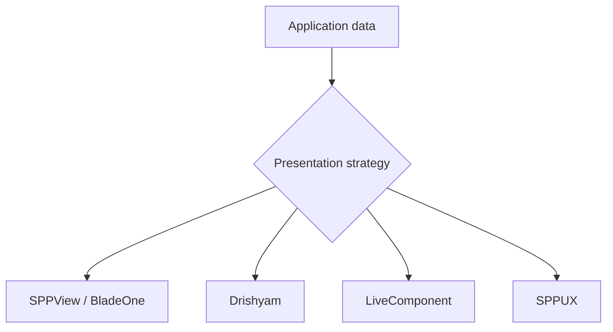
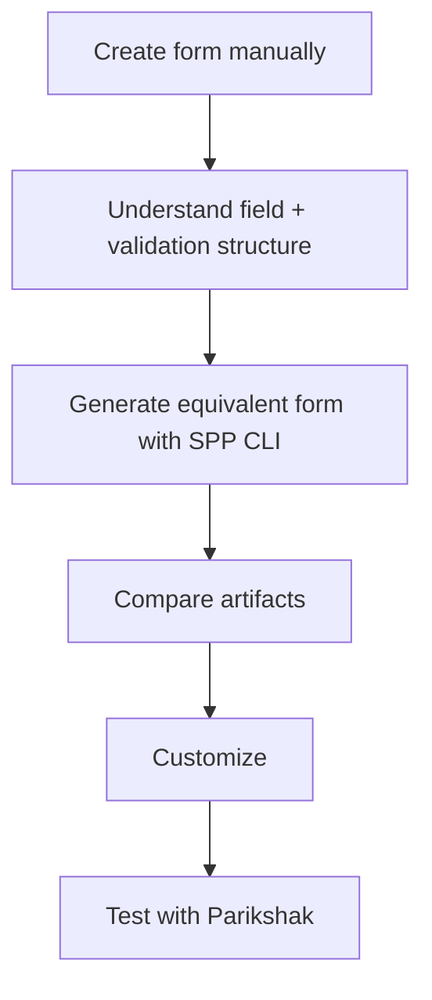
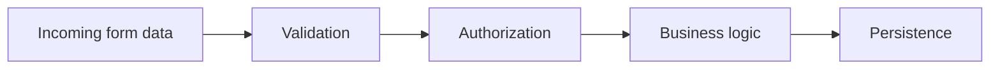
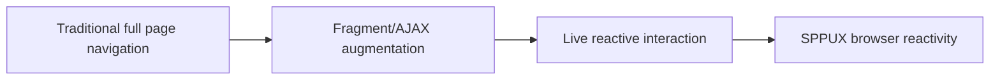
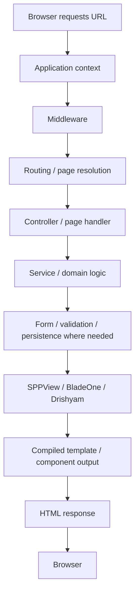

# 39. Rendering: SPPView, Extended BladeOne, ViewTags, Drishyam, Forms, and Validation

Routing answers **which application entry point should run**.

Rendering answers:

> **What should the user actually receive?**

A beginner who only knows PHP might think rendering means:

```php
echo '<h1>Hello</h1>';
```

That is technically rendering, but an enterprise web application needs much more:

- templates;
- reusable layouts;
- data binding;
- escaping;
- forms;
- validation;
- assets;
- reusable UI components;
- partials;
- server-side rendering;
- client-side enhancement;
- caching and pre-compilation.

SPP has a substantial presentation stack, and it is important not to flatten all of it into the word "template".

---

## 39.1 The rendering boundary

A useful mental model is:



SPP can put several mechanisms inside the rendering layer depending on the application:

```text
SPPView
Extended BladeOne
ViewTags
Drishyam
LiveComponent
SPPUX
```

These mechanisms overlap in purpose but have different responsibilities.

---

# Part I — SPPView

## 39.2 What is SPPView?

SPPView is the primary SPP presentation subsystem documented in the repository.

It is broader than a template file. It provides mechanisms around:

- page rendering;
- views/templates;
- route/page integration;
- resource lookup;
- asset inclusion;
- custom ViewTags;
- view compilation/caching;
- integration with dynamic pages.

The source includes dedicated classes such as `ViewPage`, `ViewTag`, validators, and JavaScript generation support.

---

## 39.3 Your first SPPView page

Create a simple view:

```text
src/myapp/resources/views/home.blade.php
```

Conceptually:

```html
<h1>{{ $title }}</h1>
<p>Welcome to Task Desk.</p>
```

The exact template syntax depends on the rendering path enabled for the application. The important architectural sequence is:



---

## 39.4 `ViewPage`

The repository documents the page rendering entry point:

```php
\SPPMod\SPPView\ViewPage::showPage();
```

For a beginner, do not memorize this call as a magic incantation. Ask what it is responsible for:

1. identifying the page/view to render;
2. locating the relevant template/resources;
3. invoking the rendering path;
4. using cached/compiled view output when available;
5. producing the final response.

---

# Part II — Extended BladeOne

## 39.5 Why BladeOne is relevant to SPP

The repository contains an extended BladeOne implementation as part of the SPP presentation stack.

The important idea is not simply:

> "SPP uses Blade."

It is:

> **SPP integrates an extended BladeOne-style template engine into a larger page/resource architecture.**

That distinction matters because SPP adds framework-specific behavior around templates rather than treating BladeOne as an isolated library.

---

## 39.6 Blade-style templates

A beginner-friendly example:

```blade
<h1>{{ $title }}</h1>

@if ($tasks)
    <ul>
        @foreach ($tasks as $task)
            <li>{{ $task->title }}</li>
        @endforeach
    </ul>
@else
    <p>No tasks found.</p>
@endif
```

The important mental model is:

```text
PHP data
   ↓
Blade-compatible syntax
   ↓
compiled PHP
   ↓
HTML
```

Template syntax is not the domain/business layer. Keep significant application logic in services/controllers/components rather than hiding it in templates.

---

## 39.7 Why compilation matters

Template engines do not normally execute the template source exactly as written on every request.

SPP's rendering systems can compile/cache views.



In production, this can reduce repeated parsing and compilation work.

The repository documents CLI support for view caching/compilation, so the handbook should teach both development mode and production preparation.

---

# Part III — ViewTags

## 39.8 Why custom ViewTags exist

Sometimes ordinary template control syntax is not enough.

SPPView supports custom elements such as:

```html
<spp-if condition="isset($user)">
    <p>Welcome.</p>
</spp-if>
```

and:

```html
<spp-foreach loop="$users as $user">
    <li><?= $user->name ?></li>
</spp-foreach>
```

The purpose is to expose framework-aware template constructs without forcing every template author to understand the internal compiler.

---

## 39.9 ViewTags are a compiler feature

Do not think of `<spp-if>` as HTML understood by the browser.

It is a framework-level template instruction.



The browser never needs to understand `<spp-if>` itself.

---

## 39.10 Building a custom ViewTag

This is an advanced exercise rather than a beginner requirement.

The learner should:

1. find the `ViewTag` base/registry mechanism;
2. inspect an existing built-in tag;
3. create a minimal custom tag;
4. compile a template using it;
5. inspect the generated PHP;
6. test both valid and malformed usage.

The exact registration API should be taken from the version of `class.viewtag.php` in the repository rather than guessed.

---

# Part IV — Drishyam

## 39.11 Why Drishyam is separate

Drishyam is another SPP presentation/UI subsystem.

It should not be documented as merely "another name for SPPView".

The handbook should teach the relationship this way:



The correct choice depends on the interaction model.

---

## 39.12 Static/server-rendered pages

Use ordinary SPPView/Blade-style rendering when:

- the user navigates between pages normally;
- server-side HTML is sufficient;
- interactivity is limited.

Use Drishyam where its component/document/view model is the better fit.

Use LiveComponent for server-backed reactive interaction.

Use SPPUX for richer browser-side reactivity.

---

# Part V — Forms

## 39.13 A form is more than HTML

A raw HTML form is:

```html
<form method="post">
    <input name="title">
    <button>Save</button>
</form>
```

A framework form often also needs:

- field definitions;
- labels;
- validation;
- normalization;
- CSRF protection;
- error display;
- submission handling;
- persistence;
- authorization;
- reusable layouts.

SPP has dedicated form configuration and generator/scaffold support.

---

## 39.14 Generated forms

The repository provides CLI scaffolding for forms.

The learning process is:



Do not teach the generator first. Teach the contract first.

---

## 39.15 Validation is a separate concern

Validation asks:

> "Is this input acceptable according to the application's rules?"

Sanitization asks:

> "How should this input be normalized/escaped so it can safely move through the system?"

Authorization asks:

> "Is this user allowed to perform this operation?"

Do not collapse the three.



SPP's security modules add further protections such as CSRF, throttling, and sanitization; those are covered in the dedicated security branch.

---

## 39.16 Form errors

A good form workflow should make invalid input visible to the user without losing the rest of the form state.

Conceptually:

```text
GET form
   ↓
render
   ↓
POST form
   ↓
validate
   ├── invalid → redisplay + errors
   └── valid → process → redirect/render success
```

This pattern will recur in authentication, workflow approvals, and admin CRUD.

---

# Part VI — Asset orchestration

## 39.17 CSS and JavaScript are part of rendering

A framework page is not just HTML.

SPPView includes asset/resource support, and the repository documents methods for adding CSS and JS includes.

Conceptually:

```php
\SPPMod\SPPView\ViewPage::addCssIncludeFile('res/custom.css');
\SPPMod\SPPView\ViewPage::addJsIncludeFile('res/custom.js');
```

The important lesson is that asset registration should happen through the framework's resource pipeline when you need SPP to understand dependency/order/context rules.

---

# Part VII — Dynamic page augmentation

## 39.18 From traditional pages toward SPA-like behavior

The repository's routing/views tutorial documents an optional "drop and play" page augmentation mode that can intercept links and forms and load fragments through asynchronous requests.

The conceptual progression is:



This is useful pedagogically because it shows that you do not have to jump directly from classical server-rendered PHP to a full client-side application.

---

# Part VIII — The complete page pipeline

A beginner should now be able to explain the complete chain:



LiveComponent and SPPUX later extend this pipeline with reactive interaction instead of replacing all of it.

---

# Part IX — Practical project

Extend Task Desk with:

1. a dashboard page;
2. a task creation form;
3. validation errors;
4. a reusable task-list partial/component;
5. CSS and JS resources;
6. a second page rendered through the application's chosen presentation mechanism;
7. a LiveComponent version of the task filter later in the curriculum.

Use Parikshak to verify:

```text
page renders
form accepts valid input
invalid input produces errors
CSRF/security behavior is enforced where configured
authorized user can save
authorized user cannot edit another tenant's task
compiled view output remains correct
```

---

# Part X — Coming from other frameworks

### Laravel / Blade

The Blade syntax will feel familiar. The important difference is that SPPView, ViewTags, page configuration, Drishyam, LiveComponent, and SPPUX form a larger presentation ecosystem.

### Symfony / Twig

The conceptual distinction between controller, template, form, and validation remains familiar. The exact template engine and page/resource integration are SPP-specific.

### Django templates

The separation between server-side data and presentation is similar, but SPP adds multiple rendering paradigms and reactive subsystems.

### React / Vue

Do not assume that every SPP application needs a full browser-side SPA. SPP supports progressive enhancement from server-rendered views through LiveComponent and SPPUX.

---

# Kernel Hacker section

Source landmarks worth tracing:

```text
spp/modules/spp/sppview/class.viewtag.php
spp/modules/spp/sppview/class.livecomponent.php
spp/modules/spp/sppview/class.viewvalidator.php
spp/modules/spp/sppview/class.jsgenerator.php
```

and the repository's extended BladeOne/Drishyam implementation directories.

Answer these questions from the source:

1. Where does template discovery happen?
2. What does the view compiler generate?
3. Where is compiled output cached?
4. How are ViewTags registered and transformed?
5. How are app/module resources located?
6. How are forms connected to validation and rendering?
7. Where does LiveComponent enter the rendering pipeline?
8. Which parts are server-rendered and which parts are browser-reactive?

---

## Practical assignment

Build the same Task Desk page three ways:

1. plain SPPView/Blade-style rendering;
2. SPPView with custom ViewTag/form behavior;
3. interactive LiveComponent enhancement.

Then explain which parts belong to **routing, controller/service logic, rendering, validation, server-side reactivity, and client-side reactivity**.
