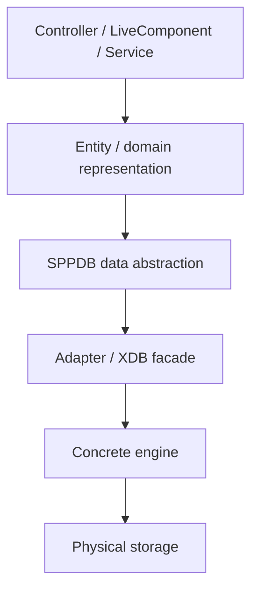
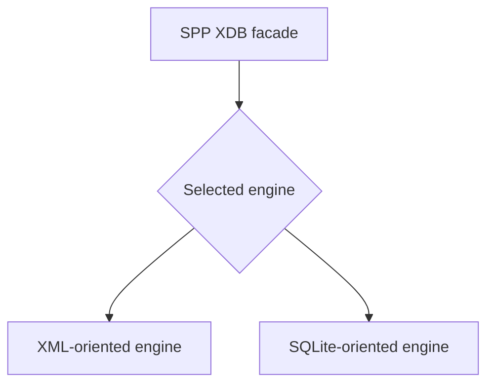
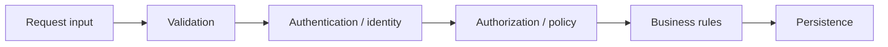
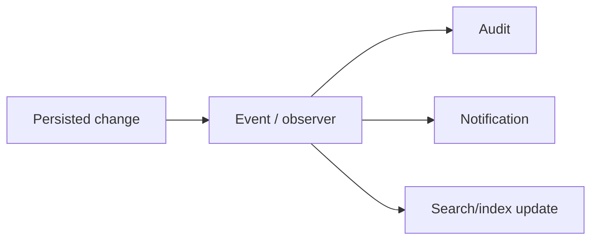
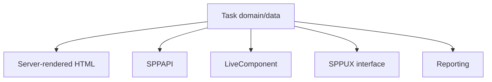

# 40. Data and Persistence: Entities, SPPDB, and XDB

This branch teaches persistence as an architectural stack rather than as “the database”. The exact implementation and guarantees are source-first.

## 40.1 The persistence stack



The controller should not need to know how bytes are ultimately stored.

## 40.2 Entity versus physical row

An entity represents an application concept with identity and data. It may map to a database row, but the two concepts should not be treated as identical.

For the Task Desk example:

```text
Task
----
id
created_by
title
description
status
priority
created_at
updated_at
```

Then decide which fields are required, optional, indexed, validated, editable, or computed.

That metadata later matters to forms, APIs, LiveComponent, and SPPUX.

## 40.3 SPPDB

SPPDB provides a database/data-access abstraction. Application services can express data operations without embedding every concrete storage detail.

Conceptually:

```text
Application service
      ↓
SPPDB abstraction
      ↓
Adapter
      ↓
Concrete backend
```

A query builder or entity-query layer can be useful for dynamic and reusable queries. Hand-written SQL can still be appropriate where the concrete contract supports it and SQL is the clearest tool.

The handbook deliberately avoids claiming that one query style is universally superior.

## 40.4 SPPDB is not the same layer as SPPXDB

The current architecture contains multiple data boundaries, including SPPDB, SPPDBPool, and SPPXDB.

**Do not teach SPPXDB as simply a renamed SPPDB.**

SPPXDB is a distinct storage subsystem with its own facade/engine architecture. SPPDB can provide an abstraction/adapter boundary above concrete implementations.

## 40.5 XDB

The SPP XDB subsystem contains a facade/factory model and engine-specific implementations, including XML- and SQLite-oriented engines in the examined source line.



The precise engine capabilities are implementation-specific. Do not infer transaction, concurrency, durability, or distributed guarantees from the existence of a class or method name.

## 40.6 Safe CRUD architecture

A create/update operation should generally be understood as:



The exact ordering can vary by application and subsystem, but arbitrary client input should not be sent directly to persistence.

### Create

Validate input, apply business rules, persist, and perform required events/audit side effects.

### Read

A typical flow is:

```text
request → route → service → query → result → pagination → HTML/API/live response
```

### Update

Establish which entity may change, which fields may change, who is making the change, and whether the requested state transition is legal.

### Delete

Define whether deletion is allowed, whether it is soft or physical, what dependencies exist, and whether audit/event side effects are required.

## 40.7 Migrations and seed data

Schema changes require reproducible history. Migrations describe structural changes needed to bring an installation from one schema state to another.

Seed data establishes known application data such as reference records, initial roles, or controlled development fixtures.

Keep **schema migration** separate from **content promotion** and **application rollback**. They solve different problems.

## 40.8 Transactions, locking, ACL, and validation

These are separate concerns:

| Concern | Question |
|---|---|
| Validation | Is the data structurally acceptable? |
| Authorization/ACL | Is this actor allowed to perform this operation? |
| Transaction | Which operations succeed or fail as a unit? |
| Locking | How is concurrent access coordinated? |

The XDB source contains classes/paths for several of these areas. That is evidence that the concerns exist in the implementation; it is not by itself proof of a particular isolation level, distributed-consensus guarantee, or production-ready concurrency model.

## 40.9 Pagination and indexing

Pagination limits how much data is processed or returned at once.

Indexes support particular access patterns. The correct index depends on actual query workload, selectivity, write cost, and engine behavior.

Do not index everything merely because an indexing subsystem exists.

## 40.10 Observers and events

Persistence can participate in event/observer mechanisms:



Use observers for genuine cross-cutting reactions. If a side effect is mandatory and central to one business operation, an explicit service call may be easier to understand.

## 40.11 Cache composition

XDB demonstrates how persistence and caching can compose:

```text
read query
 → cache lookup
 → engine execution on miss
 → cached result

mutation
 → engine execution
 → relevant cache invalidation
```

This makes the cache an optimization around authoritative data rather than a replacement for it.

## 40.12 Administration

XDB-specific administration and CLI tooling should be documented from current command implementations. The handbook should not invent flags or promise operational capabilities merely because a command name exists.

## 40.13 Testing persistence

A useful persistence test matrix includes:

```text
create
read
update
delete
validation failure
authorization failure
migration behavior
seed behavior
pagination
concurrency-sensitive behavior where supported
```

Use controlled test data and the project's database-reset facilities where appropriate.

## 40.14 One data model, multiple application surfaces

The same Task entity can feed different interaction paradigms:



The important lesson is that the persistence architecture should not be rebuilt separately for every frontend.

## 40.15 Coming from other frameworks

### Laravel Eloquent

The entity/data abstraction solves related concerns, but SPP's APIs and persistence semantics are framework-specific.

### Doctrine

The entity and query concepts are familiar, but SPP's SPPDB/XDB boundaries have their own lifecycle and implementation.

### Django ORM

The model-centric mental model is useful, but do not assume Django ORM semantics map one-to-one to SPP.

### Raw PDO/SQL

The major architectural shift is moving persistence concerns behind framework boundaries rather than scattering connection and storage logic through controllers.

## Kernel Hacker section

Trace persistence from high to low:

```text
entity/application data layer
        ↓
SPPDB abstraction
        ↓
adapter
        ↓
SPPXDB facade where used
        ↓
engine
        ↓
physical storage
```

When a claim concerns transactions, locking, ACL, encryption, consensus, or distributed behavior, verify the exact source path and tests before documenting it as a guarantee.

### Practical assignment

Build the Task Desk persistence layer once, then exercise the same data through:

1. HTML;
2. SPPAPI;
3. a Parikshak test; and
4. LiveComponent.

Then trace one operation downward into the concrete storage layer. The goal is to see the separation between **application data model, framework data abstraction, storage subsystem, and presentation surface**.
