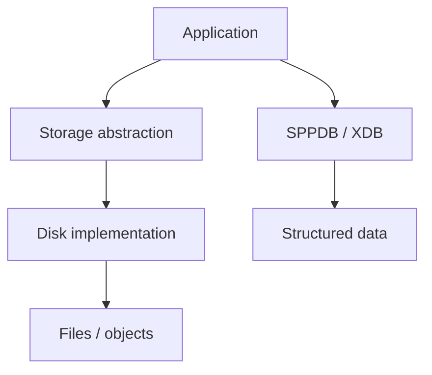
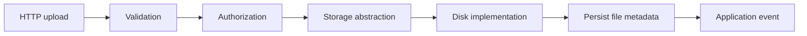
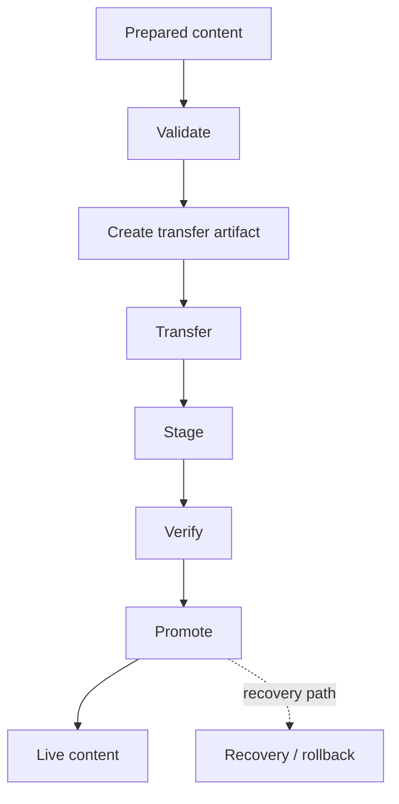
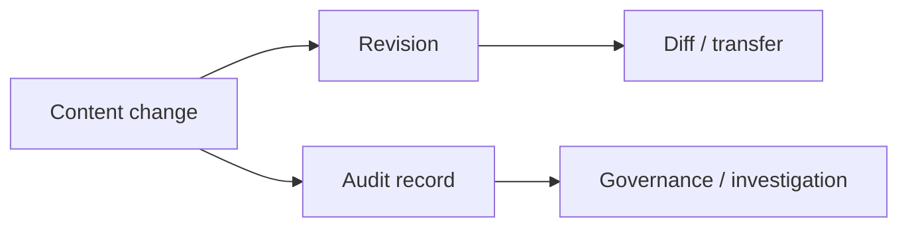
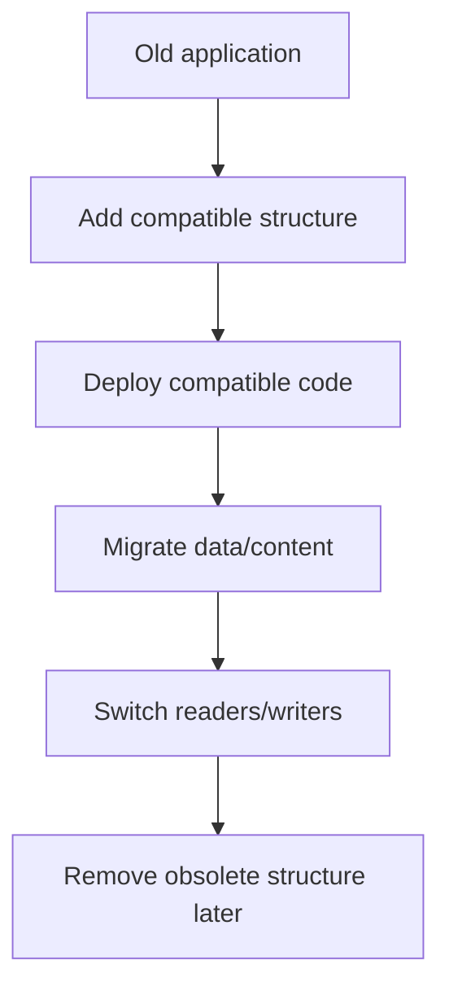

# 41. Storage, Transfer, and Live-Content Promotion

This chapter teaches three related but different ideas:

1. application file/object storage;
2. migration and transfer of application/data state;
3. promoting content prepared offline into a live website.

They are related, but they are **not the same operation**.

> **Evidence boundary:** storage abstractions and migration components are implementation-backed. The broader offline-publishing lifecycle is an architectural teaching model unless a concrete transfer/promotion implementation is traced for the installation being documented.

---

## 41.1 Start with the beginner problem

A web application may have more than one kind of persistent information:

```text
records               → database
files                 → storage/filesystem
configuration        → configuration/settings
content revisions    → revision/audit layer
runtime cache        → cache
```

A common beginner mistake is to call all of these “the database”.

SPP separates these concerns.

---

## 41.2 Storage is different from the database

The repository exposes a storage abstraction with disk-oriented concepts such as `DiskInterface` and `LocalDisk`. The conceptual separation is:



Use structured persistence for application records and the storage layer for binary/file objects when the application requires that separation.

---

## 41.3 Why use a storage abstraction?

If application code directly manipulates a local filesystem everywhere, later changes become expensive. A stable storage contract allows the application to remain independent of a particular disk implementation.

Possible deployment choices include local or shared storage, but the handbook must not claim that every such backend is currently implemented merely because the abstraction permits the architecture.

---

## 41.4 Build a document upload

Extend the Task Desk project with:

```text
Task
  └── attachments
       ├── report.pdf
       ├── screenshot.png
       └── notes.txt
```

A sound application flow is:



The file and its metadata are separate concerns.

---

## 41.5 File metadata belongs with application data

Typical metadata includes:

```text
original filename
stored filename
media type
size
owner
entity relation
created_at
checksum or integrity information
```

Binary content belongs in storage; searchable/relational metadata belongs in structured persistence when the application needs it.

---

# Part II — Migration versus transfer

## 41.6 Ordinary schema migration

A schema migration changes the structure required by an application:

```text
v1 → add task.priority
v2 → add task.due_at
v3 → create approval tables
```

SPP contains migration infrastructure in its core/database/XDB areas. A schema migration answers:

> “How does a deployed installation acquire the new structure?”

Migration presence does **not** by itself prove transaction, rollback, or zero-downtime guarantees.

---

## 41.7 Content transfer is a different question

Content transfer asks:

> “How do I move prepared content/state from one environment to another?”

A useful enterprise lifecycle is:

```text
offline authoring
→ validation
→ transfer artifact
→ staging
→ verification
→ promotion
```

The exact package format and transport protocol must be documented only when the executable implementation establishes them.

---

# Part III — Offline publishing

## 41.8 Why prepare content offline?

Offline preparation can support editorial review, bulk preparation, scheduled publication, or environments where the production site should not be the authoring surface.

This is an architectural use case, not evidence that every SPP deployment contains a turnkey content-promotion service.

---

## 41.9 The promotion model



The diagram describes a safe lifecycle. It is not a claim that every arrow is one built-in SPP command.

---

## 41.10 Why staging matters

A strong deployment workflow separates:

```text
transfer
→ stage
→ inspect
→ validate
→ promote
```

That creates a boundary where incompatible content can be detected before publication.

---

## 41.11 Compatibility matters

A transfer package can depend on:

```text
application version
module version
schema/migration level
content format version
required features
```

Compatibility checks should therefore be part of a real promotion design.

---

# Part IV — Diff, revision, and audit

## 41.12 Why send only what changed?

The repository exposes revision/diff concepts including `RevisionManager` and `DeltaEngine` in the examined architecture. Conceptually, transfer can use either a full snapshot or a base snapshot plus a delta.

Do not infer a guaranteed delta-transfer protocol from the existence of those classes alone.

---

## 41.13 Revision and audit are different

A revision system asks:

> “What version changed?”

An audit system asks:

> “Who performed which action, and when?”



They can cooperate without being the same subsystem.

---

# Part V — Zero-downtime thinking

## 41.14 Expand-contract strategy

A common compatibility strategy is:



The important principle is that old and new versions may coexist during a transition. This is guidance, not proof of a particular SPP deployment topology.

---

## 41.15 Promotion and cache invalidation

A promotion can appear unsuccessful when stale caches continue serving older state. Depending on the actual application, promotion may require:

```text
content/data update
→ cache invalidation
→ compiled-view invalidation if applicable
→ index/search refresh if applicable
→ verification
```

The exact invalidation semantics must follow the installed SPP cache/view implementation.

---

# Part VI — Testing the transfer lifecycle with Parikshak

Test boundaries rather than merely testing that a package object exists:

```text
valid package
invalid package
missing dependency
schema incompatibility
partial transfer
staging failure
promotion failure
recovery path
cache invalidation
repeat promotion
idempotency where supported
```

A useful deliberate-failure exercise contains one valid and one invalid entity and asks the learner to prove where rejection occurs and what state was changed.

---

# Part VII — Practical architecture

```text
Authoring application
      ↓
SPP content/data layer
      ↓
revision + audit
      ↓
transfer artifact
      ↓
production staging
      ↓
validation
      ↓
promotion
      ↓
production application
```

The same workflow can be exercised through CLI, Parikshak, SPPAPI, LiveComponent, and SPPUX administration surfaces when those surfaces are actually wired into the application.

---

# Kernel Hacker section

Trace these boundaries independently:

```text
Storage / Disk
Migration
SPPDB / SPPXDB
Revision / Delta
Audit
Cache invalidation
Deployment tooling
```

Do not turn the presence of a migration, revision, or storage class into a claim of atomic cross-system promotion, distributed consistency, or automatic rollback.

## Practical assignment

Build an offline content-publishing lab:

```text
prepare
→ validate
→ package
→ transfer
→ stage
→ verify
→ promote
→ invalidate relevant caches
→ verify live state
→ record audit/revision information
```

Then deliberately corrupt the package and document the earliest failing boundary.