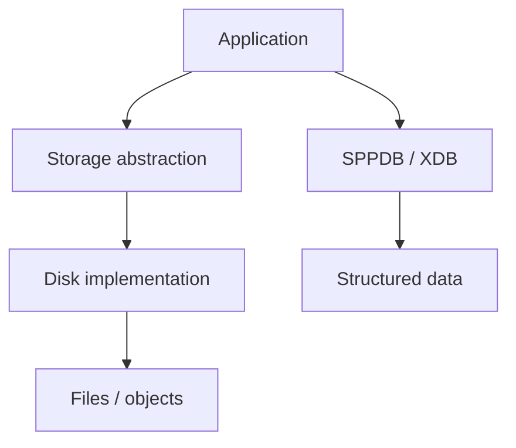
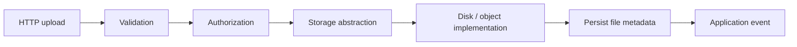
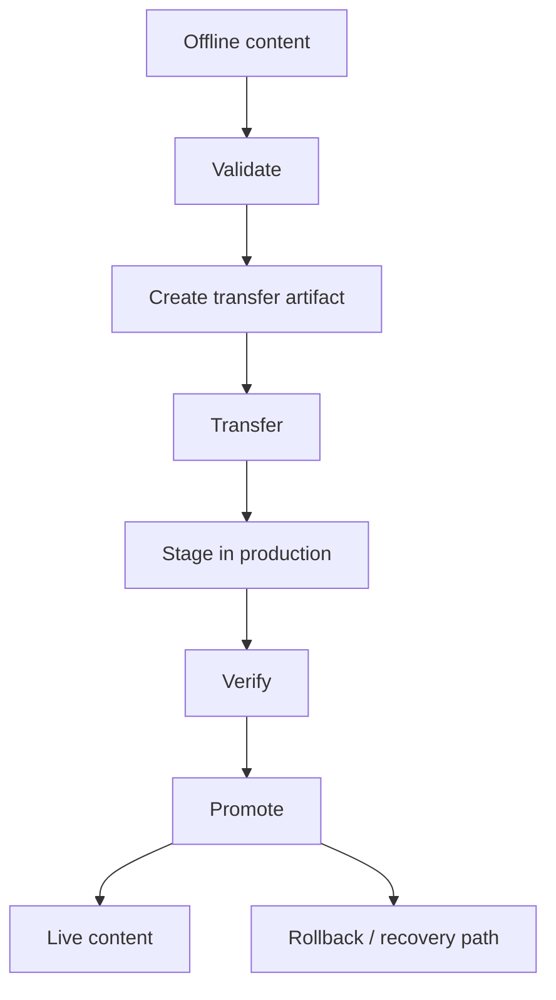
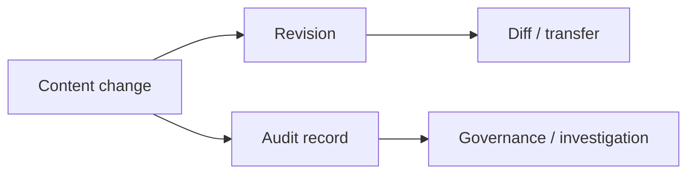
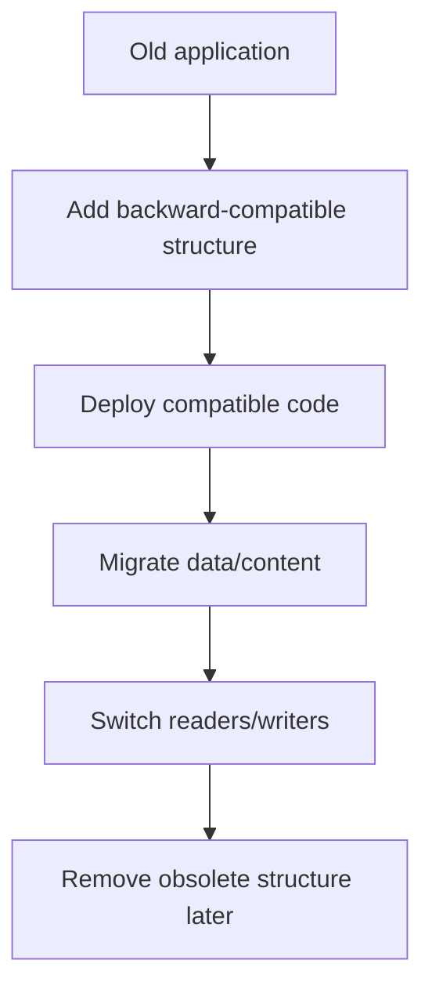

# 41. Storage, Transfer, and Live-Content Promotion

This chapter teaches three related but different ideas:

1. application file/object storage;
2. migration and transfer of application/data state;
3. promoting content prepared offline into a live website.

They are related, but they are **not the same operation**.

---

## 41.1 Start with the beginner problem

A web application may have more than one kind of persistent information:

```text
records      → database
files        → storage/filesystem
configuration → configuration/settings
content revisions → revision/audit layer
runtime cache → cache
```

A common beginner mistake is to call all of these "the database".

SPP separates these concerns.

---

## 41.2 Storage is different from the database

The repository exposes a storage abstraction with a `Storage` API and disk-oriented components such as `DiskInterface` and `LocalDisk`.

The conceptual separation is:



Use the database for structured application state. Use storage for files and objects.

---

## 41.3 Why use a storage abstraction?

If application code directly manipulates a local filesystem everywhere, later changes become expensive.

For example, the application may eventually need:

```text
local disk
shared disk
object storage
remote storage
application-specific storage
```

The abstraction gives application code a stable contract while storage implementations can vary.

The handbook should teach the **contract first**, then the actual disk implementations provided by SPP.

---

## 41.4 Build a document upload

Extend the Task Desk project with:

```text
Task
  └── attachments
       ├── report.pdf
       ├── screenshot.png
       └── notes.txt
```

The correct conceptual path is:



Notice that the file itself and its metadata are separate concerns.

---

## 41.5 File metadata belongs with application data

The application often needs to remember:

```text
original filename
stored filename
media type
size
owner
entity relation
created_at
checksum or other integrity information
```

Those fields belong in structured persistence, while the binary content belongs in storage.

This pattern makes search, authorization, reporting, and cleanup much easier.

---

# Part II — Migration versus transfer

## 41.6 Ordinary schema migration

A schema migration changes the structure required by an application.

Example:

```text
v1 → add task.priority
v2 → add task.due_at
v3 → create approval tables
```

SPP has migration infrastructure at the core, SPPDB, and XDB layers.

A schema migration answers:

> "How does a deployed installation acquire the new structure?"

---

## 41.7 Content transfer is a different question

Content transfer asks:

> "How do I move prepared content/state from one environment to another?"

For example:

```text
offline authoring environment
        ↓
validation
        ↓
transfer package
        ↓
production staging
        ↓
verification
        ↓
promotion
```

This is broader than a database migration.

---

# Part III — Offline publishing

## 41.8 Why prepare content offline?

Some websites need content preparation away from the live site.

Typical reasons include:

```text
editorial review
bulk content preparation
poor connectivity
regulated workflows
scheduled publication
safe content testing
```

The important architectural property is that the live website should not need to become the authoring environment merely because it is the production environment.

---

## 41.9 The promotion model

A useful SPP mental model is:



The handbook deliberately keeps the exact transport mechanism separate from this lifecycle unless the repository provides a concrete implementation.

---

## 41.10 Why staging matters

Never treat transfer and promotion as one opaque step when availability and correctness matter.

A stronger enterprise workflow is:

```text
transfer
→ stage
→ inspect
→ validate
→ promote
```

This allows the application to detect incomplete or incompatible content before it becomes visible to users.

---

## 41.11 Compatibility matters

If an offline package was created against a newer application schema than production supports, promotion can fail.

Therefore a transfer system needs compatibility checks such as:

```text
application version
module version
schema/migration level
content format version
required features
```

This connects content promotion to the migration subsystem rather than treating them as unrelated tools.

---

# Part IV — Diff, revision, and audit

## 41.12 Why send only what changed?

The repository exposes revision/diff/audit components including `RevisionManager` and `DeltaEngine`.

Conceptually, a transfer can operate on:

```text
full snapshot
```

or:

```text
base snapshot + changes/delta
```

The second model can be much more efficient for repeated content promotion.

---

## 41.13 Revision and audit are different

A revision system answers:

> "What version of the content changed?"

An audit system answers:

> "Who performed which action, and when?"

They may work together, but they solve different problems.



---

## 41.14 Delta-based promotion exercise

Use the Task Desk project:

1. prepare ten tasks offline;
2. promote the initial content;
3. change only two tasks;
4. generate the next transfer set;
5. verify that unchanged content does not need to be resent if the implemented transfer path supports delta behavior;
6. inspect the revision/audit records;
7. stage the second promotion;
8. intentionally introduce one incompatible change and observe the validation boundary.

The purpose of this exercise is architectural understanding, not merely learning a command.

---

# Part V — Zero-downtime thinking

## 41.15 The simple deployment model

A beginner may imagine:

```text
stop site
→ update files/database
→ start site
```

That can be acceptable for small installations, but enterprise systems often need the site to remain available.

The repository also contains documentation for zero-downtime migration analysis. The handbook therefore teaches zero-downtime as a compatibility discipline.

---

## 41.16 Expand-contract strategy

A common safe pattern is:



The important rule is:

> During a transition, old and new application versions may need to coexist.

That changes how schemas, content packages, APIs, and caches must be designed.

---

## 41.17 Promotion and cache invalidation

A successful content promotion can still appear to fail if old data remains in caches.

Therefore promotion may involve:

```text
transfer
→ database/content update
→ cache invalidation
→ compiled view invalidation if required
→ search/index refresh if required
→ verification
```

The actual cache/view semantics must follow the SPP implementation in use.

---

# Part VI — Testing the transfer lifecycle with Parikshak

## 41.18 What to test

The transfer branch should not be considered complete until tests cover:

```text
valid package
invalid package
missing dependency
schema incompatibility
partial transfer
staging failure
promotion failure
rollback/recovery
cache invalidation
repeat promotion
idempotency where supported
```

---

## 41.19 Deliberate failure exercise

Create a package containing:

```text
one valid entity
one invalid entity
```

Then require the promotion workflow to reject the package before it reaches the final live state.

The learner should document:

```text
where validation failed
what was already changed
whether the system remained safe
how recovery works
what the audit trail shows
```

This is a better enterprise exercise than a happy-path deployment tutorial.

---

# Part VII — Practical architecture

The final content-publishing sample should have:

```text
Authoring application
      ↓
SPP content/data layer
      ↓
revision + audit
      ↓
transfer artifact
      ↓
production staging application
      ↓
validation
      ↓
promotion
      ↓
production SPP application
```

The same architecture can then be exercised through:

```text
CLI
Parikshak
SPP API
LiveComponent
SPPUX administration UI
```

---

# Part VIII — Kernel Hacker section

Source landmarks for this subsystem include:

```text
spp/core/class.migration.php
spp/modules/spp/sppdb/src/Migration/
spp/modules/spp/sppxdb/class.migrationmanager.php
spp/modules/spp/sppxdb/class.xdbfactory.php
docs/tutorials/2-zero-downtime-migration-analyzer.md
SPPAudit / DeltaEngine / RevisionManager implementation
SPP Core Storage / DiskInterface / LocalDisk
```

When documenting the exact transfer protocol, package format, promotion transaction semantics, or recovery guarantees, verify the executable implementation before presenting them as framework guarantees.

---

## Practical assignment

Build an offline content publisher for Task Desk:

```text
prepare offline
→ validate
→ package
→ transfer
→ stage
→ verify
→ promote
→ invalidate relevant caches
→ verify live content
→ record audit/revision information
```

Then deliberately break the package and demonstrate that the live site remains protected by the promotion boundary.
