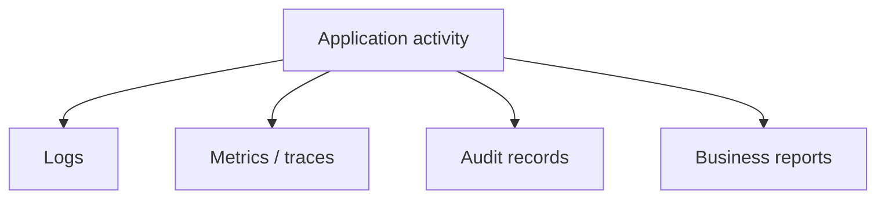
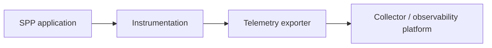
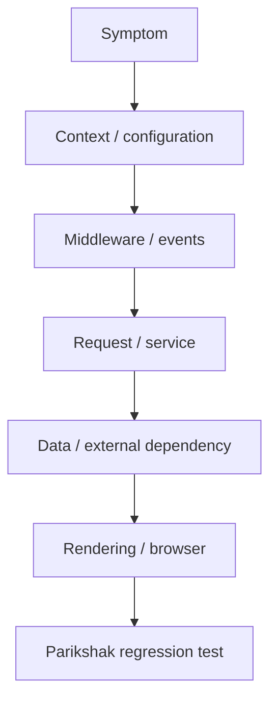

# 42. Reporting, Observability, and Diagnostics

A production application has two different jobs:

```text
serve the user
help the operator understand what happened
```

This chapter separates business reporting, operational observability, audit, logging, and source-driven diagnosis.

> **Evidence boundary:** the repository contains reporting, logging, audit, and OpenTelemetry-related surfaces. Exact telemetry propagation/export behavior must be verified from the enabled implementation; subsystem presence is not proof of complete distributed tracing.

---

## 42.1 Reporting versus observability

A report answers a business question:

> “How many tasks were completed this month?”

Observability answers an operational question:

> “Why did the task API become slow?”

Audit answers a governance question:

> “Who approved this task and when?”

Logging can support observability or audit, but a log line is not automatically an audit record.



---

## 42.2 Build the first report

Use the Task Desk project to build:

```text
Task Summary
-------------
Open        42
In Review    8
Approved    17
Closed     123
```

Prefer a report/service layer over putting business aggregation directly in a template.


The same report definition can then be reused by different presentation surfaces if the application wires them together.

---

## 42.3 Scheduled reporting

The repository contains report/Cron integration and report command paths. The safe learning sequence is:

```text
run report manually
→ verify result
→ inspect diagnostics
→ schedule execution
→ verify scheduled path
```

Do not begin debugging a scheduled report by waiting for the scheduler. First prove the underlying operation.

---

# Part II — Logging and audit

## 42.4 What logging is for

Useful operational log context includes:

```text
operation
request/context
result
error class
execution timing
relevant identifiers
```

Never log passwords, bearer tokens, secrets, or unnecessary personal data.

---

## 42.5 Logging versus auditing

Operational log:

```text
POST /tasks/17/approve completed in 84ms
```

Governance/audit record:

```text
User 42 approved Task 17 at 14:05 under the finance-review step.
```

The second has a different retention, access, and integrity purpose.

---

# Part III — Metrics and tracing

## 42.6 Why logs are not enough

A single log line can tell you that a request was slow without explaining which downstream operation consumed the time.

Tracing can model a request as multiple timed operations:

```text
HTTP request
→ application handler
→ database query
→ external call
→ response
```

The repository includes an OpenTelemetry collector/exporter tutorial. Treat this as an integration surface and verify which signals and propagation behavior the installed configuration actually enables.



Do not claim automatic end-to-end correlation unless source/tests demonstrate it.

---

# Part IV — Source-driven diagnostics

## 42.7 Diagnostic sequence

When a production request fails:

1. reproduce or capture the failure;
2. identify application/context;
3. inspect relevant logs;
4. establish middleware/event/request flow;
5. inspect service/data behavior;
6. inspect downstream dependencies;
7. compare working and failing versions;
8. create a Parikshak regression test.

The objective is to identify the **earliest boundary that explains the symptom**.



---

## 42.8 Reporting, observability, and SPPDB

A report may use SPPDB, SPPXDB, or another application data path. Keep three questions separate:

```text
What is the authoritative data?
How is it queried?
How is the result observed/presented?
```

A report result should not become the authoritative source merely because it is cached or exported.

---

# Part V — Testing

## 42.9 What to test

Reports:

```text
filters
authorization
totals
empty results
large results
pagination
invalid parameters
export
scheduled execution
```

Diagnostics:

```text
expected log emitted
sensitive data absent
failure information emitted
telemetry integration does not break the request
```

Use Parikshak for deterministic behavioral tests and separate external integration tests from the core suite where appropriate.

---

## 42.10 Deliberate diagnostic exercise

Break Task Desk intentionally:

```text
wrong filter
slow query
incorrect permission
failing downstream service
```

Then identify the earliest failing boundary before changing implementation code.

---

# Kernel Hacker section

Useful repository landmarks include the reporting module, report Cron/command paths, SPP logging services, audit paths, and OpenTelemetry tutorial/configuration.

When source tracing, distinguish:

```text
report definition
→ report execution
→ query/data access
→ result
→ presentation/export
```

and:

```text
application event
→ logging/telemetry/audit consumer
```

Do not infer automatic metric/span propagation or audit guarantees from names alone.

## Practical assignment

Build one business report and one diagnostic workflow for Task Desk:

```text
daily pending-approval report
scheduled execution
structured logging
audit record
Parikshak regression test
slow-path diagnosis
```
