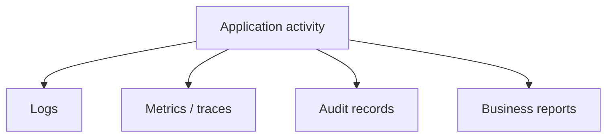
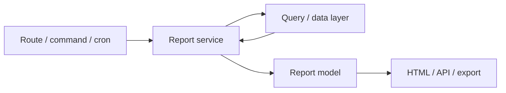
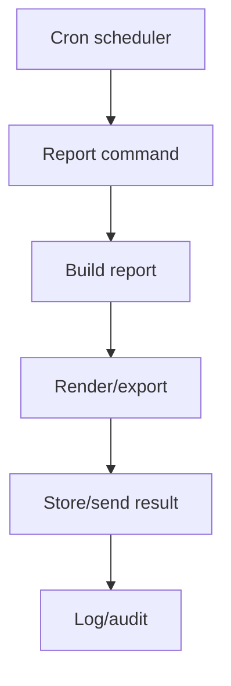
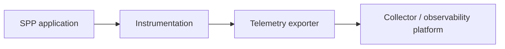
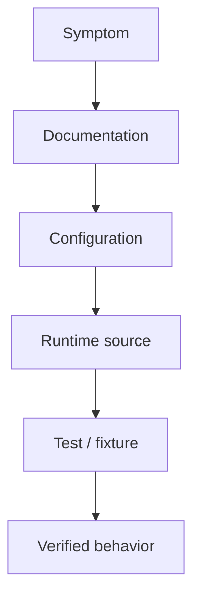

# 42. Reporting, Observability, and Diagnostics

A production application has two different jobs:

```text
serve the user
```

and:

```text
help the operator understand what happened
```

This chapter teaches the SPP reporting and observability surface separately so a beginner does not confuse a user-facing report with a diagnostic trace.

---

## 42.1 Reporting versus observability

A report answers a business question:

> "How many tasks were completed this month?"

Observability answers an operational question:

> "Why did the task API become slow at 14:03?"

Audit answers a governance question:

> "Who approved this task and when?"

Logging is a mechanism that may contribute to observability or audit, but a log file is not automatically an audit system.

---

## 42.2 The four layers



The same event can feed more than one layer, but the consumer and purpose remain different.

---

# Part I — Reporting

## 42.3 What is a report?

A report converts application data into information for a human or another business process.

Examples:

```text
monthly task completion
pending approvals
user activity
inventory position
financial summary
operational dashboard
```

SPP contains a reporting subsystem with report APIs, report views, scheduled report support, and administrative/reporting surfaces.

---

## 42.4 Build the first report

Use the Task Desk project to build:

```text
Task Summary
-------------
Open       42
In Review   8
Approved   17
Closed    123
```

Keep report generation in a service/report layer rather than putting data aggregation directly inside a view.

A useful architecture is:



---

## 42.5 Report APIs

The repository exposes a report API surface and report service files.

The tutorial should teach the learner to distinguish:

```text
report definition
report execution
report result
report presentation
report scheduling
```

That separation makes the same report reusable from a browser, API, CLI command, or scheduled job.

---

## 42.6 Report viewer

The repository also contains report viewer/admin UI assets.

A report viewer is a presentation layer. It should not become the place where the business query itself is defined.

The preferred separation is:

```text
query/service
      ↓
report result
      ↓
viewer
```

---

# Part II — Scheduled reporting

## 42.7 Why schedule a report?

A user may need:

```text
08:00 daily operations report
Friday weekly management report
month-end compliance report
```

A scheduled report turns reporting into an automated workflow.

The repository contains report cron integration and a report-cron command path.

---

## 42.8 Scheduled reporting lifecycle



The exact delivery mechanism must follow the actual report module implementation enabled in the installation.

---

## 42.9 Practical exercise

Schedule a daily Task Desk summary.

Test the path manually before using Cron:

```text
run report command
→ inspect result
→ inspect logs
→ schedule it
→ verify scheduled execution
```

This teaches an important operations principle:

> Never debug a scheduled task only through the scheduler. First prove the underlying command works interactively.

---

# Part III — Logging

## 42.10 What logging is for

Logging records diagnostic information about execution.

Useful entries include:

```text
request started
route selected
external request failed
migration completed
workflow transition rejected
unexpected exception
```

Do not place secrets, passwords, tokens, or unnecessary personal information in logs.

---

## 42.11 Structured logging

Whenever practical, log structured context rather than unreadable strings.

For example:

```text
operation=task.approve
user=42
task=1902
workflow=finance
result=success
```

Structured logs are much easier to search and aggregate.

---

## 42.12 Logging versus auditing

An operational log may say:

```text
request POST /tasks/17/approve took 84ms
```

An audit record should answer:

```text
User 42 approved Task 17 at 14:05 under workflow step finance-review.
```

The second record has governance meaning and should be designed accordingly.

---

# Part IV — Metrics and tracing

## 42.13 Why logs are not enough

Suppose an API call takes 1.5 seconds.

A log line may tell you that it was slow, but not necessarily:

```text
which downstream call consumed time
which internal span caused the delay
whether the problem affects one route or many
whether latency changed across deployments
```

That is where metrics and tracing help.

---

## 42.14 OpenTelemetry

The repository includes a dedicated OpenTelemetry collector/exporter tutorial.

The handbook therefore treats telemetry as an advanced observability branch rather than claiming that every SPP installation automatically emits complete traces.

Conceptually:



The exact exported signals and configuration should be taken from the implementation and current tutorial in the repository.

---

## 42.15 Trace a slow request

An advanced lab should deliberately create a slow path:

```text
HTTP request
→ controller
→ service
→ database query
→ external call
→ response
```

Then identify where the time was spent.

The learner should compare:

```text
application logs
metrics
trace information
```

This is the point where the difference between logging and tracing becomes practical rather than theoretical.

---

# Part V — Diagnostics

## 42.16 Debugging workflow

When a production request fails, use a disciplined sequence:

1. reproduce;
2. identify the request/context;
3. inspect logs;
4. inspect the relevant module or service;
5. inspect database/query behavior;
6. inspect event/middleware flow;
7. inspect downstream dependencies;
8. compare working and failing versions;
9. write a Parikshak regression test.

---

## 42.17 Source-driven diagnosis

A good SPP diagnosis does not stop at:

> "The documentation says this should work."

Trace:



This is especially important for advanced infrastructure such as transport, distributed behavior, or observability integrations.

---

# Part VI — Reporting + Parikshak

## 42.18 What to test

A report should be tested for:

```text
correct filters
correct authorization
correct totals
empty result
large result
pagination
invalid parameters
scheduled execution
export behavior
```

Observability should be tested carefully too:

```text
expected log emitted
sensitive data absent
failure log emitted
trace hook does not break request
```

---

## 42.19 Deliberate diagnostic exercise

Break the Task Desk report intentionally:

```text
wrong filter
missing index
failing downstream service
incorrect permission
```

Then diagnose the problem without immediately adding print statements everywhere.

The goal is to learn a production troubleshooting method, not merely to make the example work.

---

# Part VII — Coming from other ecosystems

### Laravel

Laravel developers will recognize logging, queues, scheduled commands, and application events. The SPP-specific work is understanding how those mechanisms integrate with its module/application/runtime architecture.

### Symfony

Symfony users will recognize Monolog, Messenger, Scheduler, and event infrastructure. SPP's implementation boundaries and terminology differ, so map concepts rather than assuming APIs.

### OpenTelemetry-native systems

Engineers already using distributed tracing should treat SPP's exporter/collector features as an integration surface and verify exactly which spans/metrics are emitted by the installed version.

---

# Kernel Hacker section

Source/documentation landmarks include:

```text
spp/modules/spp/sppreport/
docs/tut/10_advanced_reporting.md
sppreport_cron.php
ReportCronCommand
SPPReport API/service files
SppLogger module
OpenTelemetry collector/exporter tutorial
```

The implementation should be checked before making claims about automatic correlation, span propagation, metric guarantees, or export semantics.

---

## Practical assignment

Build one report and one diagnostic workflow for Task Desk:

```text
Report:
    daily pending-approval report

Operations:
    scheduled execution
    structured logging
    audit record for generation
    failure diagnostics
    Parikshak regression test
```

Then add an observability exercise for the slow-report case.
