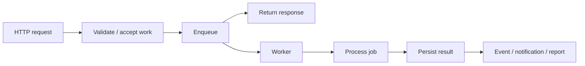
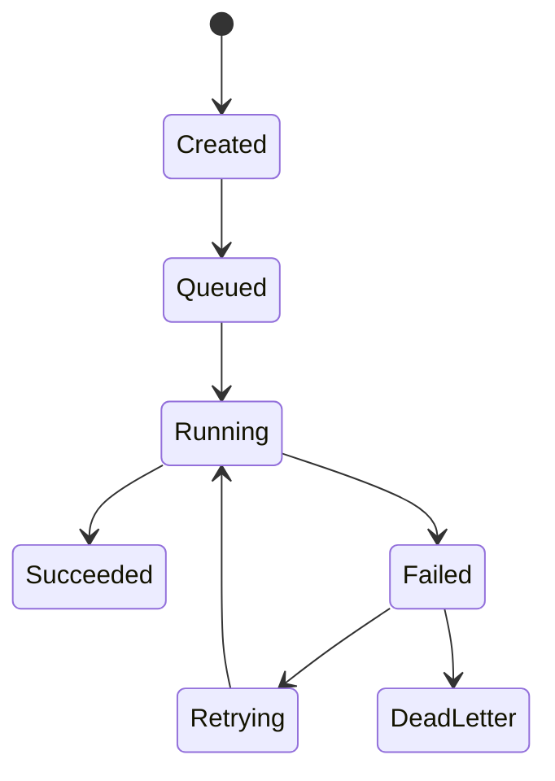
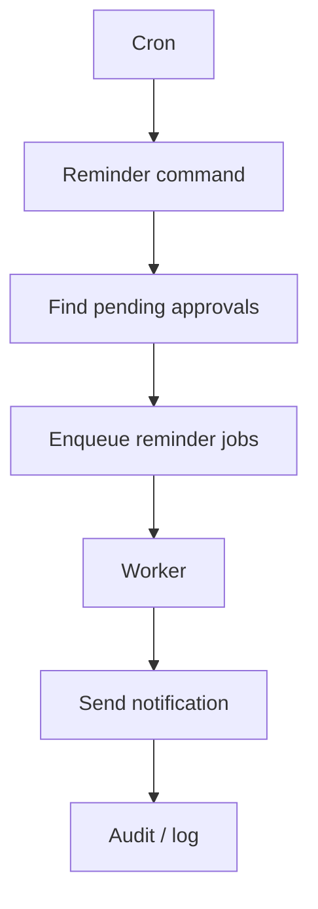
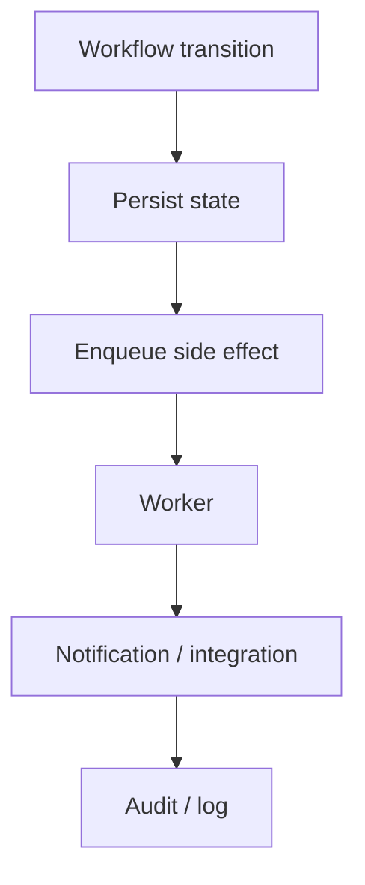
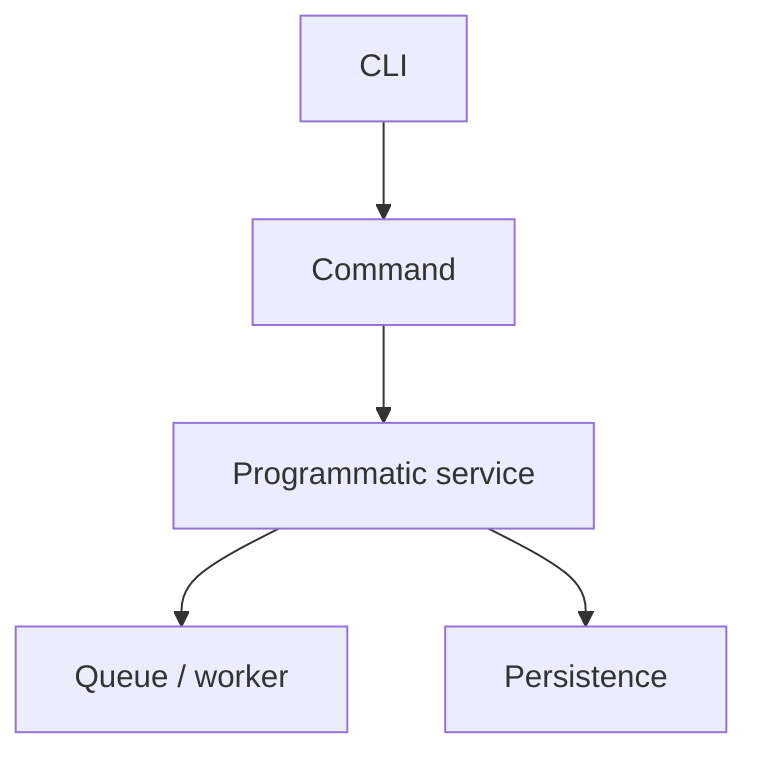

# 43. Queue, Cron, and Background Execution

A web request is usually short-lived, but real applications also perform work that is slow, large, repetitive, scheduled, retryable, or unnecessary to finish before the response.

This chapter separates **queue**, **worker**, and **Cron/scheduler** responsibilities.

> **Evidence boundary:** the repository identifies SppQueue and contains Cron/Scheduler command/runtime surfaces. Exact queue backend, acknowledgement, retry, locking, and worker-supervision semantics must be traced from the enabled implementation before being presented as guarantees.

---

## 43.1 Synchronous versus background work

A naive bulk import might do everything inside the HTTP request:

```text
receive upload
→ validate thousands of records
→ import
→ generate report
→ send notifications
→ return response
```

A background architecture separates acceptance from execution:



---

## 43.2 Queue versus Cron

**Queue:** “Run this unit of work asynchronously.”

**Cron:** “Run this work according to a schedule.”

They commonly cooperate:


Cron is the trigger; the queue can be the execution mechanism.

---

# Part I — Queue architecture

## 43.3 Why a queue exists

Typical asynchronous work includes:

```text
email/notifications
image processing
PDF generation
bulk imports
search/index refresh
slow external API calls
AI work
large reports
```

The SPP module inventory identifies **SppQueue** as the background/distributed-job subsystem. That establishes the subsystem boundary, not a blanket guarantee of distributed delivery semantics.

---

## 43.4 A job lifecycle

Use this as a conceptual model:



The actual states, retry count, dead-letter behavior, and persistence mechanism must follow the current SppQueue implementation.

---

## 43.5 Create the first job

Build:

```text
GenerateTaskSummaryReport
```

Payload:

```text
date range
organisation
requested_by
```

The payload should contain durable execution information, not an assumed-live HTTP request or controller object.

---

## 43.6 Worker responsibilities

A worker should conceptually:

1. receive a job;
2. validate the payload;
3. load required data;
4. perform the work;
5. persist the outcome;
6. emit relevant events/logs;
7. expose a useful failure state.

A worker cannot rely on the originating PHP request still existing.

---

# Part II — Retries and idempotency

## 43.7 Why retries are dangerous

If a worker performs an external side effect and crashes before recording completion, a retry may repeat that side effect.

Design retryable operations around an operation identity and state check where practical:

```text
job ID
+ business operation ID
+ state check
→ apply effect only when required
```

Idempotency is application design; it should not be assumed merely because a queue exists.

---

## 43.8 Failure injection exercise

Create a job that:

```text
persists its main result
→ fails before completion bookkeeping
→ is retried
```

Observe the duplicate-effect risk, then redesign the operation to make the intended effect idempotent.

---

# Part III — Cron and Scheduler

## 43.9 SPP Cron

The repository contains Cron/Scheduler surfaces including a `Scheduler.cron` implementation and CLI operations for scheduled work.

The exact command syntax should be taken from the current command implementation/documentation rather than copied from another framework.

---

## 43.10 Start with manual execution

Always prove the underlying operation before diagnosing the schedule:

```text
run manually
→ verify behavior
→ inspect diagnostics
→ schedule
→ verify scheduler path
```

This reduces the problem from “scheduler + business logic” to a smaller boundary.

---

## 43.11 Scheduled workflow example

For reminders on approvals older than 48 hours:



Keep the scheduler thin; put business behavior in testable services/jobs.

---

# Part IV — Long-running jobs

## 43.12 What long-running work must consider

```text
memory growth
timeouts
partial progress
restart behavior
concurrency
locks
external failures
logging
```

The exact worker lifecycle and process supervision remain implementation-specific.

---

## 43.13 Progress tracking

For a bulk import, persist useful status such as:

```text
job ID
status
total
processed
failed
started_at
finished_at
error details
```

That state can feed CLI, reports, LiveComponent, and SPPUX surfaces without coupling the worker to any particular UI.

---

# Part V — Queue + events + workflow

A job may emit meaningful lifecycle events:

```text
started
progress
succeeded
failed
```

Use events for genuinely decoupled consumers such as audit, logging, notifications, or indexing.

Workflow should remain the state machine while the queue handles asynchronous side effects:



Do not make every method call an event simply because SPP has an event system.

---

# Part VI — Queue + Parikshak

Test in layers:

```text
job logic
→ service logic
→ queue integration
→ scheduler integration
```

Add failure cases for:

```text
invalid payload
missing record
external failure
duplicate execution
worker exception
retryable failure
permanent failure
```

The goal is deterministic behavioral proof, not merely proving that a queue object can be instantiated.

---

# Part VII — CLI and operations

The SPP CLI provides Cron-oriented operations in the repository. Use the exact current command contract when teaching operators.

More importantly, preserve the architectural distinction:



The CLI is an interface. It is not automatically the internal API of every subsystem.

---

# Coming from other frameworks

### Laravel

Map SPP queue/Cron concepts to queues and scheduled tasks, but learn SPP's module, application-context, command, and runtime boundaries independently.

### Symfony

The conceptual comparison is Messenger + Scheduler/Console; do not assume identical lifecycle or transport semantics.

### Node.js

The worker model is familiar; the SPP-specific lesson is integration with application context, events, persistence, CLI, and modules.

---

# Kernel Hacker section

Trace a real execution as:

```text
command / trigger
→ scheduler or queue
→ worker
→ application service
→ persistence
→ events / logging
```

Verify the actual backend, acknowledgement, retry, locking, serialization, and failure behavior before documenting distributed guarantees.

## Practical assignment

Build:

```text
daily pending-approval Cron task
asynchronous notification job
hourly report job
```

Then add:

```text
Parikshak tests
failure injection
idempotency protection
logs/audit
LiveComponent progress
SPPUX monitoring
```
