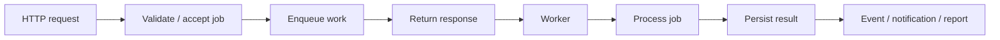
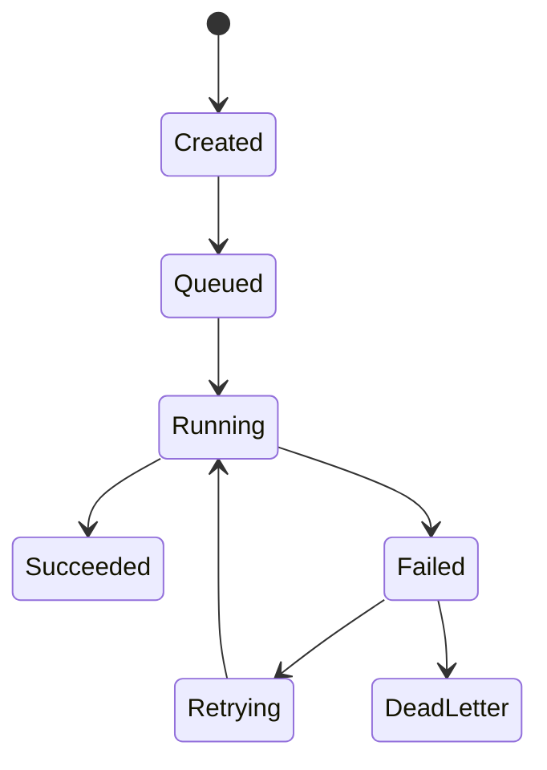
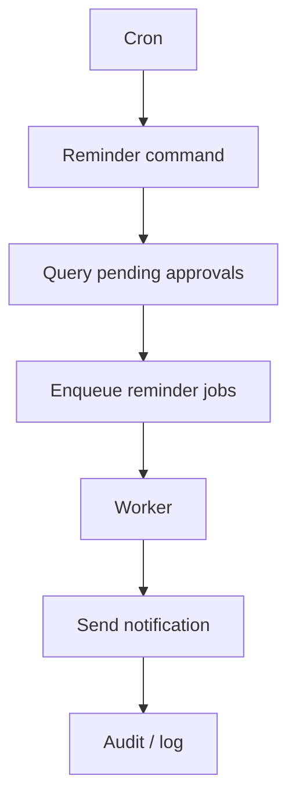
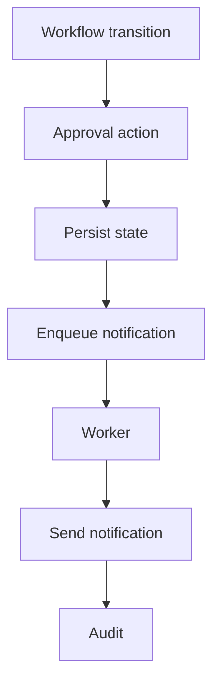

# 43. Queue, Cron, and Background Execution

A web request is usually short-lived.

But real applications have work that is:

```text
slow
large
repetitive
scheduled
retryable
not necessary to finish before the user sees the response
```

This chapter teaches how SPP moves such work out of the immediate request path.

---

## 43.1 Synchronous work versus background work

Imagine a user uploads 5,000 records.

A naive controller might do:

```text
receive upload
→ validate all 5,000 records
→ import all 5,000
→ generate report
→ send notifications
→ return response
```

The browser waits for everything.

A background design can instead do:



---

## 43.2 Queue versus Cron

These are related but different.

### Queue

A queue answers:

> "Run this unit of work asynchronously."

### Cron

Cron answers:

> "Run this work at a scheduled time or interval."

A cron task may itself enqueue a background job.


---

# Part I — SppQueue

## 43.3 Why a queue exists

A queue gives the application a place to put work that should be processed later.

Examples:

```text
send email
resize images
generate PDF
build report
reindex search data
process offline content
call a slow external service
run bulk imports
```

The repository's module index identifies **SppQueue** as the background-task/distributed-job subsystem.

The tutorial should teach queue concepts before assuming a particular backend.

---

## 43.4 A job has a lifecycle

A useful mental model is:



The exact retry/dead-letter semantics must follow the implementation enabled in the repository.

---

## 43.5 Create the first job

Use the Task Desk application and create:

```text
GenerateTaskSummaryReport
```

Input:

```text
date range
organisation
requested_by
```

The job should contain enough information to execute later without depending on the original PHP request object.

Do not put an entire live controller object into a queue payload unless the framework explicitly supports and serializes it safely.

---

## 43.6 Worker responsibilities

A worker should:

1. receive a job;
2. validate the payload;
3. load required data;
4. execute the work;
5. persist the outcome;
6. emit relevant events/logs;
7. report failure clearly.

A worker should not assume the request that created it is still alive.

---

# Part II — Idempotency and retries

## 43.7 Why retries are dangerous

Suppose a notification job sends an email and crashes afterward.

The queue may retry the job.

The recipient might receive the message twice.

Therefore retryable jobs should be designed around idempotency where practical.

A useful pattern is:

```text
job ID
+ business operation ID
+ state check
→ execute only when the intended effect has not already been committed
```

---

## 43.8 Deliberate retry exercise

Build a job that fails after persisting its main result but before recording completion.

Observe:

```text
attempt 1
→ partial success
→ failure

attempt 2
→ retry
```

Then redesign the job so the second attempt does not duplicate the effect.

This is one of the most useful enterprise lessons in queue architecture.

---

# Part III — Cron/Scheduler

## 43.9 SPP Cron

The repository contains a Cron/Scheduler subsystem with CLI operations such as run, list, and flush, plus a `Scheduler.cron` implementation and report-cron integration.

This means scheduled work is an explicit part of the SPP runtime/tooling surface.

---

## 43.10 Start with manual execution

Never begin debugging by waiting for a schedule.

The correct workflow is:

```text
run the command manually
→ prove the job works
→ inspect output/logs
→ schedule it
→ verify scheduler execution
```

This makes failures much easier to isolate.

---

## 43.11 Scheduled workflow example

Suppose finance approvals older than 48 hours need a reminder.



Cron schedules the work; queue workers perform the scalable work.

---

## 43.12 Cron should remain thin

Avoid placing huge business logic directly inside a cron callback.

Prefer:

```text
Cron command
    ↓
Service
    ↓
Queue
    ↓
Worker
```

This also makes Parikshak testing easier because the service and job can be executed independently of the clock.

---

# Part IV — Long-running jobs

## 43.13 Why long-running work is different

Jobs may run for minutes or hours.

They need to account for:

```text
memory growth
timeouts
partial progress
restarts
locks
concurrency
external API failures
logging
```

The exact worker lifecycle is implementation-specific, so the handbook must document the current SPP worker/queue behavior from source before promising particular process supervision semantics.

---

## 43.14 Progress tracking

For a bulk import, persist:

```text
job ID
status
total items
processed items
failed items
started_at
finished_at
error details
```

This enables:

```text
CLI monitoring
admin UI
LiveComponent status page
SPPUX dashboard
reports
```

One background job can therefore feed many frontend surfaces.

---

# Part V — Queue + events

## 43.15 Emit events at important boundaries

A job may emit:

```text
JobStarted
JobProgress
JobSucceeded
JobFailed
```

Use events for decoupled reactions such as:

```text
logging
notifications
audit
metrics
search refresh
```

Do not make every internal method call an event merely because an event system exists.

---

# Part VI — Queue + Workflow

Workflow and background execution naturally cooperate.

For example:



The workflow remains the state machine; the queue handles asynchronous side effects.

---

# Part VII — Queue + Parikshak

## 43.16 Test the job, not just the scheduler

The test hierarchy should be:

```text
1. job logic
2. service logic
3. queue integration
4. scheduler integration
```

A job should have deterministic tests that do not depend on the wall clock.

Then add one integration test proving that the scheduler invokes the expected command/job path.

---

## 43.17 Failure injection

Create tests for:

```text
invalid payload
missing record
external API failure
duplicate execution
worker exception
retry condition
permanent failure
```

A background system is not production-ready if only the happy path works.

---

# Part VIII — CLI operations

The SPP CLI includes Cron operations for:

```text
run
list
flush
```

Use the exact current command syntax from repository command documentation in exercises rather than copying syntax from unrelated framework examples.

Also teach the interactive SPP command mode as an operator/developer environment where available.

---

# Part IX — Architecture comparison

### Laravel

Laravel users can map SPP queues/Cron to queues and scheduled tasks, but should learn SPP's command and module integration rather than assuming identical APIs.

### Symfony

The closest conceptual mapping is Messenger + Scheduler/Console, but the implementation boundaries differ.

### Node.js

Queue workers are conceptually familiar; the SPP-specific lesson is how queue work integrates with the framework's application context, events, modules, CLI, and persistence.

---

# Kernel Hacker section

Repository landmarks include:

```text
SppQueue module
spp/core/class.scheduler.cron.php
CronRunCommand
CronListCommand
CronFlushCommand
sppreport_cron.php
queue/workers implementation
```

Trace a real execution from:

```text
command
→ scheduler
→ queue
→ worker
→ service
→ persistence/event/logging
```

Do not infer distributed delivery guarantees merely from the existence of a queue abstraction; verify the actual backend, acknowledgment, retry, locking, and failure behavior.

---

## Practical assignment

Build three related operations for Task Desk:

```text
1. daily pending-approval Cron task
2. asynchronous notification Queue job
3. hourly report generation job
```

Then add:

```text
Parikshak tests
failure injection
idempotency protection
logs/audit
LiveComponent progress display
SPPUX monitoring dashboard
```

This single exercise connects scheduling, queues, events, persistence, testing, and reactive UI.
