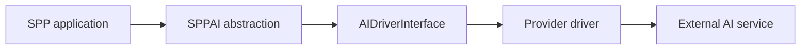
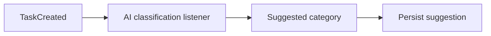
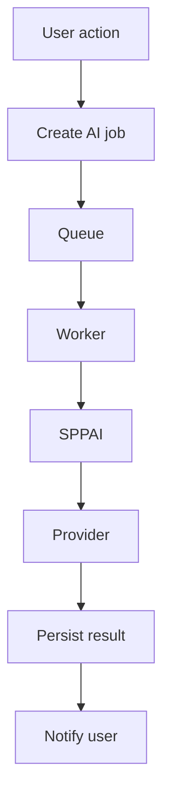
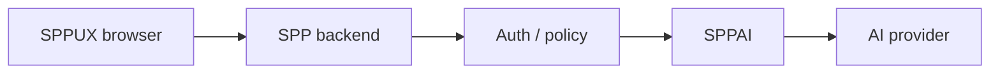
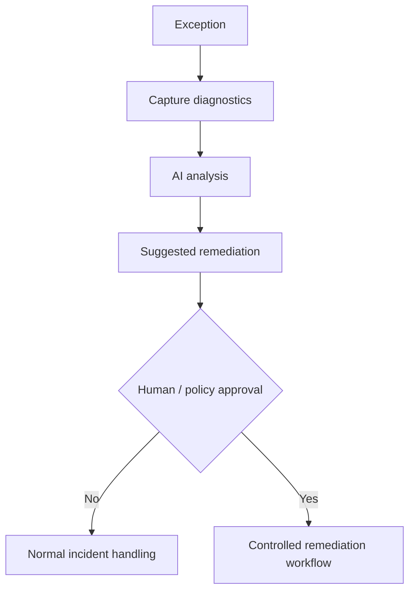

# 44. SPPAI: AI Integration from First Principles

SPP includes an AI integration layer. The repository exposes a central `SPPAI` abstraction, an `AIDriverInterface`, and provider-specific drivers.

This chapter teaches AI integration as an **application capability**, not as magic added to the framework.

---

## 44.1 What problem does an AI abstraction solve?

Without a framework abstraction, application code might directly call one provider:

```text
controller
  ↓
provider-specific HTTP SDK
  ↓
AI service
```

That makes provider changes expensive.

An abstraction creates a boundary:



The application asks for an AI capability instead of embedding every provider-specific detail everywhere.

---

# Part I — Learn AI application architecture

## 44.2 Model provider versus application feature

These are different concepts.

```text
AI provider
    = external model/service

AI capability
    = what your application wants to do
```

Examples of capabilities:

```text
summarize a document
classify a support ticket
generate a draft
extract structured information
translate content
suggest tags
analyze an exception
```

The application should ideally describe the capability first and the provider second.

---

## 44.3 Provider drivers

The repository contains concrete driver classes for multiple providers, including examples such as:

```text
ChatGPT
Claude
Gemini
Grok
DeepSeek
Sarvam
```

There is also an `AIDriverInterface`.

The important architectural lesson is:

> A driver is an implementation of the AI boundary; it should not become the application's domain API.

---

## 44.4 Build a summarization service

Create:

```text
TaskSummaryAiService
```

Input:

```text
task description
comments
approval history
```

Output:

```text
short summary
priority suggestion
risk notes
```

Keep the domain service independent of the concrete provider when possible.

---

# Part II — Prompt and output design

## 44.5 Treat AI output as untrusted input

AI output is not automatically correct.

The application should validate it just like data received from another external system.

For structured output:

```text
AI response
→ parse
→ schema validation
→ authorization/policy checks
→ persistence/use
```

Do not take arbitrary generated text and execute it as code.

---

## 44.6 Prompt construction is application logic

A prompt often depends on:

```text
user role
application state
business rules
locale
security policy
context window
```

Do not build complex prompts inside templates or controllers if the logic deserves its own service.

---

## 44.7 Provider switching exercise

Run the same `TaskSummaryAiService` against two different supported drivers.

The learner should observe:

```text
same application service
same capability
possibly different driver
possibly different output characteristics
```

Then add normalization so the rest of the application sees a stable internal result shape.

---

# Part III — AI + Events

AI features often become natural event consumers.

Example:



Do this only when asynchronous or decoupled behavior is actually useful. A synchronous business-critical decision may be better expressed as an explicit service call.

---

# Part IV — AI + Queue

AI calls can be slow or externally rate-limited.

For non-interactive use cases:



This connects SPPAI to the queue branch.

---

# Part V — AI + LiveComponent

A user may start an AI task and watch progress through LiveComponent.

The component should not necessarily contain the AI provider implementation itself.

Prefer:

```text
LiveComponent
  ↓
application service / command
  ↓
queue
  ↓
AI worker
  ↓
persist result
  ↓
component refresh
```

---

# Part VI — AI + SPPUX

SPPUX can present:

```text
pending
working
completed
failed
```

but browser code should not receive provider credentials.

The secure architecture is:



---

# Part VII — Security

AI integration creates several new security concerns:

```text
secret management
prompt injection
untrusted retrieved content
sensitive data sent externally
output validation
provider-specific data retention
cost controls
rate limits
```

The SPP security stack and application authorization rules remain important even though the model call itself is external.

---

# Part VIII — Testing AI features with Parikshak

Do not require live external AI calls for every unit test.

Instead test:

```text
prompt construction
request normalization
response parsing
schema validation
failure handling
provider selection
fallback behavior
authorization
```

Then add a small number of integration tests for actual provider connectivity where appropriate.

A useful test abstraction is:

```text
fake driver
→ deterministic response
→ application service
→ assertions
```

---

# Part IX — Failure handling

An external AI provider can fail because of:

```text
network error
quota
rate limit
invalid credentials
timeout
provider outage
invalid response
model availability
```

The application needs explicit handling for these classes.

Never turn an AI outage into an unexplained 500 error if the feature can degrade gracefully.

---

# Part X — Self-healing AI exception handling

The repository contains a tutorial for an AI-assisted exception handler.

Treat this as an **advanced experimental capability**, not as permission for production code to silently rewrite itself.

A safe teaching model is:



The critical architecture point is that diagnosis and remediation are separate concerns.

---

# Part XI — Coming from other ecosystems

### OpenAI/Anthropic SDK users

SPPAI adds a framework-level provider boundary. Keep your application capability separate from a particular SDK.

### Laravel AI integrations

The conceptual goal is similar: centralize provider interaction. SPP adds its own module/configuration/runtime architecture around it.

### Java/Spring developers

Think of `AIDriverInterface` like a provider abstraction or strategy boundary. Keep the domain service above it.

---

# Kernel Hacker section

Repository landmarks include:

```text
spp/modules/spp/sppai/class.sppai.php
SPPAI / AIDriverInterface
provider driver classes
SPPAI configuration
self-healing AI exception-handler tutorial
```

Trace:

```text
application service
→ SPPAI facade
→ driver selection
→ provider driver
→ external request
→ normalized result/error
```

Verify the installed implementation before making claims about retries, streaming, structured-output guarantees, provider failover, or secret storage.

---

## Practical assignment

Build an AI-assisted Task Desk feature:

```text
Task → summarize → classify → suggest priority
```

Then implement it in three ways:

```text
1. synchronous service
2. queued background job
3. LiveComponent progress UI
```

Finally expose the result in an SPPUX dashboard and add Parikshak tests using a fake AI driver.
