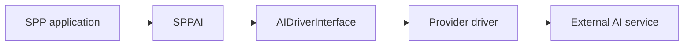
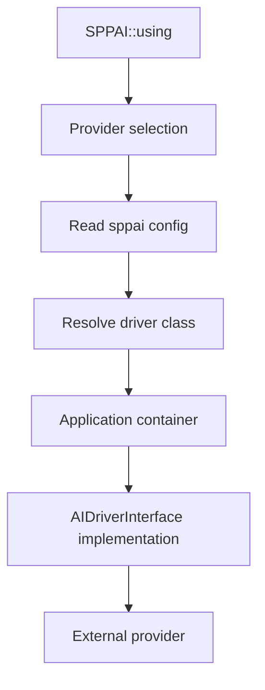
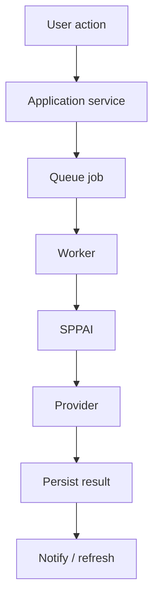
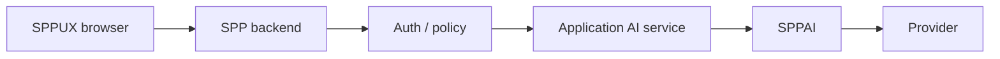
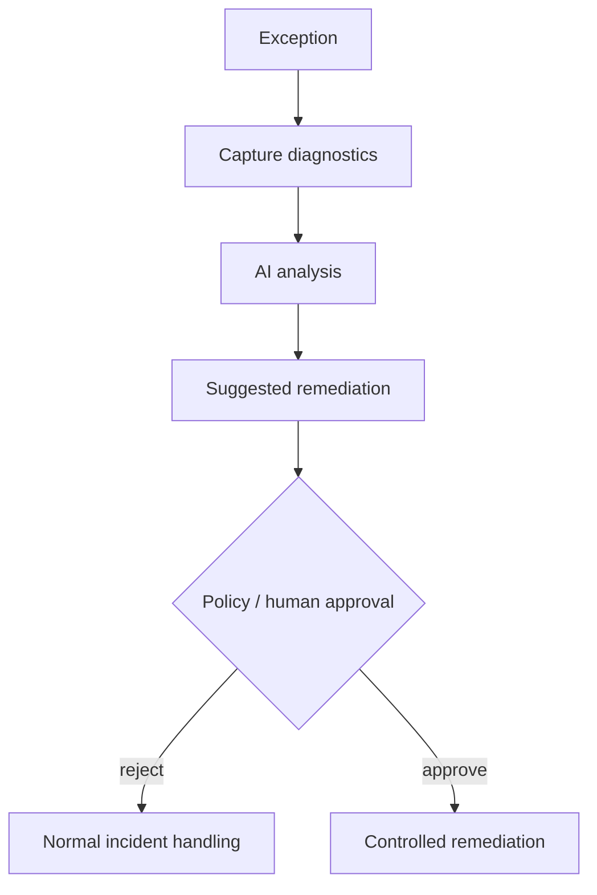

# 44. SPPAI: AI Integration from First Principles

SPP includes an AI integration layer built around `SPPAI`, `AIDriverInterface`, provider drivers, and configuration.

> **Evidence boundary:** current source establishes provider selection, model selection, completion/chat/embedding/tool/structured-output entry points, and provider configuration. It does **not** by itself establish universal retries, failover, safety, or production security.

---

## 44.1 What problem does an AI abstraction solve?

Without an abstraction:

```text
application
  ↓
provider-specific SDK
  ↓
AI service
```

With SPPAI:



The domain feature should depend on the capability it needs, not on provider-specific SDK details.

---

## 44.2 Current SPPAI facade

The current `SPPAI` implementation exposes these major operations:

```text
using(provider)
withModel(model)
complete(prompt, options)
chat(messages, options)
createEmbedding(text)
callTool(prompt, tools, options)
structured(prompt, jsonSchema, options)
getRegistry()
```

Provider selection is temporary: `using()` records the selected provider and `withModel()` records the selected model; driver construction then consumes those selections and clears the temporary selection.

The default provider is read from `sppai` configuration, with the current source falling back to `google` when no configured default is available.

---

## 44.3 Provider configuration

The current configuration defines provider entries including:

```text
google     → GeminiDriver
openai     → ChatGPTDriver
anthropic  → ClaudeDriver
deepseek   → DeepSeekDriver
sarvam     → SarvamDriver
```

Each configured provider can specify a default model and an environment-backed API key.

Treat model names as configuration data, not timeless framework constants. Provider/model availability changes independently of SPP.

---

## 44.4 Driver loading

The current facade resolves a configured driver class, loads the interface/driver file when necessary, constructs the driver through the application container, and applies a selected model when one was requested.

Conceptually:



This is an important source-backed distinction from simply wrapping an HTTP client.

---

# Part II — Build an application AI capability

## 44.5 Provider versus capability

```text
provider
    = external model/service

capability
    = application behavior
```

Examples:

```text
summarize a task
classify a ticket
extract structured fields
suggest tags
translate content
```

Create a domain-level service such as `TaskSummaryAiService` above SPPAI.

---

## 44.6 Treat AI output as untrusted input

A safe structured-output path is:

```text
AI response
→ parse
→ schema validation
→ authorization/policy checks
→ persistence/use
```

Do not execute arbitrary generated text as code.

---

## 44.7 Prompt construction is application logic

Prompts may depend on:

```text
user role
application state
business rules
locale
security policy
retrieved content
```

Keep complex prompt construction in a service rather than scattering it across templates and controllers.

---

# Part III — AI + events and queues

AI calls may be slow or externally rate-limited. For non-interactive work, combine SPPAI with the queue branch:



Do not assume the queue provides AI-specific retries or safe replay; those must be designed and verified separately.

---

# Part IV — AI + LiveComponent + SPPUX

Keep provider credentials on the server.



A LiveComponent can expose application progress such as:

```text
pending
working
completed
failed
```

The component should not become the provider integration layer.

---

# Part V — Security and the current AI manifest

The repository's current SPPAI facade also contains `generateAiManifest()`. It produces an OpenAPI-oriented metadata structure, including an API URL derived from the current application base URL.

**Important source finding:** the generated manifest currently sets:

```text
auth.type = none
```

Therefore the handbook must not describe this manifest as automatically authenticated or “zero-trust”. If the manifest endpoint is exposed, its actual access control must be established separately through the API/security boundary.

AI-specific security concerns include:

```text
secret management
prompt injection
untrusted retrieved content
sensitive-data disclosure
output validation
provider retention policies
cost controls
rate limits
```

---

# Part VI — Testing AI features with Parikshak

Prefer deterministic tests for:

```text
prompt construction
provider selection
request normalization
response parsing
structured-output validation
authorization
failure handling
```

A useful boundary is:

```text
fake AIDriverInterface
→ deterministic response
→ application service
→ Parikshak assertions
```

Use a small number of live-provider integration tests where connectivity itself is the subject under test.

---

# Part VII — Failure handling

External AI providers can fail through:

```text
network errors
rate limits
quota
invalid credentials
timeouts
provider outages
invalid responses
model availability changes
```

The application should classify failures and decide whether to retry, degrade, queue for later, or surface an error. Do not claim that SPPAI itself automatically solves every failure class without tracing the driver implementation.

---

# Part VIII — Self-healing AI

The repository also contains an AI-assisted exception-handler tutorial. Treat this as an advanced/experimental workflow rather than permission for silent self-modification.

A safer architecture is:



Diagnosis and remediation should remain separate trust boundaries.

---

# Coming from other ecosystems

### OpenAI/Anthropic SDK users

Treat SPPAI as the provider boundary and keep application capability logic above it.

### Laravel developers

The architectural analogy is a provider abstraction around application services; SPP adds its module/configuration/runtime model.

### Spring developers

Think of `AIDriverInterface` as a strategy/provider contract and the domain service as the layer above it.

---

# Kernel Hacker section

Current source landmarks:

```text
spp/modules/optional/sppai/class.sppai.php
spp/modules/optional/sppai/int.aidriver.php
spp/modules/optional/sppai/drivers/
spp/modules/optional/sppai/etc/config.yml
```

Trace:

```text
SPPAI::using / withModel
→ Module configuration
→ driver resolution
→ application container
→ AIDriverInterface implementation
→ external request
→ driver result/error
```

The module manifest currently declares `SPPAI`, `AIDriverInterface`, and provider drivers as autoloaded components.

Verify driver source before documenting streaming, retry, failover, structured-output enforcement, or provider-specific security semantics.

## Practical assignment

Build an AI-assisted Task Desk feature:

```text
Task
→ summarize
→ classify
→ suggest priority
```

Implement:

```text
1. synchronous service
2. queued background job
3. LiveComponent progress
4. SPPUX dashboard
5. Parikshak tests with a fake driver
```

Then deliberately break provider credentials and document the resulting failure boundary.