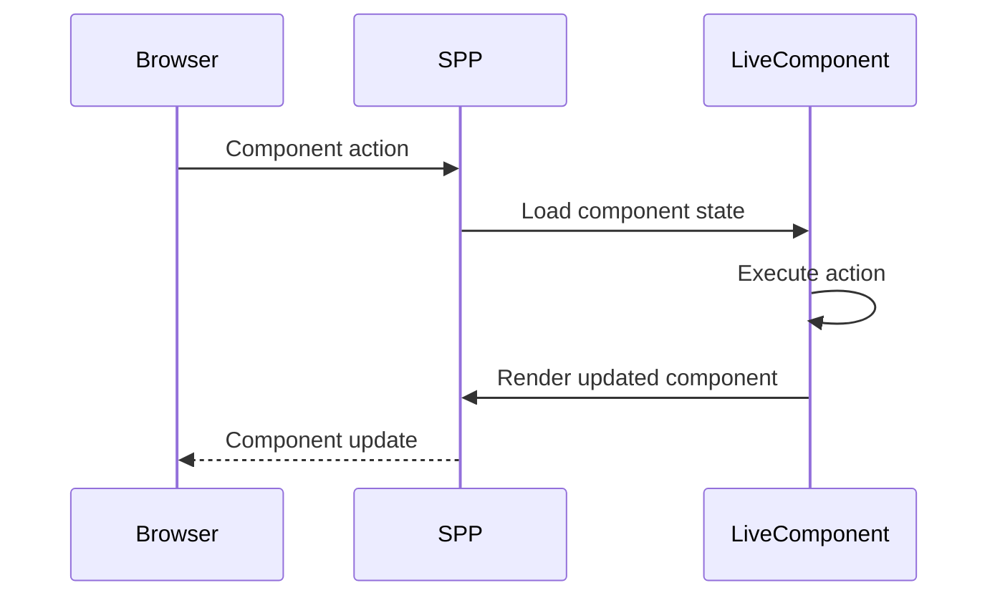
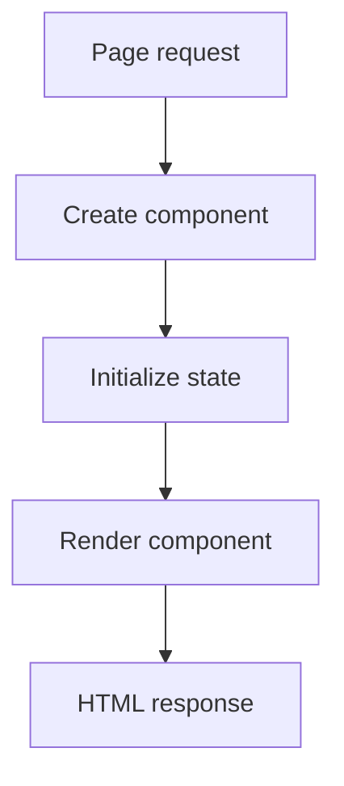
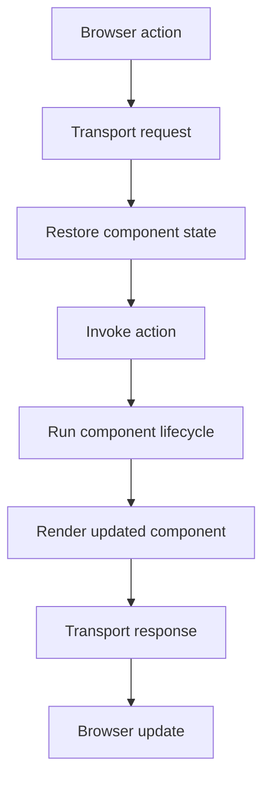
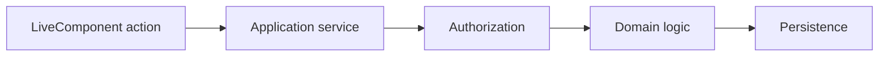
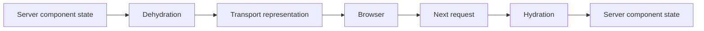
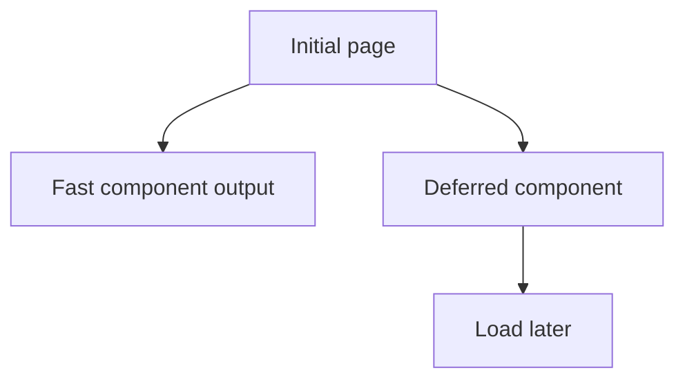
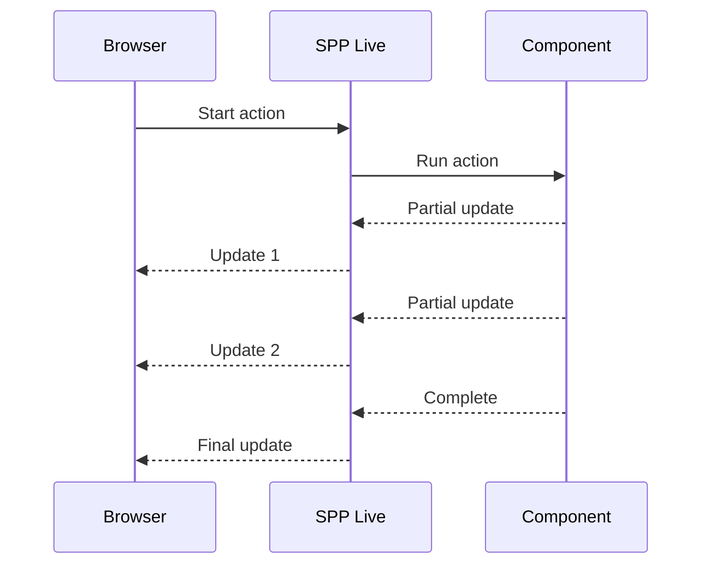

# 45. LiveComponent: Server-Side Reactive UI from Zero to Kernel

A traditional server-rendered page works like this:

```text
browser
→ HTTP request
→ PHP application
→ HTML response
→ browser reload
```

A LiveComponent keeps the component's authoritative state on the server while allowing the browser to interact with it without rebuilding the entire page after every small action.

This chapter teaches LiveComponent from first principles.

---

## 45.1 What problem does a reactive component solve?

Imagine a task editor.

Without reactive behavior:

```text
click "save"
→ submit form
→ request
→ render page
→ full page response
```

With a server-side component:



The important point is that the **component model remains server-side**.

---

# Part I — Component mental model

## 45.2 A component has identity, state, actions, and rendering

Think of a LiveComponent as:

```text
Component identity
+ public state
+ actions
+ lifecycle
+ rendered output
```

Example:

```text
TaskEditor
    id = 17
    title = "Prepare report"
    status = "review"
    action = save()
    render() = current UI
```

---

## 45.3 Why public state matters

A component needs a state model that can survive a request boundary.

Typical state:

```text
selectedTaskId
search
page
form values
validation errors
loading flags
```

State that should never cross the trust boundary should not be blindly exposed as public component state.

---

# Part II — Initial rendering

## 45.4 First render

The first request is usually a normal page render that includes the component output and the information the client needs for later interaction.

Conceptually:



The lifecycle details in the installed SPP version should be learned from `class.livecomponent.php` and the related renderer/dispatch code.

---

## 45.5 Subsequent action

A later interaction can be modeled as:



This is the central LiveComponent learning loop.

---

# Part III — Actions

## 45.6 An action is application behavior

A button might invoke:

```text
save()
archive()
assign()
approve()
addComment()
```

Keep actions thin enough to be understandable, but move important domain behavior into application services.

For example:



This prevents the UI component becoming the domain layer.

---

## 45.7 Validation

A component form often follows:

```text
input
→ component validation
→ business validation
→ authorization
→ persistence
```

A validation failure should normally update the component state rather than causing a mysterious server error.

---

# Part IV — Lifecycle

## 45.8 Lifecycle thinking

The exact lifecycle hook names must be verified from the installed LiveComponent implementation.

The conceptual stages are:

```text
construct/create
→ initial state
→ mount/initialization
→ action/update
→ computed/derived state
→ render
→ response
```

The repository implementation should be treated as authoritative if this conceptual sequence differs from a version's precise method names.

---

## 45.9 State hydration and dehydration

A server-side component needs a mechanism for the next request to understand the component's state.

Conceptually:



This is a security-sensitive boundary.

Do not assume that arbitrary private server state is safe merely because a framework offers component hydration.

---

# Part V — Computed state

## 45.10 Derived values

Sometimes a component has:

```text
selectedTask
pendingCount
canApprove
summaryText
```

Some values are derived from primary state rather than being independently stored.

Keeping derived values computed reduces inconsistent state.

Example:

```text
source state:
    task.status = "review"
    user.role = "manager"

computed:
    canApprove = true
```

The exact computed-state API must follow the installed SPP implementation.

---

# Part VI — Events

## 45.11 Component events versus kernel events

LiveComponent has component-level dispatch/action behavior.

SPP also has the kernel-wide `SPPEvent` system.

They should be distinguished:

```text
LiveComponent event/dispatch
    = reactive component interaction

SPPEvent
    = framework/application event infrastructure
```

A component can cooperate with kernel events, but they are not automatically the same thing.

---

# Part VII — Lazy and isolated rendering

Some components should not block initial page rendering.

Examples:

```text
analytics panel
large report
remote data widget
expensive dashboard card
```

Conceptually:



The exact lazy/isolated behavior must be traced from the SPP LiveComponent implementation before promising transport or concurrency semantics.

---

# Part VIII — Streaming

Streaming is useful when a component can produce incremental progress or content.

Examples:

```text
AI generation
large report generation
long-running analysis
progress updates
```

A conceptual flow is:



The actual transport mechanism belongs to the SPP Live chapter.

---

# Part IX — Error handling

A component action can fail because of:

```text
validation
authorization
business rule
network failure
database failure
unexpected exception
```

The UI should distinguish expected validation/business failures from unexpected system errors.

Advanced error boundaries and client behavior belong to SPPUX where the browser participates.

---

# Part X — Security

A LiveComponent should never be treated as a trusted client.

Every action must still enforce:

```text
authorization
input validation
CSRF/session requirements where applicable
server-side business rules
object-level access checks
```

The fact that the UI displays a button does not mean the server should trust an action invocation.

---

# Part XI — Testing with Parikshak

Component tests should cover:

```text
initial render
action invocation
valid input
invalid input
authorized user
unauthorized user
state changes
rendered result
failure handling
```

The exact component-testing helpers should come from the installed Parikshak/LiveComponent testing support.

A good test reads like a user story:

```text
Given manager is viewing Task 17
When manager approves the task
Then status becomes approved
And approval event is emitted
And audit record exists
```

---

# Part XII — Coming from other frameworks

### Livewire

The conceptual mapping is close: server-side component state plus client interaction. Do not assume identical lifecycle APIs or serialization semantics.

### Symfony UX Live Components

Similar server-side reactive patterns exist. SPP's transport and runtime architecture are its own.

### React/Vue

The important difference is where authoritative state lives. A conventional React/Vue application often treats the browser as the primary component runtime; LiveComponent keeps the framework component semantics server-side.

---

# Kernel Hacker section

Repository landmark:

```text
spp/modules/spp/sppview/class.livecomponent.php
```

Trace:

```text
initial page
→ component creation
→ state representation
→ action dispatch
→ lifecycle execution
→ render
→ transport encoding
→ browser update
```

Then compare that path with the transport implementation and SPPUX bridge.

Never infer security or transport guarantees merely from a public component property; verify hydration, signing/validation, and server-side checks in source/tests.

---

## Practical assignment

Turn the Task Desk detail page into a LiveComponent:

```text
edit task title
change priority
assign user
add comment
approve/reject
show validation errors
show processing state
```

Then add Parikshak tests for every action and one deliberate authorization bypass attempt.
