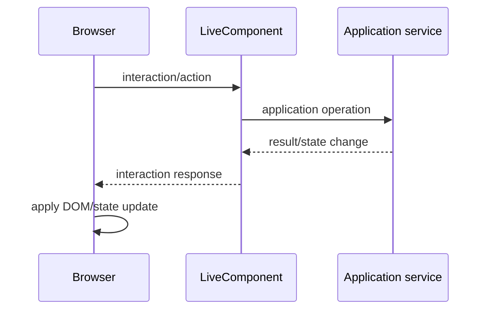
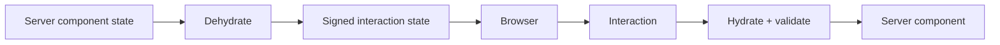
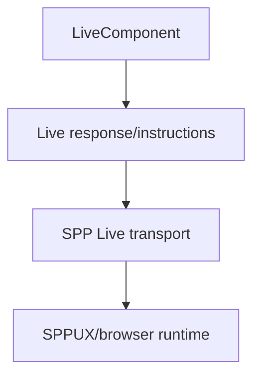

# 45. LiveComponent: From Zero to Kernel

LiveComponent is the server-side reactive component model in SPP. The browser interacts with a PHP component through a request/response contract while the component owns server-side state and lifecycle behavior.

> **Evidence boundary:** current architecture includes lifecycle hooks, signed dehydrated public state, `wire:id`, lazy loading, hydration/dehydration, computed/URL/session state, events, streaming/download/reset/pull/only operations, and multiple template forms. Exact browser transport is covered separately in Chapter 46.

---

## 45.1 Why LiveComponent exists

Traditional MVC:

```text
browser request
→ controller
→ render page
→ response
```

Reactive server components add an interaction loop:



The important point is that the component is still server-side PHP. It is not a browser JavaScript component.

---

## 45.2 Component lifecycle

A useful model is:

```text
construct/discover
→ boot
→ booted
→ mount
→ render
→ hydrate/dehydrate on interaction
```

Exact ordering should be verified against the current LiveComponent implementation when teaching a particular hook.

---

## 45.3 State is part of the protocol

A component interaction can require state to move between browser and server.

SPP therefore includes signed dehydrated public state. Conceptually:



Never treat client-supplied component state as trusted merely because it originated from a previous server render.

---

## 45.4 `wire:id` and component identity

A rendered component needs a stable identity so subsequent interactions can be associated with the correct component instance/state.

The current implementation uses `wire:id` in the LiveComponent protocol.

This is a protocol concern, not merely a CSS/HTML convenience.

---

# Part II — Actions and application services

## 45.5 Keep business logic above the component boundary

Prefer:

```text
LiveComponent
    ↓
application service
    ↓
domain/data operation
```

rather than putting provider calls, persistence policy, and complex business rules directly into component methods.

This makes the same behavior reusable from API, CLI, queue, or non-reactive HTTP paths.

---

## 45.6 LiveAction and response instructions

The SPP LiveAction surface supports response instructions including operations such as replace/morph, attribute changes, append/prepend/remove, redirect, notification, store synchronization, server-side rendering, modal operations, refresh, dispatch, script, alert, assignment, call, and clear.

The architectural model is:

```text
component/action
→ response instructions
→ live transport
→ browser runtime
```

Do not confuse these instructions with the transport itself.

---

# Part III — Computed, URL, session, and lazy state

LiveComponent supports specialized state patterns including computed values, URL-bound state, session-related state, and lazy components.

These should be taught as different ownership models:

| State type | Main concern |
|---|---|
| Public component state | interaction state |
| Computed state | derived server value |
| URL state | address/shareable state |
| Session state | server/session continuity |
| Lazy state | deferred initialization |

The implementation should be read before claiming caching or persistence semantics for any particular attribute.

---

# Part IV — Security

A reactive component introduces a larger attack surface than a static template because the browser can repeatedly request server-side actions.

Protect:

```text
component/action authorization
state integrity
CSRF/session boundaries
input validation
record-level authorization
rate limits where required
```

A signed state payload protects integrity of the serialized state; it does not replace authorization.

---

# Part V — LiveComponent versus SPP Live versus SPPUX

Keep the three layers separate:



If initial rendering fails, start with component discovery/lifecycle/rendering. If the response is correct but the DOM is wrong, investigate SPPUX. If the request cannot reach the server, investigate the transport/request boundary.

---

# Part VI — Testing with Parikshak

Test:

```text
initial render
lifecycle behavior
action authorization
state hydration/dehydration
invalid/tampered state
computed values
URL/session state
lazy loading
response instructions
```

The useful test is behavioral, not simply “component class instantiates”.

---

# Kernel Hacker section

Trace:

```text
component discovery
→ lifecycle
→ state dehydration
→ browser interaction
→ hydration/signature validation
→ action
→ LiveAction response
→ transport
→ browser runtime
```

Current source landmarks include the LiveComponent implementation, LiveAction, SPPView/Live attributes, and SPP Live/SSP UX integration.

## Practical assignment

Build a Task Desk component with:

```text
editable task
server-side validation
record-level authorization
optimistic-looking UI only where semantics permit
signed state
modal response
notification
Parikshak tests
```

Then tamper with the serialized state and explain which boundary rejects it.