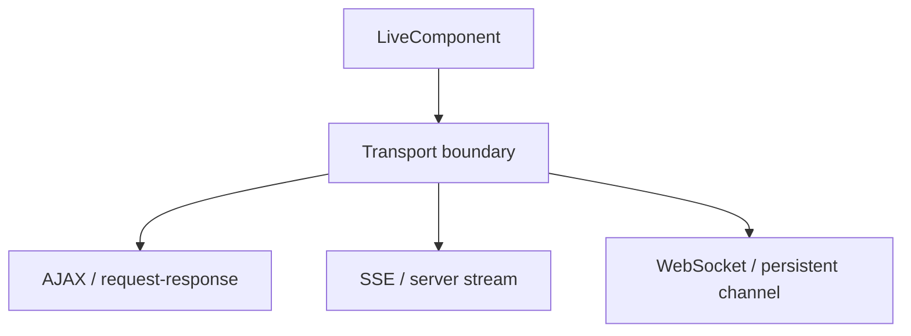
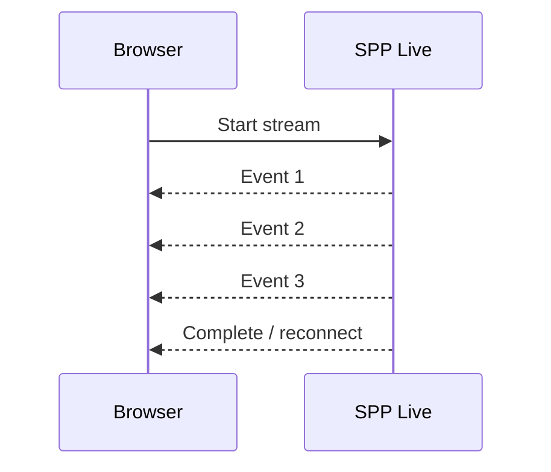
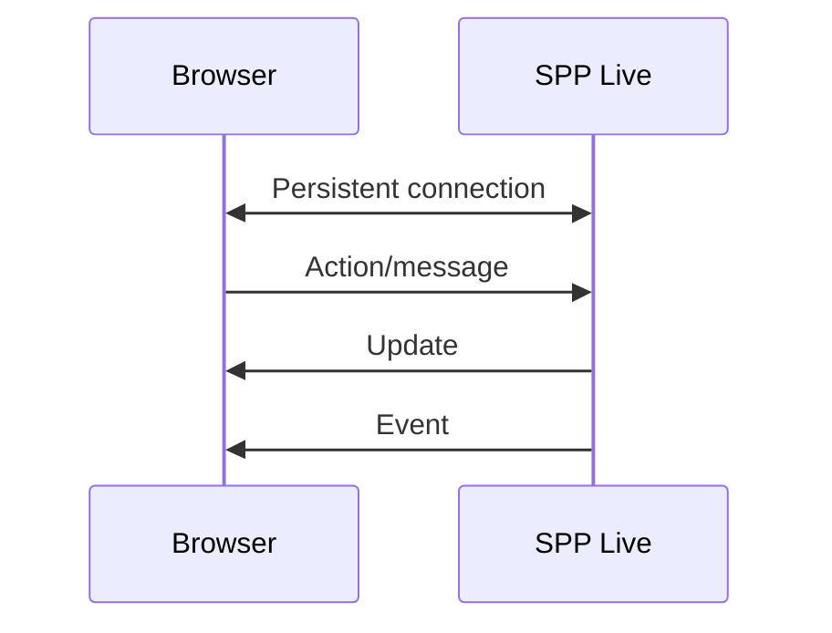
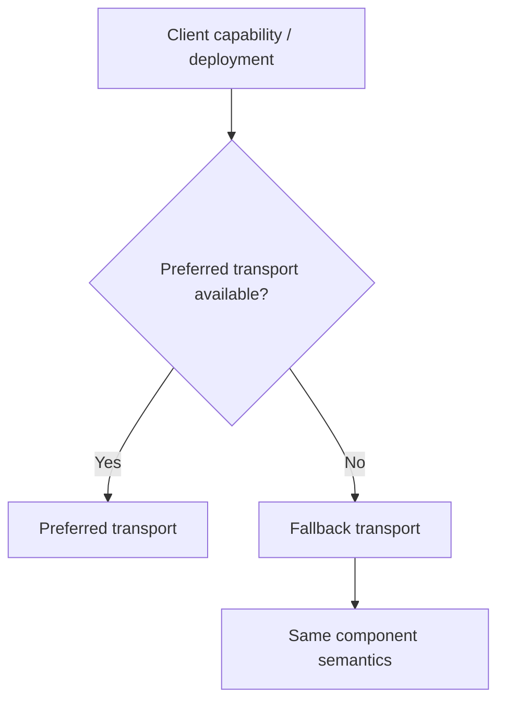

# 46. SPP Live: Transporting LiveComponent Updates

A LiveComponent explains **what the server-side reactive component is**.

SPP Live explains **how updates move between browser and server**.

These are different responsibilities.

---

## 46.1 Why separate the transport?

Imagine the same component running over different communication mechanisms.



The component should not have to become a different business component merely because the transport changes.

---

## 46.2 The three mental layers

A beginner should keep these separate:

```text
Component layer
    state, actions, lifecycle, rendering

Transport layer
    how requests/updates travel

Browser runtime
    how the browser applies the result
```

SPP Live mainly concerns the second layer, while SPPUX concerns the third.

---

# Part I — AJAX / request-response

## 46.3 The simplest transport

The simplest model is:

```text
Browser
→ HTTP request
→ SPP
→ LiveComponent action
→ response
→ Browser
```

This is easy to reason about and often a good fallback.

---

## 46.4 Why request-response can be enough

Use ordinary request-response transport when:

```text
updates are occasional
latency requirements are moderate
long-lived connections are unnecessary
infrastructure simplicity matters
```

Do not choose WebSockets merely because they sound more advanced.

---

# Part II — Server-Sent Events

## 46.5 What SSE solves

SSE is useful when the server needs to push a stream of updates to the browser over an HTTP-oriented connection.

Conceptually:



Typical use cases include:

```text
progress display
streaming output
notifications
AI generation
long-running report status
```

---

## 46.6 SSE is not a full bidirectional socket

The browser receives server events through the SSE stream, while the browser can still make ordinary requests back to the server.

That is different from a full-duplex WebSocket channel.

---

# Part III — WebSockets

## 46.7 What a WebSocket changes

A WebSocket creates a persistent bidirectional channel.



This can reduce repeated connection establishment and support highly interactive systems.

---

## 46.8 Where WebSockets are useful

Examples:

```text
collaborative UI
live monitoring
chat-style interaction
rapid updates
real-time operational dashboards
```

But they also introduce operational concerns:

```text
connection lifecycle
scaling
load balancing
reconnect behavior
authentication
memory usage
sticky/session requirements where applicable
```

Document only the guarantees supported by the SPP implementation.

---

# Part IV — Redis and SQLite transport/storage helpers

The repository contains transport-related infrastructure including Redis/SQLite-oriented components.

The important teaching point is to separate:

```text
transport protocol
```

from:

```text
state/backplane/storage mechanism
```

A Redis-backed mechanism can help coordinate state or communication without Redis itself being the browser transport protocol.

---

# Part V — Transport selection

## 46.9 Choose based on requirements

| Requirement | Typical starting point |
|---|---|
| Occasional component action | AJAX/request-response |
| Server push / progress | SSE |
| Highly interactive persistent channel | WebSocket |
| Distributed coordination/backplane | Redis where supported |
| Local/simple persistence/helper state | SQLite where supported |

This is an architectural guide, not a promise that every combination is supported by every SPP installation.

---

## 46.10 Transport fallback

An enterprise UI may choose a fallback strategy:



The transport abstraction is valuable precisely because the application feature should continue to make sense when the transport changes.

---

# Part VI — Security

Every transport must authenticate and authorize actions on the server.

Never assume:

```text
WebSocket = trusted
SSE = trusted
AJAX = trusted
```

All are user-controlled client interaction paths.

The security layer must continue to enforce:

```text
identity
permissions
CSRF/session rules where applicable
input validation
object-level authorization
rate limits
```

---

# Part VII — Failure and reconnect behavior

A transport tutorial is incomplete without failure.

Simulate:

```text
connection lost
server restart
slow network
duplicate action
out-of-order update
stale component state
```

The learner should understand what is guaranteed by the component protocol and what must be handled at the browser/runtime layer.

---

# Part VIII — Transport debugging

Use this sequence:

```text
1. Does the component action execute?
2. Does the transport request reach SPP?
3. Does authentication pass?
4. Does state hydrate correctly?
5. Does the action return successfully?
6. Is the transport response correctly encoded?
7. Does the browser runtime apply it?
```

This prevents blaming the transport when the actual bug is a component lifecycle or browser-runtime problem.

---

# Part IX — Parikshak testing

Test transport-independent behavior first:

```text
component state
component action
service/domain behavior
authorization
```

Then add transport-level integration tests where supported:

```text
request payload
response envelope
stream behavior
authentication failure
reconnect/failure behavior
```

Do not make every unit test depend on a real persistent socket.

---

# Part X — Coming from other frameworks

### Livewire

Think of SPP Live as the transport infrastructure behind a server-side reactive component model, while exact wire protocol semantics are SPP-specific.

### Phoenix LiveView

The separation between server-rendered component behavior and transport is conceptually familiar, but SPP provides its own transport engines and browser runtime.

### React + WebSocket

A typical React system may own most UI state in the browser and use sockets for data/events. LiveComponent instead keeps framework component semantics server-side.

---

# Kernel Hacker section

Repository areas to inspect include:

```text
sppview LiveComponent implementation
SPP Live transport module
AJAX transport classes
SSE implementation
WebSocket implementation
Redis-backed transport/state helpers
SQLite-backed helpers
```

Trace one action across the stack:

```text
browser event
→ transport request
→ SPP Live entrypoint
→ component resolution
→ state hydration
→ action
→ lifecycle
→ render/stream result
→ transport encoding
→ browser runtime
```

Keep protocol claims tightly tied to the actual implementation.

---

## Practical assignment

Run the same Task Desk LiveComponent over two transport modes where supported.

Measure and document:

```text
request behavior
latency
reconnection behavior
error handling
security checks
Parikshak coverage
```

Then explain why the component code did or did not need to change.
