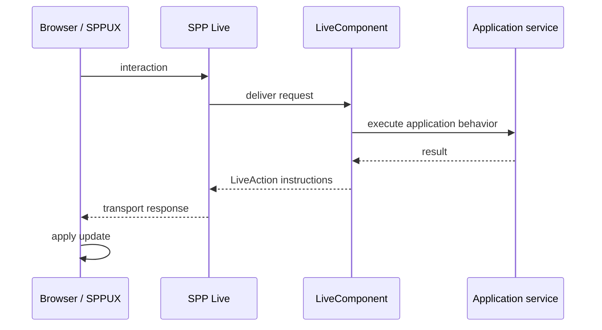

# 46. SPP Live: Transport Architecture

SPP Live is the transport layer that carries reactive server-component interactions. It should be understood separately from LiveComponent and separately from SPPUX.

```text
LiveComponent
    ↓
Live response/instructions
    ↓
SPP Live transport
    ↓
SPPUX/browser runtime
```

> **Evidence boundary:** the current source tree contains WebSocket, SSE, AJAX fallback, Redis-backed, and SQLite-backed live-engine components. Their presence establishes transport implementations; it does not automatically prove a particular deployment's failover order, durability, scalability, or delivery guarantees.

---

## 46.1 Why have a transport layer?

A server-side reactive component needs a way to communicate after the initial HTML response.

Possible transport families include:

```text
HTTP/AJAX
Server-Sent Events
WebSocket
```

SPP's architecture provides multiple engine implementations so the component model is not identical to one wire transport.

---

## 46.2 Transport versus protocol versus component

These are different layers:

| Layer | Responsibility |
|---|---|
| LiveComponent | server-side state/lifecycle/action |
| LiveAction | response instructions |
| SPP Live | transport/connection mechanism |
| SPPUX | browser-side interpretation/update |

Confusing these layers creates bad diagnostics.

---

## 46.3 Connection model

A simplified architecture is:



The exact message framing and handshake should be taken from the current transport implementation.

---

# Part II — Engines and fallback

## 46.4 Current transport surface

The source tree contains implementations/components associated with:

```text
WebSocket
SSE
AJAX fallback
Redis live engine
SQLite live engine
upload handling
server detection
live emission
```

A deployment should select a supported engine according to its actual configuration and runtime conditions.

Do not teach “WebSocket always wins” or a fixed fallback chain unless the current selector/source proves that exact behavior.

---

## 46.5 Why fallback matters

A transport can fail because:

```text
browser limitations
proxy restrictions
connection failure
server configuration
infrastructure policy
```

A fallback architecture can preserve application functionality when the preferred transport is unavailable, but fallback semantics must be verified rather than assumed.

---

# Part III — State and reconnection

A long-lived transport introduces lifecycle questions:

```text
connection lost
→ reconnect
→ identify component/session
→ restore or rebuild state
→ continue interaction safely
```

Never assume a browser reconnect means the server can safely reuse arbitrary stale state. State integrity and authorization remain server responsibilities.

---

# Part IV — Security

Transport security is not application authorization.

A secure architecture still requires:

```text
authenticated session/token where required
TLS at the deployment boundary
CSRF/session protections where applicable
component/action authorization
signed state validation
input validation
rate controls
```

A successful WebSocket connection does not mean that every LiveComponent action is authorized.

---

# Part V — Performance reasoning

The correct performance question is not simply “Is WebSocket faster?”.

Measure:

```text
connection overhead
message size
server processing time
serialization cost
frequency of updates
concurrent connections
reconnection behavior
```

Transport performance depends on workload and deployment.

---

# Part VI — Testing with Parikshak

Test transport-independent behavior first:

```text
component action
state validation
LiveAction instructions
authorization
```

Then test transport integration:

```text
connection
message delivery
failure handling
reconnect behavior where implemented
fallback selection where implemented
```

Do not make every application test depend on a real long-lived WebSocket connection.

---

# Kernel Hacker section

Trace:

```text
browser
→ server detector / transport selection
→ live engine
→ request dispatch
→ LiveComponent
→ LiveAction response
→ engine emitter
→ browser
```

Repository landmarks include the SPP Live engines, `AjaxFallbackEngine`, `WebsocketLiveEngine`, `RedisLiveEngine`, `SqliteLiveEngine`, `SSEHandler`, `ServerDetector`, `UploadHandler`, and `LiveEmitter`.

Verify exact selector and failure semantics from source before documenting a production topology.

## Practical assignment

Run the same Task Desk interaction through the available live transport paths. Deliberately make the preferred path unavailable and document what the current installation actually does—not what you expected it to do.