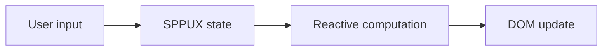
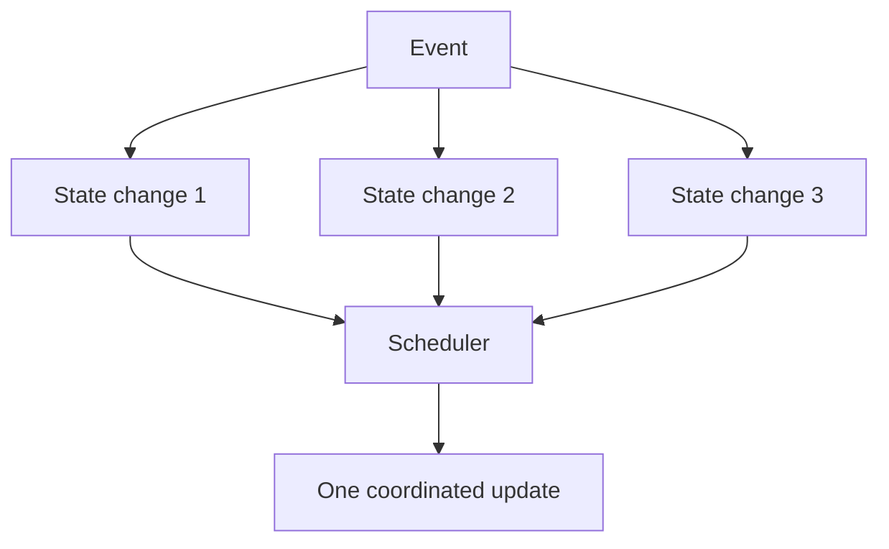
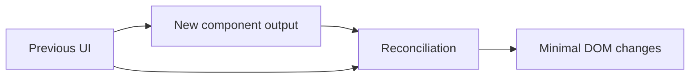
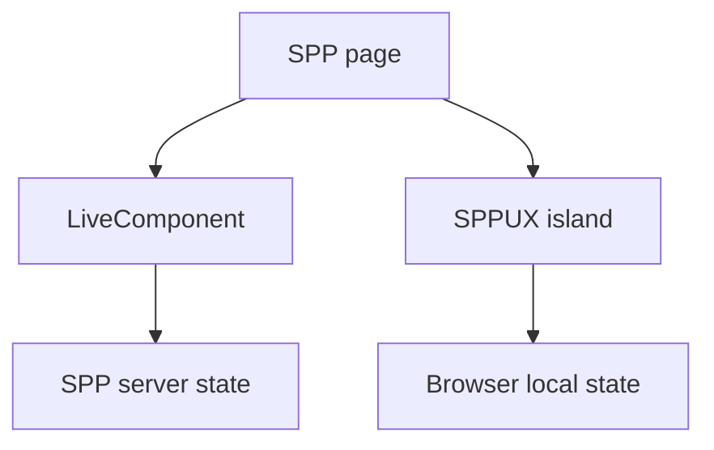
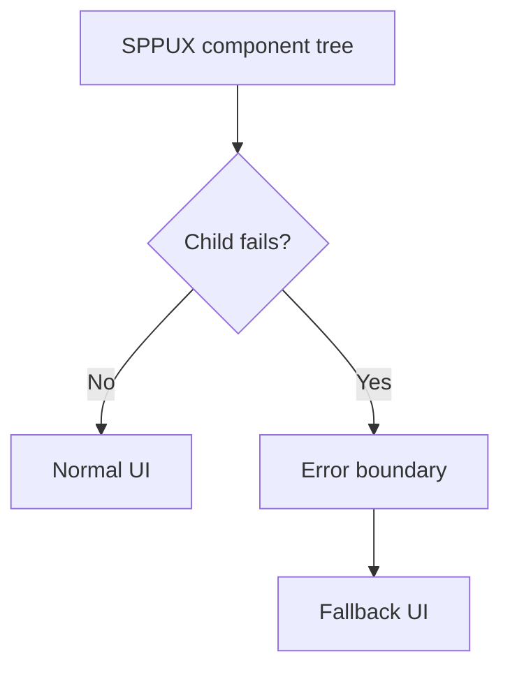
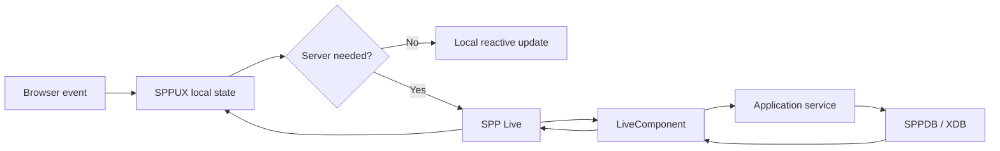

# 47. SPPUX: Browser-Side Reactive Architecture from Zero

SPPUX is the browser-side reactive layer of the SPP ecosystem.

A beginner who only knows PHP may ask:

> "Why do I need another runtime if PHP already renders the page?"

Because some interactions should happen immediately in the browser without asking the server to rebuild everything.

---

## 47.1 Server rendering versus browser reactivity

A classic server-rendered interaction is:

```text
click
→ browser sends request
→ server executes PHP
→ server returns HTML
→ browser updates page
```

A browser reactive interaction can be:



SPPUX lets the browser perform appropriate local updates while the server remains available for authoritative operations and data.

---

# Part I — The browser runtime

## 47.2 What a browser runtime does

A browser runtime can manage:

```text
state
events
computed values
effects
rendering
DOM updates
scheduling
errors
component coordination
```

SPPUX provides these kinds of capabilities as a framework runtime rather than requiring each application to build them from scratch.

---

## 47.3 Signals

The simplest reactive primitive is a changing value that other code can observe.

Conceptually:

```text
count = 0

count changes
    ↓
observers become eligible to run
```

The exact SPPUX signal API should be taken from the installed runtime implementation/documentation.

---

## 47.4 Computed values

A computed value derives from other state.

Example:

```text
firstName = "Satya"
lastName = "Shukla"

fullName = firstName + " " + lastName
```

When either source changes, the derived value should update according to the runtime's dependency tracking.

---

# Part II — Effects and scheduling

## 47.5 Effects

An effect performs work because reactive state changed.

Examples:

```text
update a counter display
persist a browser preference
refresh a visual indicator
request a server update
```

Effects must be designed carefully so they do not create accidental feedback loops.

---

## 47.6 Batching

Suppose three state values change during one event.

A naive UI might render three times.

A reactive scheduler can group the work:



SPPUX includes scheduler/batching concepts; the actual API and timing behavior must be verified from the installed source.

---

# Part III — Templates

## 47.7 Why templates matter

A reactive runtime needs a way to express what the UI should look like.

SPPUX provides tagged-template/component-oriented rendering facilities.

A beginner should think:

```text
state
+ template
→ UI
```

The runtime then determines which DOM work is necessary when state changes.

---

## 47.8 DOM reconciliation

A complete page rewrite is expensive and can disrupt user interaction.

A reconciler instead tries to update only the affected parts.



The exact reconciliation algorithm is implementation-specific.

---

# Part IV — Events

## 47.9 Browser events

SPPUX handles browser interactions such as:

```text
click
input
change
submit
keyboard
pointer interactions
```

The browser event system is distinct from SPP's kernel `SPPEvent` mechanism.

The relationship is:

```text
browser event
→ SPPUX runtime
→ local reactive update
or
→ server interaction
```

---

# Part V — Components

## 47.10 Browser component versus LiveComponent

This distinction is crucial.

### LiveComponent

```text
component semantics
→ server
```

### SPPUX component

```text
component semantics
→ browser
```

A combined application can use both.



---

# Part VI — Error boundaries

## 47.11 Why a browser runtime needs error isolation

One component should not necessarily destroy the entire page when it throws an exception.

An error boundary can provide controlled containment and a fallback UI.

Conceptually:



The actual SPPUX boundary API should be taken from the installed runtime.

---

# Part VII — SPPUX versus LiveComponent

| Question | LiveComponent | SPPUX |
|---|---|---|
| Primary runtime | Server | Browser |
| State authority | Server-side component | Browser reactive state for local interactions |
| Best for | Server-driven application state | Immediate browser interaction |
| Communication | Uses SPP Live | May remain local or call server |
| Security authority | Server | Server remains authoritative for protected operations |

Do not use SPPUX to move authorization decisions into the browser.

---

# Part VIII — Full-stack reactive pattern

The strongest SPP application can combine all three layers:



This allows developers to put logic where it belongs:

```text
instant presentation → browser
application authority → server
persistence → data layer
```

---

# Part IX — Security

The browser is never trusted simply because SPPUX uses framework-generated code.

Do not put in SPPUX:

```text
secrets
provider API keys
authorization rules as the sole enforcement
trusted database operations
```

The browser can suggest an action. The server decides whether that action is allowed.

---

# Part X — Testing

A complete SPPUX test strategy should distinguish:

```text
pure reactive logic
component rendering
browser interaction
server integration
```

Use deterministic unit-level tests for state/computation where possible, then browser/integration testing for actual DOM behavior where supported by the project tooling.

Combine this with Parikshak for server-side behavior.

---

# Part XI — Practical Task Desk dashboard

Create an SPPUX dashboard containing:

```text
open task count
pending approval count
filters
sort state
search input
live progress card
```

Local-only state:

```text
search text
sort choice
expanded/collapsed cards
selected dashboard filter
```

Server-required state:

```text
task approval
persistent filter preference
secure task details
AI processing
```

This teaches the most important architectural skill:

> **Do not send work to the server merely because the framework can; do not keep authoritative work in the browser merely because the browser is fast.**

---

# Part XII — Coming from other ecosystems

### React

SPPUX will feel familiar in its reactive/browser-component role, but its exact signals, templates, scheduler, and reconciler are SPP-specific.

### Vue

Computed/effect/reactive concepts are familiar. Learn SPPUX's actual primitives instead of translating Vue syntax mechanically.

### Alpine.js

The lightweight browser-side interaction idea is similar, but SPPUX is a fuller runtime with explicit component and scheduling infrastructure.

---

# Kernel Hacker section

Repository landmarks include:

```text
SPPUX documentation
spp/modules/spp/drishyam/class.sppux.php
SPPUX runtime source
scheduler/batching implementation
reactive primitives
reconciler
error boundaries
bridge/integration code
```

Trace one dashboard interaction:

```text
DOM event
→ SPPUX event handling
→ reactive state
→ scheduler
→ template/component computation
→ reconciliation
→ DOM update
```

Then trace a server-required action:

```text
DOM event
→ SPPUX
→ SPP Live
→ LiveComponent
→ application service
→ persistence
→ transport response
→ SPPUX update
```

Do not assume that an internal class name implies a particular reconciliation or scheduling algorithm; verify the source.

---

## Practical assignment

Build the Task Desk dashboard in three stages:

1. local-only reactive dashboard;
2. server-backed dashboard using LiveComponent/SPP Live;
3. hybrid dashboard where SPPUX handles local interaction and SPP handles authoritative operations.

Then document why each piece lives where it does.
