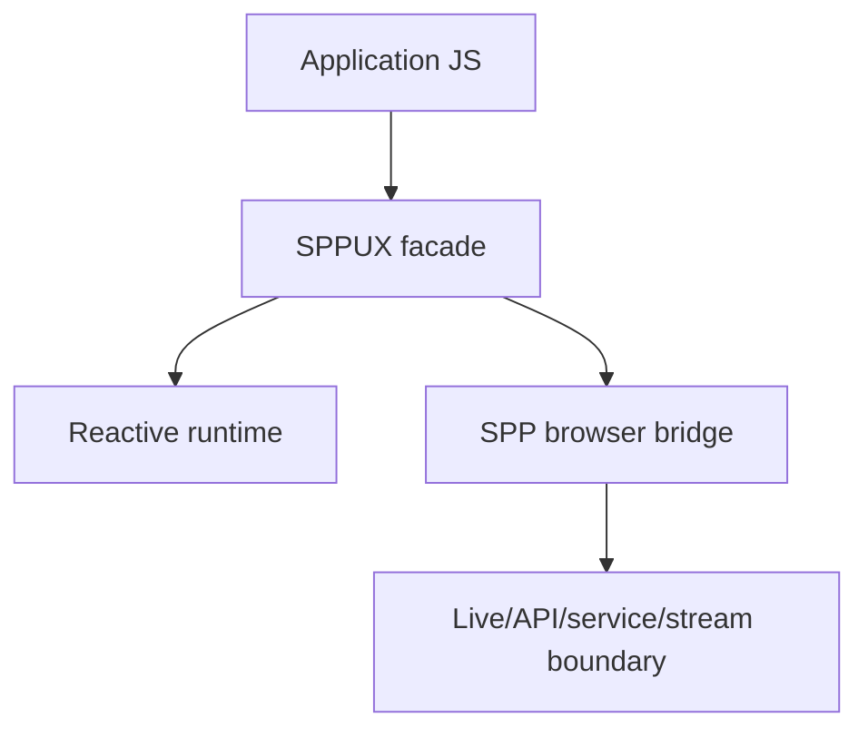
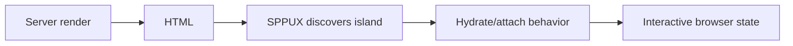

# 47. SPPUX: Browser Runtime from Zero

SPPUX is the browser-side runtime/facade that turns SPP's server-side reactive contracts into browser behavior.

The clean mental model is:

```text
LiveComponent / server
        ↓
LiveAction / interaction response
        ↓
SPP Live transport when applicable
        ↓
SPPUX browser runtime
        ↓
DOM / browser state
```

> **Evidence boundary:** current repository material exposes an SPPUX JavaScript facade/runtime/bridge, reactive primitives, component discovery/mounting concepts, SSR/island concepts, and service/API/stream bridges. Exact browser APIs and build integration must follow the installed source.

---

## 47.1 Why a browser runtime exists

Without a framework runtime, every application writes its own code for:

```text
DOM updates
event handling
server interaction
state synchronization
component mounting
```

SPPUX provides a common browser-side layer for these interactions.

---

## 47.2 SPPUX is not LiveComponent

This distinction is fundamental:

| Layer | Runs where? | Main job |
|---|---|---|
| LiveComponent | PHP/server | state, lifecycle, actions, rendering |
| SPP Live | server/network | interaction transport |
| SPPUX | browser | client runtime and DOM/state behavior |

A browser bug can therefore exist even when the PHP component is correct.

---

## 47.3 Facade and browser runtime

The current SPPUX JavaScript surface acts as a facade/re-export layer over reactive runtime primitives while also providing browser integration/bridge behavior.

Conceptually:



The exact exported functions should be read from the current generated/build source rather than inferred from names.

---

# Part II — Component discovery and mounting

A browser runtime needs to know where a server/client component belongs in the document.

The current architecture includes component discovery and mount-point concepts, including SSR/island-oriented integration.

A useful lifecycle is:

```text
HTML/SSR output
→ discover mount point
→ initialize runtime
→ attach behavior
→ interact
→ update state/DOM
```

---

## 47.4 SSR and islands

Server rendering and browser enhancement are complementary:



Do not assume every component is an island or every page requires full client-side rendering.

---

# Part III — Actions

The browser should send an interaction request rather than embedding server credentials or provider logic.

```text
user interaction
→ SPPUX action
→ SPP backend
→ authorization
→ application service
→ LiveAction/API response
→ SPPUX update
```

Current SPP LiveAction supports browser-facing instruction types such as DOM morph/replace, attributes, append/prepend/remove, redirects, notifications, store synchronization, server rendering, modal operations, refresh, dispatch, scripts, alerts, assignment, calls, and clearing state.

Treat these as response instructions, not as arbitrary permission to execute untrusted server-provided code.

---

# Part IV — Browser security

Never place these in browser source:

```text
AI provider API keys
database credentials
server signing secrets
private integration credentials
```

Browser input is untrusted. Server-side authorization remains authoritative.

A reactive UI does not remove the need for:

```text
CSRF/session protection
input validation
record-level authorization
output encoding
rate controls
content-security considerations
```

---

# Part V — SPPUX and SPPAPI

SPPUX may consume application APIs, but the API boundary remains separate:


Do not treat “called from SPPUX” as an authorization rule.

---

# Part VI — Testing with Parikshak

Test the server contract separately from browser behavior:

```text
server component/action contract
→ response instructions
→ browser integration
```

Browser-focused tests should cover:

```text
mounting
action dispatch
DOM/state update
error handling
reconnection/fallback behavior where relevant
```

Use deterministic fixtures and avoid making the entire application test suite depend on live external services.

---

# Part VII — Coming from React/Vue

React/Vue developers will recognize reactive state and component mounting, but SPPUX has a different server relationship:

```text
React/Vue
    browser component owns most UI execution

SPP Live + LiveComponent + SPPUX
    server component owns PHP lifecycle
    browser runtime handles interaction/update behavior
```

The boundary is architectural, not merely syntactic.

---

# Kernel Hacker section

Trace:

```text
SPPUX entry/facade
→ runtime primitive
→ bridge
→ API/live request
→ server response
→ DOM/store update
```

Also inspect template integration (`@sppux`, reactive directives, component discovery, SSR/island mount points) before describing a feature as universal.

## Practical assignment

Build a Task Desk dashboard with:

```text
server-rendered initial page
SPPUX mount point
live task update
notification
modal
API-backed search
error state
```

Then break the server response and diagnose whether the failure is in the component, transport, or browser runtime.