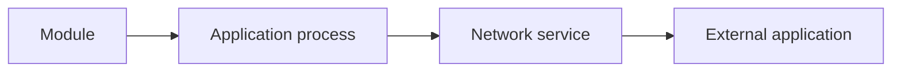
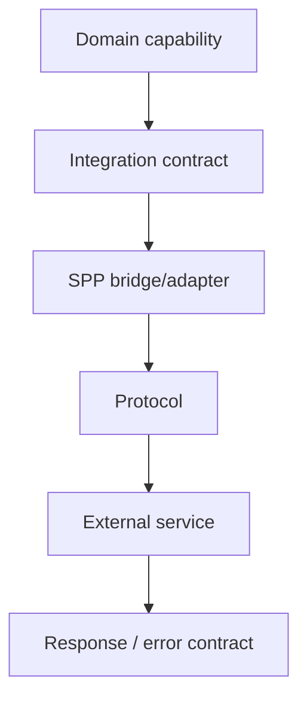
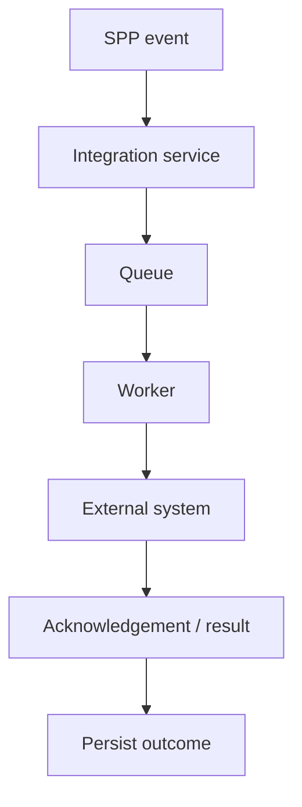

# 48. Polyglot, IPC, and External Application Architecture

SPP can participate in systems larger than one PHP process. This chapter teaches the difference between a framework module boundary, a process boundary, a network boundary, and an external application boundary.

> **Critical evidence rule:** “IPC” is a category, not a protocol. The repository contains polyglot bridge abstractions and external-application integration documentation, but a protocol, serialization format, retry policy, authentication mechanism, or delivery guarantee must be traced from the concrete implementation before being presented as current behavior.

---

## 48.1 Why external boundaries exist

An application may need to cooperate with:

```text
Python service
Node service
legacy PHP application
WordPress
mobile/backend service
external SaaS
separate SPP application
```

The important question is not “Can SPP call it?” but:

> **What contract exists across the boundary, and who owns failure and security?**

---

## 48.2 Four boundaries



A function call inside one PHP process has very different failure semantics from an HTTP request to another service.

---

## 48.3 Polyglot bridge

The repository exposes polyglot bridge abstractions and language-specific bridge concepts.

A useful architecture is:

```text
SPP application
    ↓
bridge contract
    ↓
protocol adapter
    ↓
external process/service
```

Keep the domain contract independent of a particular language where possible.

---

# Part II — IPC is a family of mechanisms

Possible mechanisms include:

```text
HTTP
message queue
socket/stream
CLI/process execution
shared storage
```

These are not interchangeable. Each has different:

```text
latency
failure modes
security boundary
serialization
back-pressure
retry behavior
observability
```

Document the concrete protocol instead of using “IPC” as if it were one technology.

---

## 48.4 Contract-first integration

Define:

```text
request schema
response schema
error schema
version
authentication
timeouts
idempotency
```

Then implement the adapter.



---

# Part III — External applications

The repository contains tutorials describing legacy/external application integration. Such material should be treated as a pattern until the current executable path is verified.

The enterprise model is:

```text
SPP application
      ↓
integration boundary
      ↓
external application
      ↓
its own data/runtime
```

Do not pretend that an external application becomes part of SPP's transaction, security, or deployment boundary merely because it is mounted behind an SPP route.

---

## 48.5 Data ownership

Decide explicitly:

```text
Who owns the record?
Who may mutate it?
Which system is authoritative?
How are conflicts resolved?
What happens if synchronization fails?
```

A shared database is not automatically a safe integration architecture.

---

# Part IV — Reliability

External calls fail independently:

```text
timeout
connection refusal
authentication failure
invalid payload
partial response
remote overload
remote deployment
```

Design explicit failure behavior:

```text
retry where safe
idempotency
circuit/degradation strategy where appropriate
queue asynchronous work when appropriate
operator visibility
```

Do not claim that the bridge automatically provides these features without source evidence.

---

# Part V — Security

At an external boundary, define:

```text
identity
credential custody
authorization
transport protection
input validation
output validation
secret rotation
least privilege
```

The calling application's authentication does not automatically authenticate the external service.

Likewise, a valid external response does not automatically mean that the response is safe to persist or execute.

---

# Part VI — Events and queues

For asynchronous integration:



This is often easier to retry and observe than making a user request wait for a slow external system.

---

# Part VII — Testing with Parikshak

Use a fake external adapter for deterministic tests:

```text
application service
→ fake bridge
→ deterministic response/error
→ Parikshak assertions
```

Then add integration tests for the real protocol:

```text
schema compatibility
authentication
timeouts
error mapping
retry/idempotency behavior
```

Test failure as seriously as success.

---

# Coming from other ecosystems

### Microservices

SPP can participate in service architectures, but do not call every module a microservice. A microservice has an independent process/deployment/ownership boundary.

### Spring Integration

The closest conceptual mapping is an adapter/message boundary; SPP's bridge implementation and runtime integration must be learned separately.

### WordPress/legacy applications

Treat the legacy system as an external runtime with its own lifecycle and security model, not as a PHP module simply because both execute on a web server.

---

# Kernel Hacker section

Trace a concrete integration as:

```text
application capability
→ integration adapter
→ protocol/transport
→ external runtime
→ response/error mapping
→ persistence/event/audit
```

Repository landmarks include polyglot bridge abstractions and legacy/external application integration tutorials.

Verify the actual protocol, authentication, serialization, retry, correlation, and failure semantics before documenting them as framework guarantees.

## Practical assignment

Build a small Task Desk integration with a fake external service first, then a real protocol adapter. Inject timeout and malformed-response failures and document the boundary at which each failure is detected.