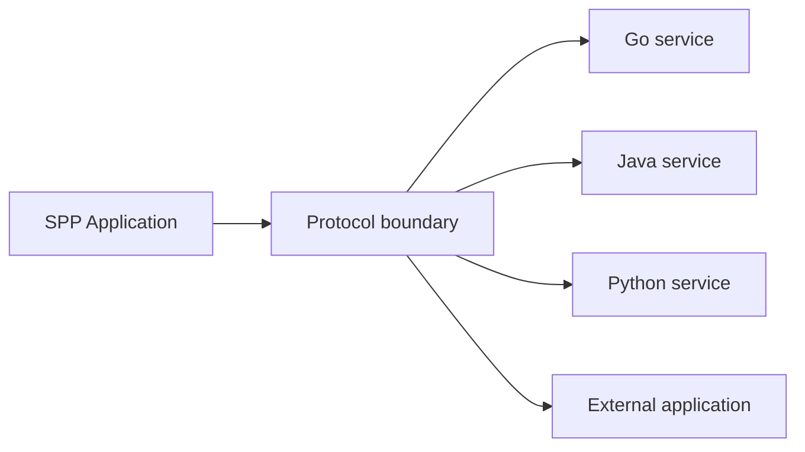
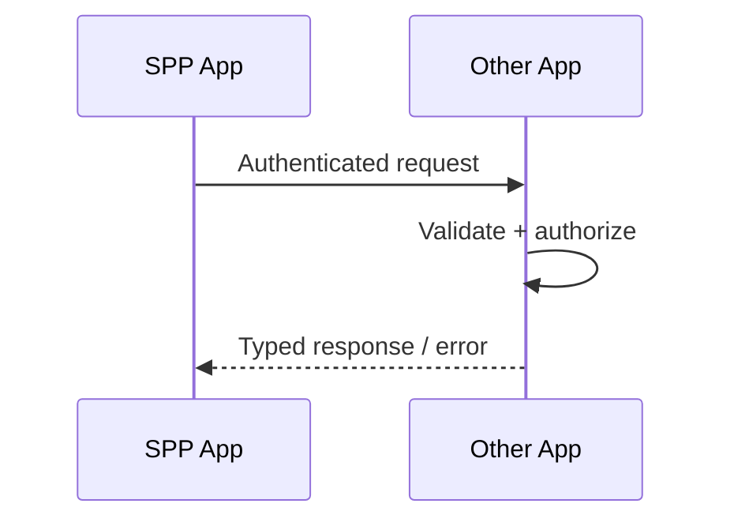
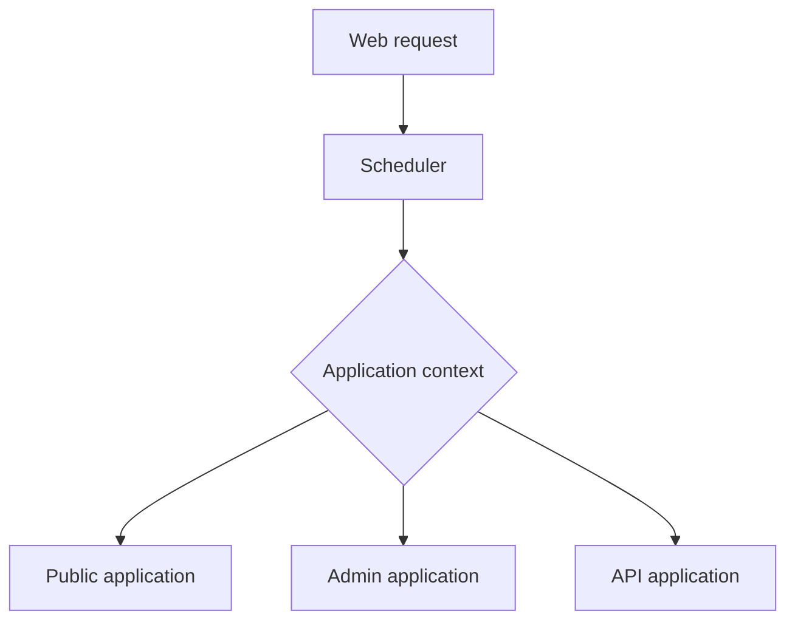

# 48. Polyglot, IPC, and External Application Architecture

One of SPP's most important architectural ideas is that an application does not have to be the only application in a system.

You may have:

```text
SPP PHP application
SPP PHP application
Go service
Java service
Python application
legacy application
external SaaS
```

The architecture challenge is to make these systems cooperate without pretending they are one process.

---

## 48.1 Start with the boundary

A local method call and an interprocess call are fundamentally different.

```text
same process:
    object → method

separate process:
    application → protocol → application
```

The second requires serialization, transport, authentication, failure handling, and versioning.

---

## 48.2 Polyglot architecture

Polyglot means more than one runtime or language participates in the system.



The boundary should be explicit.

---

# Part I — SPP's polyglot tooling

## 48.3 Generating polyglot integration

The repository contains `MakePolyglotCommand` and a `make-polyglot` CLI path.

The tutorial should teach the generator as a starting point for integration scaffolding, not as proof that every generated transport is production-ready.

The workflow is:

```text
CLI
→ generated integration scaffold
→ inspect boundary contract
→ implement protocol
→ test
→ secure
```

---

## 48.4 Go and Java targets

The repository also exposes generator documentation for Go and Java.

This is important for beginners because it shows that SPP's architecture can cross language boundaries.

But the rule remains:

> Generate the boundary; verify the protocol implementation.

Do not infer a distributed system simply because a language-specific scaffold exists.

---

# Part II — IPC

## 48.5 What IPC means

IPC means **inter-process communication**.

Examples include:

```text
HTTP API
message queue
socket
Unix-domain socket
RPC
shared persistence
file transfer
```

The correct choice depends on latency, reliability, coupling, deployment, and security requirements.

---

## 48.6 API-based IPC

For many enterprise systems, an API is the simplest starting point:



The response contract should be versioned and documented.

---

## 48.7 Queue-based IPC

Use asynchronous messaging when the caller does not need an immediate result.


This naturally connects the polyglot branch with the SppQueue branch.

---

# Part III — External non-SPP applications

## 48.8 Why integrate non-SPP systems?

Real systems inherit existing technology.

Examples:

```text
legacy PHP site
ERP
CMS
identity provider
analytics platform
document processing service
school information system
```

SPP should integrate rather than demand that every existing system be rewritten.

---

## 48.9 Adapter boundary

Do not spread external protocol details throughout application code.

Prefer:


The adapter converts external representation into application concepts.

---

## 48.10 External API authentication

An external integration may require:

```text
API key
JWT
OAuth
mutual TLS
signed requests
network-level controls
```

Use the SPP security mechanisms appropriate to the actual integration.

Never hard-code external credentials in source code.

---

# Part IV — Multiple SPP applications

## 48.11 Why multiple applications?

Multiple SPP applications can be useful when boundaries are real.

Examples:

```text
public website
admin portal
authoring portal
reporting portal
API application
background processing application
```

The repository's Scheduler/application-context architecture is designed to select an active application context.

---

## 48.12 Application boundary

A useful model is:



The applications may share framework infrastructure while keeping application configuration and runtime context distinct.

---

## 48.13 Shared code versus shared state

Do not confuse:

```text
shared framework code
```

with:

```text
shared mutable runtime state
```

Shared code can be desirable.

Uncontrolled shared state creates coupling and concurrency problems.

---

# Part V — IPC failure is normal

## 48.14 Remote failure

A remote application can fail even when your own application is healthy.

Therefore every integration must consider:

```text
timeout
retry
partial failure
invalid response
version mismatch
authentication failure
rate limit
service unavailable
```

---

## 48.15 Retries need idempotency

If an API request creates an object and the network fails after the server commits it, retrying may create a duplicate.

Use an operation identity/idempotency strategy where supported and appropriate.

This is why the polyglot branch connects directly to the queue and data branches.

---

# Part VI — Versioning

## 48.16 Contracts evolve

A service should be able to evolve without breaking every client.

Version:

```text
API schema
message shape
authentication requirements
required fields
error model
```

Avoid coupling to another application's private database schema unless shared-storage architecture is explicitly required and controlled.

---

# Part VII — Security boundaries

Every external call is a trust boundary.


Document:

```text
who authenticates
who authorizes
what data crosses the boundary
how secrets are managed
how replay is prevented where necessary
what gets logged
```

---

# Part VIII — Testing with Parikshak

External systems should not be required for every unit test.

Use:

```text
mock/fake adapter
contract tests
integration tests
failure injection
```

Test at least:

```text
success
validation failure
auth failure
timeout
bad response
retry
idempotent retry
version mismatch
```

---

# Part IX — Practical Task Desk polyglot exercise

Build an external document-processing service conceptually like:

```text
Task Desk (SPP)
     ↓
Document adapter
     ↓
Python / Go / Java processor
     ↓
structured result
     ↓
Task Desk
```

The SPP application remains responsible for:

```text
identity
authorization
workflow
persistence
user experience
```

The external service remains responsible for its specialized processing capability.

---

# Kernel Hacker section

Repository landmarks include:

```text
spp/core/class.polyglotproxy.php
spp/commands/MakePolyglotCommand.php
make-polyglot command documentation
make-go documentation
make-java documentation
SPP API / bridge infrastructure
multi-application Scheduler/App code
```

Trace one call across the process boundary:

```text
application service
→ adapter/proxy
→ serialization
→ transport
→ remote application
→ remote validation/auth
→ remote execution
→ response/error
→ local normalization
```

The critical rule is to document **the actual protocol and guarantees**, not just the presence of a proxy or scaffold class.

---

## Practical assignment

Build the Task Desk document-processing adapter twice:

1. local fake implementation for Parikshak;
2. external process implementation.

Then deliberately break:

```text
timeout
bad authentication
malformed result
version mismatch
duplicate request
```

Document how the SPP application remains safe in every case.
