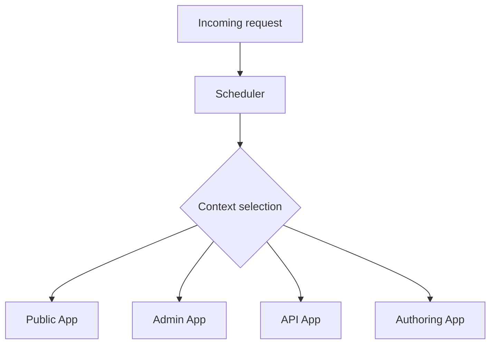
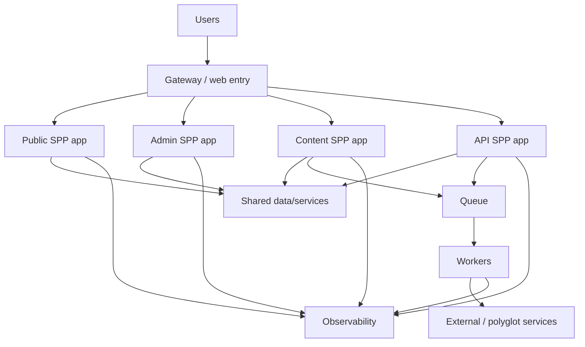
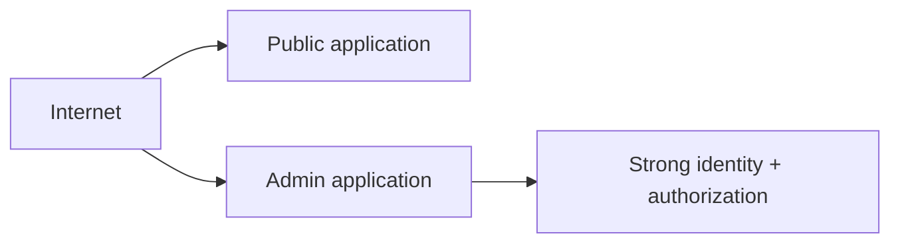
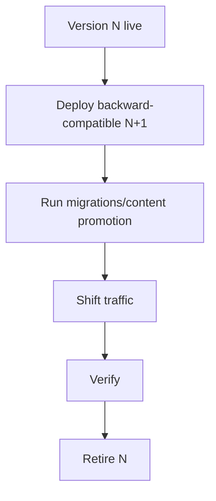
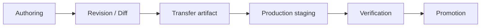
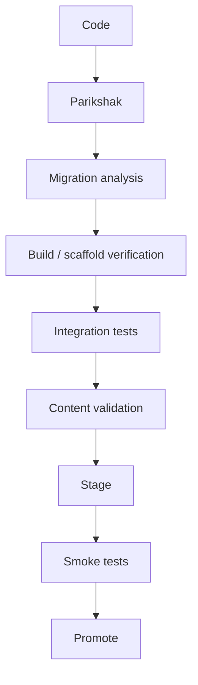

# 49. Multi-Application Enterprise Architecture and Deployment

This chapter brings the major SPP concepts together into an enterprise topology.

A single web application is useful for learning.

A production platform may contain:

```text
public site
admin portal
authoring/content portal
API application
reporting application
background workers
external processing services
shared data/storage
observability systems
```

---

## 49.1 Why split an application?

Do not split an application merely because multiple applications sound more enterprise.

Split when there is a real boundary in:

```text
security
lifecycle
scaling
deployment
ownership
failure isolation
traffic pattern
technology choice
```

---

## 49.2 SPP application contexts

The framework can select an active application context through the Scheduler.

Conceptually:



The selected app then receives app-specific configuration, modules, middleware, services, and resources.

---

## 49.3 Why application contexts are valuable

An admin portal may require:

```text
stronger authentication
stricter middleware
separate UI resources
administrative modules
```

A public site may require:

```text
cache-heavy pages
high read throughput
limited privileged operations
```

Separating contexts can make these requirements explicit.

---

# Part I — Enterprise topology

## 49.4 Example topology



This is an architectural example. The actual deployment topology must follow the real system's requirements.

---

## 49.5 Shared framework versus shared resources

Several applications may share:

```text
SPP framework code
module packages
common libraries
```

But sharing a mutable resource requires stronger coordination:

```text
same database
same storage
same cache
same queue
same external credentials
```

Document the ownership of every shared resource.

---

# Part II — Security boundaries

## 49.6 Public and privileged applications

A public site and admin portal should not necessarily have identical security posture.



The privileged application may also have:

```text
network restrictions
additional middleware
stronger audit requirements
shorter session lifetimes
additional CSRF controls
```

SPP security features should be composed according to the actual application boundary.

---

# Part III — Deployment strategies

## 49.7 One deployment versus several

A small installation may deploy everything together.

A larger platform may deploy:

```text
public app
admin app
workers
external services
```

separately.

The correct decision depends on:

```text
availability
scaling
release cadence
failure isolation
operations complexity
```

---

## 49.8 Zero-downtime thinking

A production deployment should consider coexistence between versions.



This connects directly to the migration/transfer branch.

---

# Part IV — Data architecture

## 49.9 Shared data is a coupling decision

Suppose all applications share the same database.

That is convenient, but creates coupling around:

```text
schema
migrations
locking
transactions
deployment order
permissions
```

An API boundary can reduce coupling but adds network complexity.

There is no universally correct answer.

---

## 49.10 Shared storage

The same question applies to files.

```text
shared storage
```

can simplify content access, but may create:

```text
concurrency
permissions
cache invalidation
backup
deployment
```

Use the SPP storage abstraction rather than spreading filesystem-specific logic through every application.

---

# Part V — Queues and workers

## 49.11 Isolate asynchronous work

Workers can be deployed independently from web applications.


This allows worker capacity to scale independently when workload patterns differ from HTTP traffic.

---

# Part VI — Observability

## 49.12 Every application needs an operational identity

When several applications log at once, operators need to know:

```text
which app
which environment
which operation
which user/request
which worker/job
```

A good enterprise observability design preserves these dimensions where the actual instrumentation supports them.

---

## 49.13 Failure isolation

Suppose the AI processing service goes down.

A good topology may allow:

```text
public website remains available
admin portal remains available
AI-dependent workflow is degraded
queued work waits/retries
```

That is much better than allowing one optional integration to take down the entire platform.

---

# Part VII — Polyglot architecture

## 49.14 PHP does not need to do everything

SPP can act as an orchestration/application platform while specialized workloads run elsewhere.

Examples:

```text
Go high-throughput processor
Java enterprise integration
Python AI/data processing
legacy external application
```

The architecture should be based on explicit contracts rather than language preference alone.

---

# Part VIII — Content promotion

## 49.15 Offline authoring and production

An enterprise content platform may have:

```text
authoring application
staging application
production public application
```

The transfer branch becomes:



This architecture should be integrated with audit, migrations, Parikshak, and observability.

---

# Part IX — Enterprise testing strategy

## 49.16 Test layers

An enterprise SPP system needs multiple test levels:

```text
unit
component
middleware
routing
event
module
persistence
API
workflow
queue
transport
browser integration
polyglot contract
migration/transfer
```

Parikshak should be the common testing foundation wherever it is the appropriate SPP test framework.

---

## 49.17 Deployment gates

Before promoting a release:



The exact CI/CD system is environment-specific; the architecture is the important lesson.

---

# Part X — Operational playbook

## 49.18 Incident response

When production fails, identify:

```text
application context
request/job
module
route
middleware
service
entity/query
external dependency
transport
```

Then correlate:

```text
logs
metrics/traces where available
audit records
Parikshak regression test
recent deployment/migration
```

---

# Part XI — Capstone architecture

The full Task Desk enterprise capstone now contains:

```text
Public SPP application
Admin SPP application
Content/authoring SPP application
API SPP application

SPPDB / XDB
SPPView / BladeOne / Drishyam
Forms / validation
Auth / RBAC / security middleware
Events
Modules
Workflow
Parikshak
SppQueue
Cron
Reporting
Logging / audit / observability
Storage
SPPAI
LiveComponent
SPP Live
SPPUX
Polyglot adapter
Migration / content promotion
```

The objective is not to use every feature in every request.

The objective is to understand **where each capability belongs and why**.

---

# Part XII — Architecture review exercise

For each subsystem, answer:

```text
What problem does it solve?
Why is it separate from neighboring subsystems?
Who owns its state?
What is its security boundary?
How is it tested?
How does it fail?
How is it deployed?
What happens if it is unavailable?
```

If the learner cannot answer those questions, the feature has not yet been understood at an enterprise level.

---

# Kernel Hacker section

Trace the entire request/runtime architecture:

```text
web entry
→ Scheduler
→ application context
→ bootstrap/init
→ module activation
→ middleware
→ routing
→ controller/service/component
→ Registry/DI
→ entity/data layer
→ event infrastructure
→ view/LiveComponent/API
→ transport
→ SPPUX
```

For background work trace:

```text
CLI/Cron
→ scheduler
→ queue
→ worker
→ service
→ persistence
→ event/audit/logging
```

For content promotion trace:

```text
offline content
→ revision/diff
→ migration/transfer
→ staging
→ validation
→ promotion
→ cache/index refresh
→ live application
```

The enterprise architect should be able to move up and down all three paths.

---

## Final assignment

Build and document a production-style Task Desk deployment with:

```text
multiple SPP application contexts
API boundary
queue workers
Cron
LiveComponent
SPPUX dashboard
AI worker
external processor
content promotion
Parikshak test suite
observability
rollback/recovery plan
```

Then document the architecture in terms of **responsibilities, contracts, boundaries, failure modes, and deployment units**, not merely classes and folders.
