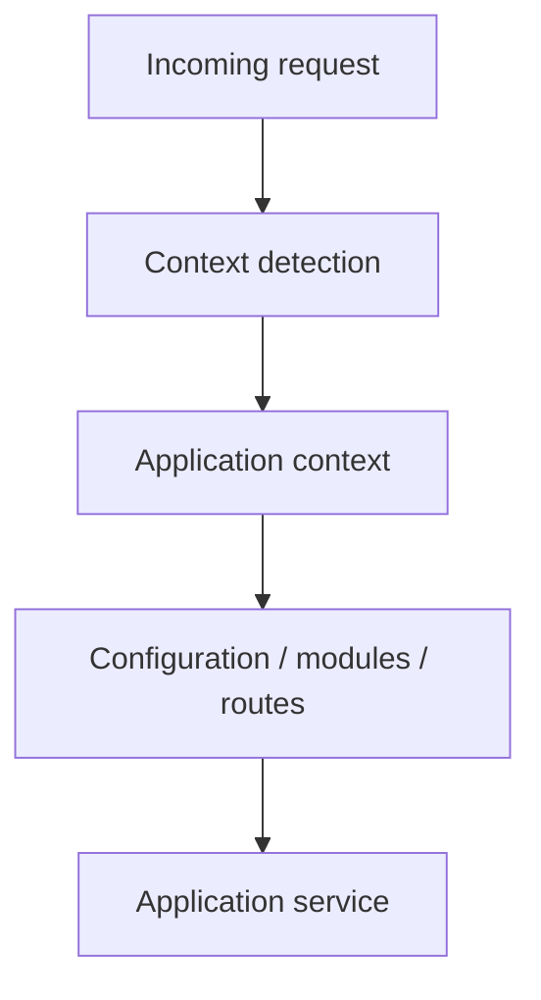
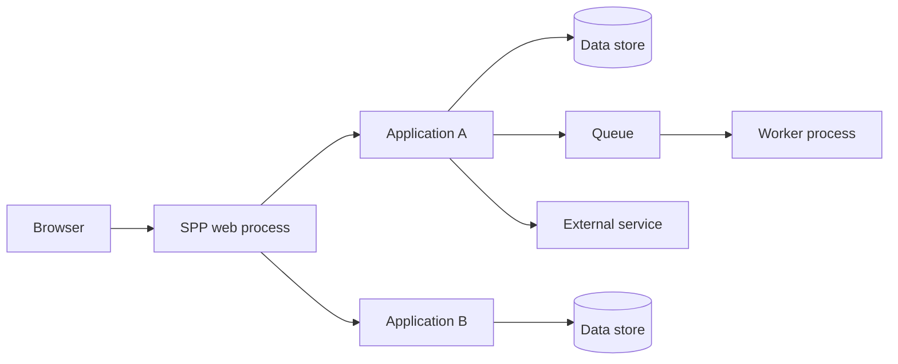
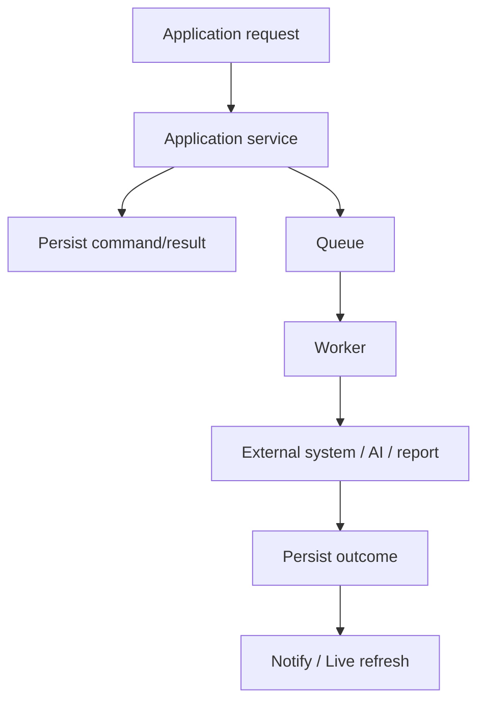

# 49. Multi-Application Enterprise Architecture and Deployment

A serious SPP deployment may contain multiple application contexts, processes, databases, workers, browser surfaces, and external services. The purpose of this chapter is to teach the reader where each boundary begins and what that boundary changes.

> **Evidence boundary:** SPP's scheduler/application architecture supports application-context selection and the repository contains enterprise/integration material. A particular multi-process topology, high-availability design, or zero-downtime guarantee must be established from deployment configuration and source rather than inferred from framework structure.

---

## 49.1 One codebase does not mean one application

Think in terms of:

```text
application context
process
network service
browser client
external application
```

These boundaries may overlap, but they are not synonymous.

---

## 49.2 Application context

SPP's runtime contains application-context selection through the scheduler/context machinery. A request can therefore be associated with a particular application configuration/runtime context.

Conceptually:



This is different from creating a separate operating-system process.

---

# Part II — Enterprise topology

A conceptual deployment may look like:



The diagram is a topology model, not a claim that one specific production topology is mandatory.

---

## 49.1 Data ownership

For multiple applications decide:

```text
which application owns each record
which application may mutate it
whether data is shared or integrated
how synchronization works
who resolves conflicts
```

Do not equate shared access with shared ownership.

---

## 49.2 Deployment boundaries

A deployment should distinguish:

| Boundary | Typical failure |
|---|---|
| Application context | wrong configuration/route |
| PHP process | crash/resource exhaustion |
| Worker | job failure/restart |
| Network service | timeout/unreachable |
| Database | query/storage failure |
| Browser | client/runtime failure |
| External application | independent outage/change |

These distinctions are essential to incident diagnosis.

---

# Part III — Security architecture

Security must be enforced at every trust boundary.

```text
Browser
→ authenticated request
→ SPP application authorization
→ application service
→ data/integration boundary
→ external authorization
```

A user being authorized inside Application A does not automatically authorize access to Application B or an external service.

Similarly, an API token should not be treated as proof of permission to every resource.

---

# Part IV — Availability and deployment

High availability is a deployment property, not something that follows from having multiple classes called “worker”, “pool”, or “cluster”.

Before claiming HA, establish:

```text
process redundancy
shared or replicated state
failure detection
traffic routing
data durability
recovery procedure
upgrade compatibility
```

Likewise, a zero-downtime migration strategy requires compatibility between old/new code and data, not merely the existence of a migration command.

---

# Part V — Live architecture in enterprise deployments

Reactive browser sessions introduce another lifecycle:

```text
browser connection
→ live interaction
→ server component
→ application service
→ response
→ browser update
```

Long-lived connections can fail independently from ordinary HTTP requests. Therefore monitor and diagnose:

```text
initial page render
live request
transport connection
server component state
browser runtime
```

Do not assume that a healthy HTTP endpoint proves that live transport is healthy.

---

# Part VI — Async architecture

A multi-application system commonly separates interactive work from background work:



The queue is an asynchronous boundary. Design retries and idempotency explicitly.

---

# Part VII — Observability

For enterprise diagnosis, capture enough context to connect a user action to the relevant operation while avoiding sensitive data leakage.

Useful dimensions include:

```text
application/context
request
operation
job ID
record ID where appropriate
error class
timing
external dependency
```

Do not claim universal correlation propagation unless the actual instrumentation establishes it.

---

# Part VIII — Deployment workflow

A disciplined deployment separates:

```text
build
→ test
→ migration planning
→ compatible deployment
→ data/content transition
→ verification
→ promotion
→ observation
→ rollback/recovery if required
```

Use Parikshak as part of the verification loop and deliberately test failure paths before relying on an enterprise deployment procedure.

---

# Part IX — Multi-application integration

When Application A calls Application B, define:

```text
contract
version
authentication
authorization
timeouts
error mapping
retry policy
idempotency
ownership
observability
```

The two applications remain separate trust and failure domains even if they share a repository or host.

---

# Coming from other ecosystems

### Kubernetes/microservices

Map process/network/deployment boundaries carefully. An SPP application context is not automatically a container or microservice.

### Laravel/Symfony monoliths

The closest conceptual comparison is multiple application/runtime contexts plus queues and external services; learn SPP's scheduler/context mechanism rather than assuming framework equivalence.

### Enterprise Java

Think in terms of bounded application services, process boundaries, messaging, and explicit contracts.

---

# Kernel Hacker section

Trace the full path:

```text
request
→ Scheduler/context selection
→ App
→ Module/configuration
→ Middleware/events
→ service
→ SPPDB/SPPXDB/external boundary
→ response
```

For asynchronous work:

```text
request
→ queue
→ worker
→ service
→ persistence/integration
→ result
```

For reactive work:

```text
browser
→ SPPUX
→ SPP Live
→ LiveComponent
→ service
→ LiveAction
→ SPP Live
→ SPPUX
```

## Practical assignment

Design a three-application Task Desk deployment:

```text
Authoring application
Operations application
Reporting application
```

Give each an explicit data-ownership boundary, API/integration contract, authorization model, asynchronous path, and failure/recovery procedure. Then write Parikshak tests for the most important cross-boundary assumptions.