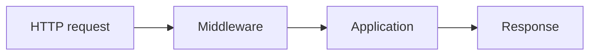

# 51. The Continuous Task Desk Course

This is the **single application that grows with the reader**.

The purpose is not to build the most complicated application possible. The purpose is to let the learner repeatedly see one idea:

> **A framework is useful because the same application can grow without every new feature forcing the developer to reinvent the underlying infrastructure.**

The learner starts with plain PHP and ends with an enterprise-style SPP application.

---

## 51.1 The application we are building

We will build a small **Task Desk** for an organisation.

The initial requirements are intentionally ordinary:

- users can see tasks;
- users can create tasks;
- tasks have status and priority;
- managers can approve important tasks;
- administrators can inspect reports;
- the application exposes an API;
- selected screens become reactive;
- background jobs process expensive work;
- the system can integrate with non-SPP services;
- offline content can be prepared and promoted to a live site.

The important part is not the business domain. It is that the same domain survives as the architecture becomes richer.

---

## 51.2 Phase 0 — Plain PHP

Start with no framework.

The first version can use:

```text
public/index.php
public/create-task.php
public/list-tasks.php
src/TaskService.php
src/validation.php
views/tasks.php
```

The learner should intentionally experience the friction:

- URL handling is manual;
- dependencies are created manually;
- cross-cutting checks are repeated;
- templates are included manually;
- application configuration is scattered;
- testing infrastructure is mostly the developer's responsibility;
- unrelated features become coupled.

This is important. The handbook should **show the problem before introducing the framework solution**.

---

## 51.3 Phase 1 — Explain MVC before using it

Separate the application conceptually into:

```text
Model/domain      what the system knows about tasks
Controller        what happens for a request
View              how the result is presented
```

Then build the same simple Task Desk using this separation.

The learner should be able to answer:

> Why should the HTML template not contain the database query?

and:

> Why should a service not need to know which HTML page displayed its result?

Only after this exercise do we introduce the SPP framework.

---

## 51.4 Phase 2 — Move the application into SPP

Create the SPP application and preserve the domain logic.

The important learning point is:

> **SPP does not replace your application's purpose. It supplies infrastructure around it.**

The application gains framework facilities for:

- application context;
- bootstrapping;
- configuration;
- dependency management;
- middleware;
- events;
- routing;
- modules;
- rendering;
- persistence;
- testing;
- APIs;
- reactive UI;
- background processing;
- integration.

---

## 51.5 Phase 3 — Add Middleware

Add two pieces of cross-cutting behavior:

```text
Request ID
Authentication guard
```

The learner first implements them manually, then moves the concerns into SPP middleware.

### What changed?

Without the framework:

```text
controller A → authentication code
controller B → authentication code
controller C → authentication code
```

With middleware:



Now the learner has a concrete reason to care about middleware.

---

## 51.6 Phase 4 — Add Events

When a task is created, three things should eventually happen:

```text
write audit record
notify interested users
schedule search/index work
```

Do not make the task service call all three systems directly.

Introduce an event and listeners.

The learner should then deliberately add another listener without touching the task creation service.

That is the point at which event-driven decoupling becomes obvious rather than theoretical.

---

## 51.7 Phase 5 — Add Registry and Dependency Injection

Start with:

```php
$repository = new TaskRepository(
    new DatabaseConnection(...)
);
```

Then add another dependency.

Then another.

Now allow SPP to resolve the dependency graph.

The learner should compare:

```text
manual construction
```

with:

```text
framework-assisted construction
```

The important lesson is not “DI is shorter.”

It is:

> **DI moves responsibility for object construction away from business code.**

---

## 51.8 Phase 6 — Add configuration

Move the following out of PHP source:

```text
base URL
feature flags
middleware configuration
module configuration
application settings
```

Then deliberately change a configuration value without rewriting application logic.

Explain the difference between:

```text
configuration
persistent settings
runtime state
```

SPP exposes these concerns through distinct mechanisms; they should not be taught as synonyms.

---

## 51.9 Phase 7 — Add routing paradigms

Build the same Task Desk endpoint through more than one SPP mechanism.

For example:

```text
pages.yml route
attribute route
CLI-generated route/page
API route
```

Then ask:

> Why does SPP have more than one routing paradigm?

The learner should understand that framework flexibility does not mean that every application should use every mechanism at once.

---

## 51.10 Phase 8 — Add modules

Extract reporting into a module.

The learner experiences the difference between:

```text
an ordinary directory
```

and:

```text
an independently described framework module
```

Then add a second module dependency and observe activation ordering.

---

## 51.11 Phase 9 — Add SPPView, BladeOne, ViewTags, and forms

Render the Task Desk through the SPP presentation stack.

Exercises include:

```text
list page
create form
validation messages
flash messages
partial
layout/theme
asset inclusion
```

The learner should see how the framework separates presentation infrastructure from business logic.

---

## 51.12 Phase 10 — Add persistence

Introduce a Task entity and persistence through the SPP data stack.

The learner moves through:

```text
entity concept
    ↓
SPPDB abstraction
    ↓
XDB/data subsystem
    ↓
physical storage
```

Then add:

```text
migration
seeder
validation
index
pagination
```

The same Task entity will later feed HTML, API, LiveComponent, SPPUX, and reporting.

---

## 51.13 Phase 11 — Add identity and security

Introduce:

```text
users
roles
permissions
login
CSRF
sanitization
rate limiting
security headers
```

The reader should learn that:

> authentication answers **who are you?**

while:

> authorization answers **what may you do?**

and:

> web security protects the application boundary and data flow.

These are related but not identical concerns.

---

## 51.14 Phase 12 — Test everything with Parikshak

The learner now stops thinking of testing as a final chapter.

Every subsequent feature must get a test.

Examples:

```text
middleware test
event test
route test
entity test
form test
security test
API test
workflow test
LiveComponent test
integration test
```

The learner should deliberately introduce failures and use the tests to locate the broken framework layer.

---

## 51.15 Phase 13 — Add API

Expose Task Desk through an API.

The learner should see that the same domain/application services can serve:

```text
HTML
API
LiveComponent
SPPUX
reporting
```

The API branch introduces resources, responses, pagination, authentication, model binding, and API documentation where supported by the implementation.

---

## 51.16 Phase 14 — Add workflow

Important tasks now require approval.

The workflow branch introduces:

```text
states
transitions
permissions
approval chain
wizard-like interaction
timeouts
workflow events
compensation/recovery where implemented
```

This is where events, persistence, security, forms, queues, and testing become one system.

---

## 51.17 Phase 15 — Add background work

Some operations are too expensive for a request:

```text
report generation
large exports
notifications
search/index updates
AI processing
content preparation
```

Move selected work into queues/workers or scheduled execution where the repository supports it.

The learner should observe the architectural distinction:

```text
request/response work
        vs.
background work
```

---

## 51.18 Phase 16 — Add LiveComponent

Turn the task editing area into a server-side reactive component.

The learner should understand:

```text
browser interaction
    ↓
component action
    ↓
server state
    ↓
component render
    ↓
transport
    ↓
browser update
```

Then deliberately break a lifecycle assumption and diagnose it.

---

## 51.19 Phase 17 — Add SPP Live

The same LiveComponent should then be exercised through supported transport choices.

The key lesson is:

> **component model ≠ transport**

A component should not have to be rewritten simply because the underlying transport changes.

---

## 51.20 Phase 18 — Add SPPUX

Now add a browser-side reactive dashboard.

The learner compares:

```text
server-side reactivity: LiveComponent
browser-side reactivity: SPPUX
```

Then build a combined screen where both layers cooperate.

---

## 51.21 Phase 19 — Add i18n, storage, reporting, and observability

The application now becomes operationally realistic.

Add:

```text
translated task content
file/document storage
reports
scheduled reports
logs
metrics/tracing where supported
audit/revision data
```

The learner can now see why these concerns were separated into their own framework modules.

---

## 51.22 Phase 20 — Add AI

Add one AI-backed feature only after the application infrastructure is mature.

For example:

> Summarize a long task description into a short briefing.

The learner should then study the provider abstraction and driver model rather than coupling the application directly to one vendor.

AI should be treated as an application capability built **on top of** framework infrastructure, not as the definition of the framework itself.

---

## 51.23 Phase 21 — Offline content and live promotion

Create content or configuration in an offline environment.

Then exercise:

```text
prepare
→ validate
→ diff/revision
→ package
→ transfer
→ stage
→ verify
→ promote
→ monitor
→ recover if required
```

This teaches why schema migrations, content migrations, revisions, and production promotion are related but distinct concepts.

---

## 51.24 Phase 22 — Polyglot and external systems

Add an external service for one capability.

Possibilities include:

```text
Go worker
Java service
external REST service
non-SPP application
specialized AI service
```

The learner should explicitly identify:

```text
protocol
serialization
authentication
failure boundary
retry strategy
timeout
observability
```

---

## 51.25 Phase 23 — Multiple applications

Split the system into justified application contexts.

Do this only after the single application is understood.

The learner should experience why multiple contexts can help, and also why unnecessary fragmentation increases complexity.

---

## 51.26 Phase 24 — Enterprise capstone

The final Task Desk deployment contains:

```text
multiple SPP applications
shared framework services where appropriate
XDB/data layer
modules
middleware
events
workflow
queues/workers
Cron
API
LiveComponent
SPP Live
SPPUX
AI integration
storage
reporting
observability
Parikshak
migration/content promotion
polyglot integration
external application integration
```

The learner then performs a production-readiness review.

---

## 51.27 The teaching rule for every phase

Every phase follows exactly this pattern:

### CONCEPT
What problem are we solving?

### GENERAL FRAMEWORK IDEA
How do frameworks usually solve it?

### SPP
How does SPP solve it?

### BUILD
Implement it in Task Desk.

### TEST
Write the corresponding Parikshak tests.

### BREAK
Introduce a realistic mistake.

### DEBUG
Follow the framework execution path to find it.

### INTERNALS
Open the source and trace the mechanism.

### ARCHITECTURE
Discuss the enterprise consequences.

### CHOICE
Explain when this SPP feature should **not** be used.

This pattern is intentionally repeated throughout the handbook so the reader learns a transferable way of thinking rather than a list of APIs.
