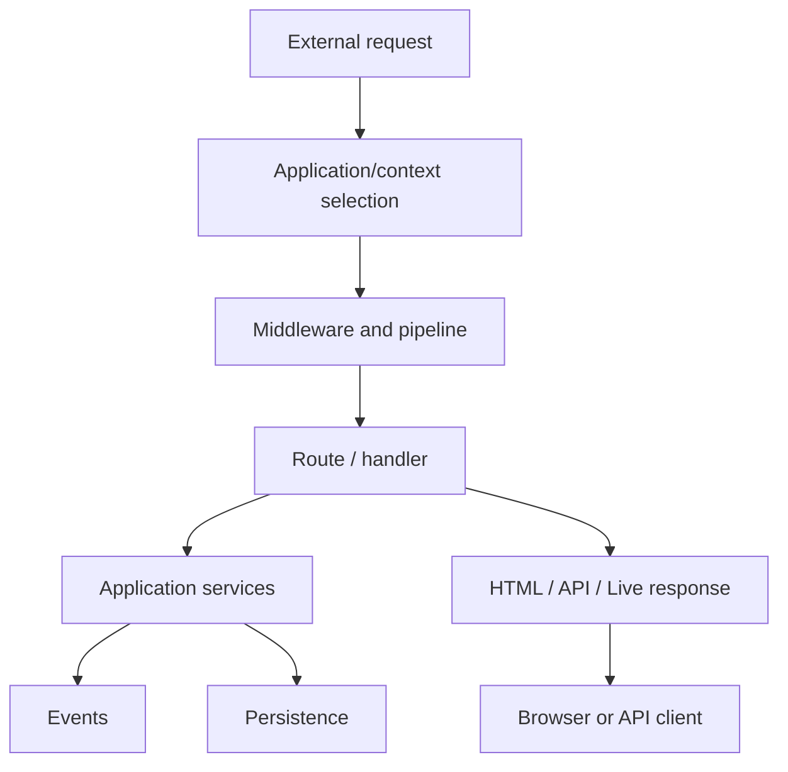

# 51. Framework Concepts → SPP Feature Map

This chapter is the bridge between **general framework knowledge** and the SPP architecture. Read it after Chapter 50 and before diving into subsystem tutorials.

## 51.1 One problem, several layers

A framework feature is rarely one class. A request such as “protect this page” can cross routing, middleware, authentication, authorization, sessions, events, and the application context.

Use this rule throughout the handbook:

> **Learn the concept first, then locate the SPP mechanism, then trace the execution path.**

## 51.2 The map

| General concept | SPP mechanism / area | Architectural role |
|---|---|---|
| Application | `SPP\App` | Owns application-level state, paths, container and module lifecycle |
| Application context | `SPP\Scheduler` | Selects and switches the active application |
| Routing | SPP routing/page/API mechanisms | Converts external addressing into application operations |
| Middleware | `MiddlewareKernel`, `Pipeline` | Wraps and gates request processing |
| Dependency injection | Registry + application/Core container | Assembles reusable object dependencies |
| Events | `SPPEvent`, event handlers | Decouples publishers from subscribers and adds staged execution |
| Modules | Module loader/compiler/installer | Packages and activates framework capabilities |
| Configuration | global/app/module settings | Separates deploy-time behavior from hard-coded logic |
| Views | SPPView / BladeOne / Drishyam | Produces server-rendered presentation |
| Reactive server UI | LiveComponent | Maintains server-side component state across interactions |
| Transport | SPP Live | Carries reactive client/server interaction |
| Browser runtime | SPPUX | Provides browser-side reactive behavior and bridges |
| API | SPPAPI | Exposes application operations through a structured request boundary |
| Identity/security | SPPAuth + web security | Authentication, authorization and request protections |
| Persistence | SPPDB / SPPXDB / engines | Separates application data access from concrete storage |
| Cache | SPPCache and related layers | Reuses derived data and metadata |
| Background execution | Queue / Cron / workers | Moves suitable work outside the request lifecycle |
| AI integration | SPPAI | Provides a provider/model abstraction and AI-facing operations |
| External integration | integrations/polyglot facilities | Connects SPP to other runtimes and applications |
| Developer lifecycle | Maker / SPPDocs / Parikshak | Generate, document and test framework-aware applications |

The table is a **map, not a claim that every row is implemented by one class**.

## 51.3 Follow one request

A useful mental model is:



The exact path depends on the kind of request. A LiveComponent update, API call, CLI operation, and ordinary HTML page do not necessarily traverse identical layers.

## 51.4 Why SPP has more than MVC

MVC answers one useful question: **how do application responsibilities relate to presentation and request coordination?**

It does not by itself answer:

- which application context is active;
- which middleware should execute;
- how modules are discovered;
- how events are prioritized;
- how background work is scheduled;
- how a browser component retains state;
- how an API exposes an entity;
- how multiple applications coexist;
- how an external runtime participates.

SPP should therefore be understood as a **runtime architecture containing MVC and several other architectural subsystems**, rather than as “an MVC framework with extras.”

## 51.5 A learning strategy

For every subsystem, ask five questions:

1. **Problem:** what pain does the general framework concept solve?
2. **SPP mapping:** which actual source implements it?
3. **Boundary:** what does this subsystem own, and what does it delegate?
4. **Failure:** what happens when the subsystem cannot complete its job?
5. **Choice:** when is a simpler mechanism better?

This prevents feature memorization without architectural understanding.

## 51.6 Source-first landmarks

The current implementation provides especially useful starting points:

- `spp/core/class.app.php` — application object and application configuration/discovery;
- `spp/core/class.scheduler.php` — active application context and context switching;
- `spp/core/class.middlewarekernel.php` and `spp/core/class.pipeline.php` — request middleware infrastructure;
- `spp/core/class.sppevent.php` — event registration, discovery and dispatch;
- `spp/core/class.registry.php` — registry/container-related infrastructure;
- `spp/modules/spp/sppapi/` — API-facing architecture;
- LiveComponent/SPP Live/SPPUX module areas — reactive architecture;
- `spp/modules/optional/sppai/` — current AI facade/provider architecture.

Paths are source landmarks, not substitutes for tracing call sites.

## 51.7 Evidence rule

**Implemented** means the executable source demonstrates the behavior. **Documented** means repository documentation describes it. **Derived** means the architecture follows from multiple verified implementation facts. **Guidance** is a recommended design choice.

Do not turn a class name, generated API page, or configuration key into an enterprise guarantee.

## 51.8 Practical exercise

Pick one feature of the Task Desk and draw its path using only these boxes:

```text
request → context → middleware → route/handler → service → data → response
```

Then add only the SPP layers that you can prove are involved.

Finally, locate the first executable source file for each box.

That exercise is the beginning of **source tracing**, which becomes a core SPP skill later in the handbook.
