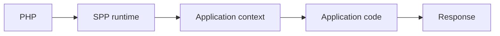
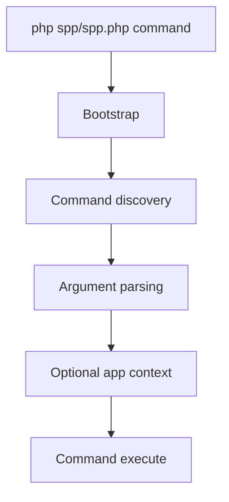

# 52 — 30-Minute SPP Quick Start

## Goal

In thirty minutes, you will not learn all of SPP. You will learn the **shape of the runtime**, inspect a real application, and make one small change without treating the framework as magic.

This quick start intentionally avoids unverified generator syntax. The repository's CLI entry point can list the commands available in the current checkout with:

```bash
php spp/spp.php list
```

The CLI source itself also directs users to that command when no command is supplied. Treat the output of the current checkout as authoritative for command names and options.

## Minutes 0–5 — Establish the mental model

Read the opening of [50 — Frameworks 101](50-frameworks-101-and-how-spp-builds-on-them.md).

Keep this model in mind:



SPP is not the business application. It supplies runtime infrastructure around it.

## Minutes 5–10 — Find the bootstrap

Open:

```text
spp/sppinit.php
```

The current bootstrap defines framework/application paths, loads Composer when available, registers the native autoloader, loads `SPP\App`, establishes session-cookie parameters, and boots the application.

The important lesson is that an SPP application enters through a framework bootstrap rather than each page inventing its own startup sequence.

## Minutes 10–15 — Find the application object

Open:

```text
spp/core/class.app.php
```

Then find:

```php
\SPP\App::getApp();
```

The current `App` implementation maintains application instances, resolves application configuration, initializes application directories, registers the application with the Scheduler, and loads modules during normal initialization.

Now open:

```text
spp/core/class.scheduler.php
```

The Scheduler maintains the active application context and registered application objects.

### Your first source-tracing exercise

Answer these questions by reading the source:

1. Where is the active context stored?
2. How is an application registered?
3. What happens when the context changes?
4. How can code temporarily execute under another context?

Do not search the handbook for the answers first. Practice locating them in source.

## Minutes 15–20 — Inspect the CLI

Run:

```bash
php spp/spp.php list
```

Do not memorize the command list.

Instead, open:

```text
spp/spp.php
```

Observe the current execution model:



The CLI is another framework entry point. It is not necessarily the internal API through which every subsystem should be called.

## Minutes 20–25 — Inspect middleware

Open:

```text
spp/core/class.middlewarekernel.php
spp/core/class.pipeline.php
```

Look for the relationship between:

```text
MiddlewareKernel
        ↓
Pipeline
        ↓
MiddlewareInterface / callable
        ↓
Destination
```

The pipeline composes middleware into an execution chain. The middleware kernel assembles middleware from framework/application sources before invoking the pipeline.

### Mini-experiment

Pick one middleware entry from the current configuration and trace:

```text
configuration
  → middleware kernel
  → pipeline
  → middleware
  → next layer
```

You have now crossed from “using a framework” into “understanding a framework.”

## Minutes 25–30 — Build your first Task Desk slice

Create one tiny requirement in the application you are using for the tutorial:

> Display a list of tasks and allow one task to be marked complete.

Do not add authentication, LiveComponent, SPPUX, AI, queues, or database abstractions yet.

The first version should have only the minimum layers needed by the application.

Then record:

```text
Requirement: mark a task complete
Entry point:
Application context:
Route/page mechanism:
Handler/service:
Persistence:
Response:
```

Finally, run the appropriate current test path. When a Parikshak test is applicable, add it now rather than postponing testing until the end of the project.

## The deliberate-break exercise

Break exactly one boundary.

Examples:

- use a route that does not exist;
- reference an unavailable service;
- disable a required middleware configuration;
- use an invalid application context.

Observe the failure.

Then answer:

```text
Which layer failed?
How did I know?
Which source file owns that behavior?
What is the smallest repair?
```

This is more valuable than simply seeing the page work.

## What you should know after thirty minutes

You should be able to explain:

- what a framework does;
- how SPP bootstraps;
- what `SPP\App` represents;
- what the Scheduler context is;
- where middleware enters the runtime;
- how the CLI discovers commands;
- why command interfaces and programmatic services are different;
- how to trace one request into source;
- how to deliberately break one framework boundary.

You should **not** yet claim to understand the entire SPP architecture.

## Where to go next

Continue in this order:

1. [65 — SPP Mental Model](65-spp-mental-model.md)
2. [51 — Framework Concepts → SPP Feature Map](51-framework-concept-to-spp-feature-map.md)
3. [56 — Middleware and Pipeline](56-middleware-and-pipeline.md)
4. [57 — Events and SPPEvent](57-events-and-sppevent.md)
5. [58 — Registry and Dependency Injection](58-registry-and-dependency-injection.md)
6. [59 — Modules, manifests, and scaffolding](59-modules-manifests-and-scaffolding.md)
7. [62 — Continuous Task Desk Curriculum](62-continuous-task-desk-curriculum.md)

Then branch into data, security, API, workflow, background execution, and reactive architecture as required.

## Source-first rule for this quick start

The exact command syntax and generated project structure can change. The source of truth for a current command is the current CLI implementation and its discovered command surface—not an old tutorial copied from another source snapshot.

That is why this quick start teaches **how to inspect SPP** as well as how to use it.
