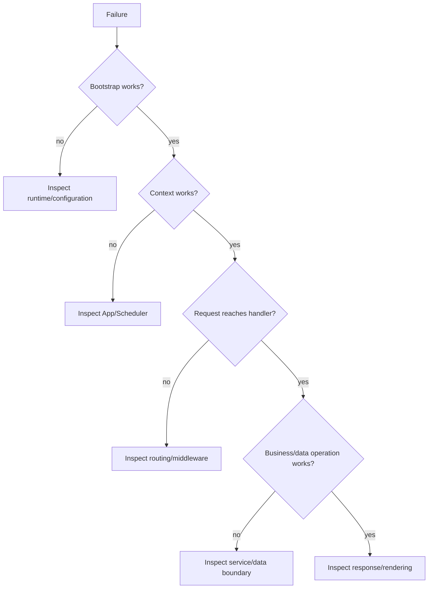

# 52. A 30-Minute SPP Quick Start

This chapter gives a first contact with SPP without pretending that a tiny example teaches the whole framework.

The goal is to understand the shape of an SPP application and then know where to go next.

## 52.1 Before starting

Use the repository's own current CLI/help output as the authority for command syntax. CLI commands can evolve; do not copy an old command from a historical tutorial merely because it looks plausible.

A useful first inspection is:

```text
SPP repository
├── spp/                  framework/runtime source
├── src/                  application/module source area
├── etc/                  configuration
├── var/                  generated/runtime state
└── documentation/        repository documentation
```

The exact project layout depends on the application and repository state.

## 52.2 The first mental model

An SPP application is not simply “a PHP file that prints HTML.” It participates in a runtime that can provide:

```text
application context
→ modules
→ configuration
→ middleware/events
→ routing/handlers
→ data/services
→ response
```

The first executable landmarks to inspect are `spp/core/class.app.php` and `spp/core/class.scheduler.php`.

## 52.3 Start with the smallest useful page

A first exercise should have only one responsibility:

> receive a request and produce a visible result.

Do not begin by adding authentication, a database, LiveComponent, AI, queues, and browser reactivity simultaneously.

The purpose of the first run is to verify the bootstrap and request path.

## 52.4 Then add one piece at a time

Use this progression:

```text
Page
  ↓
Route
  ↓
Service
  ↓
Persistent data
  ↓
Validation
  ↓
Authentication/authorization
  ↓
Test
  ↓
API
  ↓
Background job
  ↓
LiveComponent
  ↓
SPP Live / SPPUX
```

Each step introduces one architectural responsibility.

## 52.5 The Task Desk exercise

Build a tiny Task Desk with these fields:

```text
Task
- id
- title
- status
- created_at
```

Start with two operations:

```text
GET  task list
POST create task
```

Then ask, for each operation:

- Where is it routed?
- Which application context handles it?
- Which service owns the business operation?
- Where is validation performed?
- Which persistence abstraction is used?
- How is the response rendered?
- How will the operation be tested?

The questions are more important than the amount of code.

## 52.6 First diagnostic habit

When something fails, do not immediately rewrite the application.

Reduce the boundary:



This is deliberately simple. The full diagnostic method appears later in the handbook.

## 52.7 Test the first feature

The handbook's canonical learning loop is:

**Learn → Build → Test with Parikshak → Deliberately break → Diagnose → Trace source → Learn when not to use it.**

For the Task Desk, the first test should establish one observable contract, such as:

```text
creating a valid task produces a task record
```

Then deliberately break one input or dependency and observe where the failure appears.

## 52.8 What not to conclude after 30 minutes

A successful hello-world page does **not** prove:

- production deployment safety;
- distributed reliability;
- transaction semantics for every storage engine;
- security of an arbitrary application;
- performance at a particular scale;
- correctness of every module;
- automatic authorization of every endpoint.

It proves that you have crossed the first boundary: from “what is a framework?” to “my application is participating in SPP's runtime.”

## 52.9 Next step

Continue the same Task Desk rather than throwing it away. Chapter 53 turns it into a structured application and introduces the framework layers one at a time.
