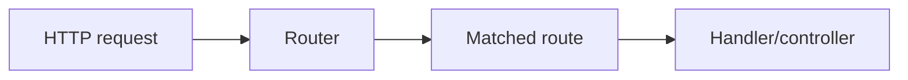

# 52. Plain PHP → Framework → SPP: The Comparison Method

This page defines the comparison format used throughout the handbook.

The purpose is simple:

> **Do not teach a framework feature as a magic API. First show the problem it solves.**

Every major tutorial should compare three levels.

---

## 52.1 Level 1 — Plain PHP

Start with the problem in ordinary PHP.

Example: routing.

A very small application might contain:

```php
$path = parse_url($_SERVER['REQUEST_URI'], PHP_URL_PATH);

if ($path === '/tasks') {
    require __DIR__ . '/pages/tasks.php';
} elseif ($path === '/tasks/create') {
    require __DIR__ . '/pages/create.php';
} else {
    http_response_code(404);
    echo 'Not found';
}
```

This works.

The problem appears when the application grows:

- many routes;
- route parameters;
- HTTP methods;
- middleware;
- permissions;
- API routes;
- multiple applications;
- caching/compilation;
- route discovery;
- controller invocation.

---

## 52.2 Level 2 — What frameworks generally do

Most web frameworks introduce a routing subsystem.

Conceptually:



The framework takes responsibility for the repetitive mechanics while the application declares intent.

---

## 52.3 Level 3 — How SPP approaches it

SPP does not force one routing style.

The repository supports multiple routing/page mechanisms, including configuration-oriented `pages.yml` and PHP attribute routing, plus CLI-assisted generation and API/live-oriented routing surfaces.

The beginner therefore learns both the **framework concept** and the **SPP design choice**.

---

## 52.4 The comparison table pattern

Every major chapter should include a table like this:

| Question | Plain PHP | Typical framework | SPP |
|---|---|---|---|
| Who finds the handler? | application code | router | SPP routing/page infrastructure |
| Where is the route declared? | arbitrary PHP | route file/attributes | multiple SPP paradigms |
| Cross-cutting behavior? | repeated code | middleware | MiddlewareKernel/Pipeline + route middleware |
| Dependencies? | `new` | container | SPP App/Registry/container mechanisms |
| Feature packaging? | folders | packages/modules | SPP modules + activation metadata |
| Testing? | ad hoc/library | framework test tools | Parikshak |

The exact row values must be validated for the feature being documented. This table is a teaching pattern, not a license to generalize unsupported implementation details.

---

## 52.5 The “What did SPP save me from writing?” section

Every feature chapter should explicitly list the repetitive infrastructure the developer no longer needs to implement manually.

For middleware, for example:

```text
Without framework
-----------------
wrap request manually
manage ordering manually
instantiate middleware manually
handle short-circuiting manually
keep route/global concerns consistent manually

With SPP
--------
MiddlewareInterface
Pipeline
MiddlewareKernel
configuration/discovery mechanisms
route middleware integration
```

This is one of the most useful ways to explain framework value to a beginner.

---

## 52.6 The “What did SPP add?” section

Do not stop at parity with other frameworks.

For each feature ask:

> Which SPP capabilities go beyond the most familiar framework pattern?

Examples documented elsewhere in this handbook include multiple routing paradigms, staged event execution, explicit event propagation and override semantics, SPP Live transport separation, SPPUX browser runtime, polyglot bridges, and multi-application contexts.

Each claim must be source-backed.

---

## 52.7 The “Where does this live?” section

Every feature tutorial ends with a source map.

For example:

```text
Concept
  ↓
public developer API
  ↓
runtime orchestration
  ↓
compiler/cache if present
  ↓
module/configuration
  ↓
tests
```

This teaches the learner how to navigate the SPP repository rather than memorizing a class name.

---

## 52.8 Use the pattern everywhere

The comparison format should be applied to:

- MVC;
- routing;
- middleware;
- events;
- DI;
- modules;
- configuration;
- rendering;
- entities and persistence;
- authentication;
- security;
- API;
- testing;
- workflow;
- queues;
- Cron;
- LiveComponent;
- SPP Live;
- SPPUX;
- AI;
- storage;
- migration/transfer;
- observability;
- polyglot/IPC;
- multi-application architecture.

The reader should repeatedly see the same progression:

**problem → general framework idea → SPP implementation → SPP extension → source**.
