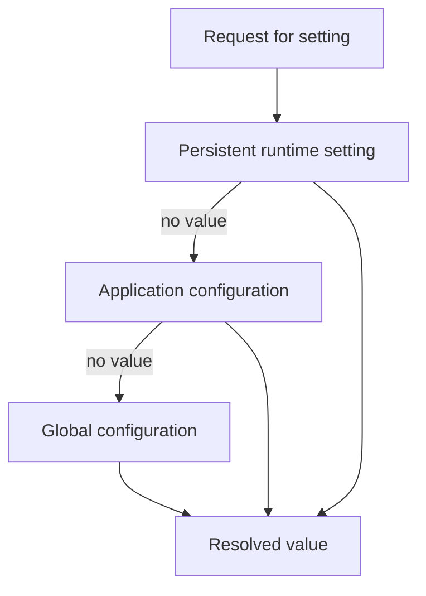

# 53 — Configuration and Runtime Settings

Configuration answers a deceptively important question:

> **Where should an application get a value that can change without changing business logic?**

SPP has more than one configuration layer. The most important beginner lesson is to distinguish **configuration**, **runtime settings**, and **application state**.

## 53.1 Configuration is not one file

The current repository documents multiple configuration sources, including:

```text
spp/etc/global-settings.yml
application/etc/app.yml
application/etc/settings.yml
module configuration
persistent/runtime settings
```

The exact layout depends on the application structure and enabled modules.

SPP's `SPPConfig` class describes itself as the core authority for reading and writing framework setting variables and standardizes global settings in `global-settings.yml` and per-application settings in `settings.yml`.

## 53.2 Three different questions

### Configuration

What should the application use as a configured default?

### Runtime setting

What value should the running application use now?

### Environment value

What value comes from the deployment environment rather than source-controlled configuration?

These may interact, but they are not interchangeable.

## 53.3 A useful model

The repository documentation describes a resolution order for a setting key such as `theme`:

```text
Database / DbSettings
       ↓
Application config / app.yml
       ↓
Global config / global-settings.yml
```

This should be taught as a **documented resolution model**, while the exact behavior of a specific key should be verified against the current implementation.



## 53.4 `SPPConfig`

The current source provides `SPPConfig` as a central configuration authority with static get/set behavior and in-memory caching.

A simple conceptual use is:

```php
$debug = \SPPMod\SPPConfig\SPPConfig::get('system.debug', false);
```

And the documented settings mechanism also provides a `Setting` abstraction for persistent runtime values.

Use the current source/documentation to determine whether a particular value belongs in `SPPConfig`, `Setting`, `app.yml`, or module configuration.

## 53.5 Persistent settings

A runtime setting is appropriate when an administrator needs to change a value without changing source configuration.

Conceptually:

```php
$siteName = \SPP\Setting::get('site_name');
\SPP\Setting::set('maintenance_mode', true);
```

The persistence layer means this is fundamentally different from a local PHP variable.

A setting may therefore affect later requests or application operations.

## 53.6 Environment interpolation

The repository's modernization guide documents environment interpolation in YAML configuration using `env:` values, for example:

```yaml
password: "env:DB_PASS"
```

The documented behavior is recursive interpolation from `.env` or the operating-system environment.

Treat environment interpolation as a **configuration mechanism**, not as proof that every secret-management requirement has been solved. The deployment still needs appropriate secret handling and access controls.

## 53.7 Application configuration

`app.yml` can hold application-specific defaults such as the application base URL and other app-level values.

Keep application-specific configuration close to the application when the repository's application layout supports it.

The important architectural property is:

```text
Global framework defaults
        ↓
Application-specific configuration
        ↓
Runtime/persistent overrides where applicable
```

## 53.8 Module configuration

Modules may contribute configuration for their own behavior.

When a setting does not appear to take effect, trace:

```text
module configuration
→ configuration loader
→ SPPConfig / settings store
→ consumer
```

A configuration key existing in YAML is not enough. Verify that the consumer actually reads it.

## 53.9 Configuration versus dependency injection

These are related but different.

Configuration answers:

> **Which value or option should this subsystem use?**

Dependency injection answers:

> **Which object should provide this behavior, and how should it be constructed?**

For example:

```text
configuration
  → selects database driver

container/Registry
  → provides service/adapter object
```

Do not use the container as a general key/value configuration store merely because it can hold objects.

## 53.10 Configuration and application context

The selected `SPP\App` matters because application-specific paths and settings are context-dependent.

A configuration bug can therefore actually be a **wrong-context bug**.

When one application sees a setting and another does not, first establish the active application context before rewriting configuration files.

## 53.11 Configuration caching

`SPPConfig` maintains a cache in the current implementation.

That creates a familiar operational issue:

```text
Configuration file changed
        ↓
Runtime still has cached value
```

The correct cache/invalidation procedure depends on the specific configuration path. Use the corresponding current CLI/operations documentation rather than inventing a generic “clear config” command.

## 53.12 `config:export` and `config:import`

The current CLI documentation exposes:

```bash
php spp.php config:export
php spp.php config:import <file>
```

with documented format/conflict options.

These commands demonstrate an important architectural capability: SPP can move configured data/settings through an explicit import/export boundary.

They should not be interpreted as automatically transactional deployment or universal rollback tooling. Inspect the actual export/import implementation before using it as a production deployment strategy.

## 53.13 `app:config`

The current CLI documentation also exposes:

```bash
php spp.php app:config
```

for application settings such as values including `base_url` and `table_prefix`.

This is a useful example of the distinction between:

```text
framework configuration API
and
CLI interface to configuration
```

The CLI is an administrative interface; the runtime still consumes the resulting configuration through its normal configuration mechanisms.

## 53.14 Security rules for configuration

Do not put secrets into source-controlled configuration merely because the framework can read YAML.

Prefer deployment-provided secrets/environment mechanisms where appropriate.

Also remember:

- a configuration endpoint is a privileged operation;
- persistent settings can affect future requests;
- administrator UI checks are not a replacement for server-side authorization;
- imported configuration should be treated as untrusted input until its origin and contents are controlled.

## 53.15 Failure lab

Take a Task Desk setting such as page size.

Perform these experiments one at a time:

1. define it globally;
2. override it at application level;
3. override it persistently if the setting supports that path;
4. remove the higher-level value;
5. observe the selected value;
6. modify configuration while a cache is warm;
7. determine which cache/invalidation step is required.

The learning target is the **resolution chain**, not one hard-coded value.

## 53.16 Parikshak exercise

For a setting with a documented cascade, create tests for:

```text
higher-priority value wins
fallback is used when higher level is absent
missing key uses the documented default
invalid value is rejected where validation exists
```

When testing a global setting, make the application context explicit so a context leak does not produce a false result.

## 53.17 Coming from other frameworks

### Laravel

Think `.env`, config files, and cached configuration, but keep SPP's application/global/persistent distinctions in mind.

### Symfony

The closest mental model is a configuration tree combined with environment-specific values; SPP's concrete loaders and setting persistence are different.

### Django

Think settings modules plus deployment environment values; SPP adds application context and persistent runtime settings as distinct mechanisms.

## Kernel Hacker section

Start with:

```text
spp/core/class.sppconfig.php
```

Then trace:

```text
SPPConfig::get/set
→ cache
→ file/config loader
→ consumer
```

For persistent settings, trace the `Setting` implementation and its storage path.

When a setting appears “ignored,” search for the **consumer**, not only for the declaration.

## Summary

SPP configuration is a layered runtime concern. The strongest mental model is:

```text
Global defaults
   ↓
Application defaults
   ↓
Runtime/persistent overrides where supported
   ↓
Consumer
```

Environment variables can feed configuration, while the CLI provides administrative interfaces such as `config:export`, `config:import`, and `app:config`.

The exact precedence and cache behavior should always be verified for the setting being debugged.
