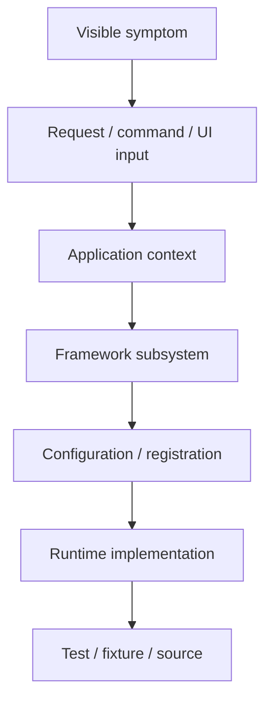

# 53. Deliberate Failure and Debugging Labs

Reading about a framework is not enough.

A developer becomes competent when they can answer:

> **Something broke. Which framework layer is responsible, and how do I prove it?**

This chapter defines the debugging method used throughout the hands-on tutorials.

---

## 53.1 The debugging ladder

Always move from the outside toward the implementation:



Do not jump straight into framework source code before confirming the symptom and the active application context.

---

## 53.2 The standard failure exercise

Every major tutorial should contain four parts:

### Break it
Introduce one controlled error.

### Observe it
Record the exact symptom.

### Diagnose it
Use logs, framework inspection, configuration, and tests.

### Explain it
Identify the framework layer that made the failure possible.

The learner should then fix the problem and write a regression test where practical.

---

## 53.3 Middleware failure lab

Break one of these intentionally:

```text
wrong middleware class name
missing global registration
wrong route middleware attribute
middleware never calls $next()
middleware returns an unexpected response
```

Diagnosis questions:

1. Did the request reach `MiddlewareKernel`?
2. Was the middleware discovered?
3. Was it instantiated?
4. Did it run before the destination?
5. Did it short-circuit?
6. Did it return a compatible response?

Trace the implementation of the active pipeline before changing unrelated application code.

---

## 53.4 Event failure lab

Break one of:

```text
wrong event name
listener not discovered
priority mistaken
propagation stopped unexpectedly
override replacing normal behavior
invalid event parameters
```

Then determine whether the failure occurred in:

```text
discovery
registration
sorting
execution
propagation
```

The learner should be able to explain the difference between a listener that never registered and a listener that registered but never executed.

---

## 53.5 Dependency injection failure lab

Break one of:

```text
missing dependency
unresolvable constructor
wrong registration
unexpected singleton behavior
incorrect manual construction
```

Ask:

> Is this a PHP type error, an application-container problem, or a framework boot/configuration problem?

The learner should identify the construction boundary before modifying business logic.

---

## 53.6 Configuration failure lab

Break one of:

```text
wrong YAML key
wrong application config directory
wrong base URL
missing module configuration
wrong settings source
```

Then inspect the active application object and resolved configuration path before editing the repository globally.

---

## 53.7 Routing failure lab

Break one of:

```text
wrong pages.yml path
route collision
incorrect attribute declaration
wrong HTTP method
wrong route parameter
CLI-generated route modified incorrectly
```

Diagnosis:

```text
request URL
→ active application context
→ route source
→ route discovery/compilation
→ matched route
→ middleware
→ handler
```

The learner should be able to distinguish:

> “The route was never registered.”

from:

> “The route was registered but the handler failed.”

---

## 53.8 Module failure lab

Break one of:

```text
invalid manifest
missing dependency
inactive module
wrong configuration path
compiled registry stale
```

Then inspect the difference between:

```text
module exists on disk
module is described
module is enabled
module is loaded
module is available at runtime
```

These are not automatically the same state.

---

## 53.9 Rendering failure lab

Break one of:

```text
missing view
invalid Blade/template syntax
invalid ViewTag
bad form definition
missing asset
wrong theme/resource path
```

Trace:

```text
route/page
→ renderer
→ template discovery
→ compilation/cache
→ generated PHP
→ response
```

When possible, inspect the generated/cache artifact rather than debugging only the source template.

---

## 53.10 Persistence failure lab

Break one of:

```text
migration mismatch
missing field
invalid query
bad relationship
pagination boundary
locking/transaction assumption
```

Determine whether the problem is in:

```text
entity metadata
query layer
SPPDB layer
XDB layer
engine
physical storage
```

Do not call every persistence failure “a database problem.”

---

## 53.11 Security failure lab

Controlled failures:

```text
missing CSRF token
invalid permissions
rate-limit exhaustion
missing security headers
sanitization bypass attempt
expired/invalid API credential
```

The exercise is to identify the boundary responsible:

```text
identity
authorization
request security
transport/API security
application validation
```

---

## 53.12 Parikshak failure lab

A failed test is a diagnostic tool.

The learner should practice:

```text
read assertion
→ identify setup
→ identify active application context
→ inspect fixture/data state
→ inspect framework boundary
→ reproduce minimally
→ fix
→ rerun
```

The test should remain as a regression guard when the failure represents a real contract.

---

## 53.13 Workflow failure lab

Break one of:

```text
invalid transition
permission failure
timeout handling
missing event
compensation path
concurrent state update
```

Then distinguish:

```text
bad input
business-rule rejection
authorization rejection
workflow-engine failure
persistence failure
background-job failure
```

---

## 53.14 LiveComponent failure lab

Break one of:

```text
invalid public state
missing action
validation failure
unexpected lifecycle order
stale state
serialization/hydration mismatch
```

The learner should trace:

```text
browser action
→ transport
→ component lookup
→ state reconstruction
→ action
→ render
→ response
```

---

## 53.15 SPP Live failure lab

Break one of:

```text
invalid transport configuration
connection failure
message framing issue
server response mismatch
unsupported transport assumption
```

The core teaching point is to identify whether the defect belongs to:

```text
component model
transport
server endpoint
browser integration
```

Do not rewrite the component when the transport layer is the actual fault.

---

## 53.16 SPPUX failure lab

Break one of:

```text
invalid reactive state update
scheduler/batching assumption
render mismatch
event delegation issue
component boundary failure
error-boundary behavior
```

The learner should identify whether the problem is:

```text
application state
SPPUX runtime
DOM/template behavior
server bridge
```

---

## 53.17 Queue and Cron failure lab

Break one of:

```text
job not discovered
job not scheduled
worker unavailable
retry behavior
poisoned job
cron invocation failure
```

The learner should distinguish:

```text
job creation
queueing
worker execution
retry
failure handling
scheduler invocation
```

---

## 53.18 Polyglot/IPC failure lab

Break one of:

```text
protocol mismatch
serialization mismatch
authentication failure
timeout
external process unavailable
version mismatch
```

Trace the explicit integration boundary.

A key enterprise lesson is:

> **Distributed failures should remain visible as boundary failures.**

Do not hide them behind generic “something failed” exceptions when the architecture can expose the failing contract.

---

## 53.19 Migration/content-promotion failure lab

Deliberately fail:

```text
validation
transfer
staging
promotion
compatibility check
rollback
```

The learner should exercise recovery, not merely the happy path.

---

## 53.20 Source-trace discipline

When you reach source code, use a fixed path:

```text
public API
   ↓
entry point
   ↓
orchestrator
   ↓
helper/adapter
   ↓
cache/compiler if present
   ↓
configuration
   ↓
test/fixture
```

Do not begin with the deepest helper class just because it has an interesting name.

---

## 53.21 The final debugging assignment

At the end of the handbook, the learner receives a broken Task Desk deployment containing multiple independent defects.

They must diagnose:

1. a middleware configuration error;
2. an event registration error;
3. a routing mistake;
4. a module activation problem;
5. a persistence migration issue;
6. an authorization failure;
7. a failed Parikshak test;
8. a queue/worker problem;
9. a LiveComponent transport problem;
10. an external-service integration failure.

The final deliverable is not merely “everything works again.”

The learner must produce a short **architecture incident report** stating:

```text
symptom
root cause
framework layer
source location
why the design allowed the failure
fix
regression test
preventive control
```

That exercise turns the handbook from a tutorial into practical framework engineering training.
