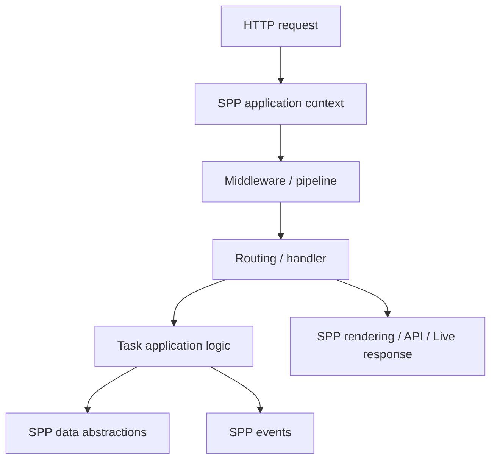
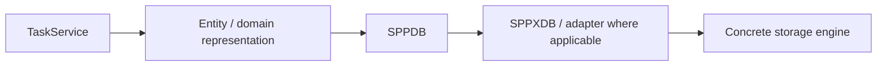
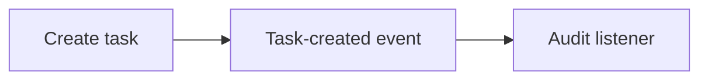

# 53. Plain PHP → MVC → SPP: The Task Desk

The fastest way to understand a framework is to solve the same problem at increasing levels of structure.

We will use one small application throughout the handbook: a **Task Desk**.

## 53.1 Stage 1 — plain PHP

Start with the problem, not the framework.

A plain PHP application might contain:

```text
index.php
create.php
save.php
config.php
helpers.php
```

`save.php` might validate input, connect to the database, insert a record, and redirect.

This is legitimate architecture for a small application. The problem is repetition and coupling as requirements grow.

## 53.2 Stage 2 — organize the application as MVC

The same application can be separated conceptually:

```text
Controller
   ↓
Service / domain logic
   ↓
Repository / data access
   ↓
View
```

The controller coordinates. The service expresses application rules. The data layer handles persistence. The view renders presentation.

Nothing about this requires a framework.

## 53.3 Stage 3 — let SPP provide the infrastructure

SPP can supply the surrounding runtime responsibilities:



The application still owns its business rules.

SPP owns or coordinates framework infrastructure around them.

## 53.4 The key architectural transformation

Do not think:

```text
plain PHP → framework magic
```

Think:

```text
manual infrastructure
       ↓
repeatable framework infrastructure
       ↓
application concentrates on domain behavior
```

This is the central reason the same Task Desk is useful across later chapters.

## 53.5 Add routing

The Task Desk needs operations such as:

```text
GET  /tasks
GET  /tasks/{id}
POST /tasks
```

Routing answers **which operation should receive the request**.

It should not become the place where every business rule is implemented.

## 53.6 Add a service boundary

A useful application-level boundary is:

```text
TaskController
      ↓
TaskService
      ↓
Task data abstraction
```

For example, the service might own rules such as:

```text
- title cannot be empty
- new tasks start as open
- only authorized users may close a task
```

The exact implementation should follow the current SPP application conventions rather than inventing a framework-specific API solely for the tutorial.

## 53.7 Add persistent data

The data path should remain explicit:



SPPDB, SPPXDB, and concrete engines are distinct architectural layers. Do not collapse them into “the SPP database.”

## 53.8 Add validation and security

A request is not trustworthy merely because it reached your application.

Validation answers:

> Is this input acceptable?

Authentication answers:

> Who is making the request?

Authorization answers:

> May this identity perform this operation?

These are different controls and should remain separate in the Task Desk design.

## 53.9 Add an event

Suppose a task is created and the system needs an audit record.

The application can publish an event and let a listener perform the audit responsibility.



This keeps the primary task operation from accumulating unrelated consumers.

## 53.10 Add Parikshak

The first useful test is a behavior contract:

```text
Given valid task data,
when the create operation runs,
a task is created with the expected initial state.
```

Then add a failure case:

```text
Given an empty title,
when the create operation runs,
the operation is rejected.
```

The test should exercise the appropriate framework boundary, not merely duplicate the implementation in assertions.

## 53.11 Deliberately break it

Remove or alter one dependency and ask:

```text
Did the request fail before routing?
Did middleware block it?
Did the service reject it?
Did persistence fail?
Did the response/rendering layer fail?
```

The purpose is to learn the architecture through failure.

## 53.12 Where the Task Desk goes next

The same application will eventually gain:

```text
routing
→ middleware
→ events
→ DI/modules
→ forms/validation
→ persistent data
→ auth/RBAC/security
→ Parikshak
→ API
→ workflow
→ queue/Cron
→ reports
→ LiveComponent
→ SPP Live
→ SPPUX
→ AI
→ storage/content promotion
→ external integration
→ multi-application deployment
```

This is intentional. A framework is best learned as a **cooperating system of responsibilities**, not as a list of unrelated features.

## 53.13 Trade-off

Do not introduce every SPP subsystem into every application.

For a small static site, plain PHP or a simple renderer may be enough. For a large application with multiple execution paths and shared infrastructure, framework structure can reduce repetition and make boundaries explicit.

The question is not “How much SPP can I use?”

It is:

> **Which framework responsibility solves a real problem in this application?**
