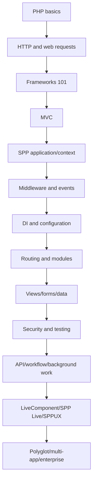
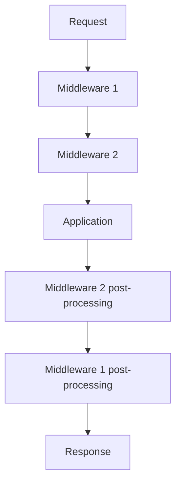
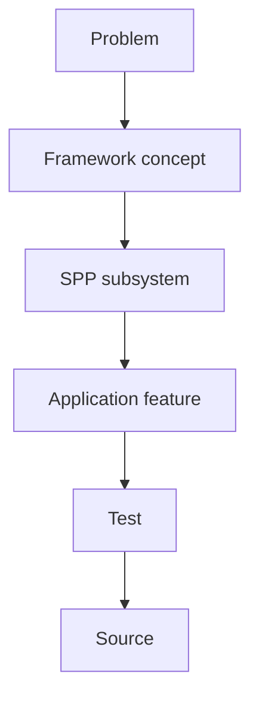

# 54. Beginner Glossary and Prerequisite Ladder

This chapter exists for the reader who can write PHP but has never worked with a framework.

Do not skip terms simply because they sound familiar. In framework architecture, familiar words often have more precise meanings.

---

## 54.1 Prerequisite ladder

The handbook assumes progressively more knowledge as it moves forward.



If a later chapter introduces an unfamiliar word, return here and follow the nearest earlier concept.

---

## 54.2 Framework

A **framework** is a reusable software environment that supplies structure, runtime conventions, extension points, and infrastructure for building applications.

A library usually behaves like this:

```text
application → calls library
```

A framework often behaves more like this:

```text
framework runtime → calls application code at defined extension points
```

That difference is central to understanding inversion of control.

---

## 54.3 Application

An **application** is the software being built for a particular purpose.

In SPP, an application can also be a named runtime context selected by the scheduler.

Those two ideas are related but should not be confused:

```text
business application
vs.
SPP application context
```

---

## 54.4 Runtime

The **runtime** is the software executing the application.

For framework purposes, think:

```text
request / command
    ↓
runtime bootstrap
    ↓
framework services
    ↓
application code
```

---

## 54.5 Request

A **request** is incoming work from a client or caller.

For a web application it commonly contains:

```text
method
URL
headers
query parameters
body
cookies
identity/session context
```

---

## 54.6 Response

A **response** is the result sent back to the caller.

It can include:

```text
status code
headers
body
redirect
HTML
JSON
streamed content
```

---

## 54.7 MVC

**Model–View–Controller** is an architectural way of separating application responsibilities.

```text
Model/domain → application data and rules
Controller   → coordinates an incoming request
View         → presents the result
```

MVC is a pattern, not a synonym for “framework.”

SPP contains MVC-style facilities but is larger than MVC.

---

## 54.8 Router / routing

A **router** determines what application behavior corresponds to an incoming request.

SPP has multiple routing/page paradigms, including configuration-oriented pages, attribute-based routes, API surfaces, and CLI-assisted generation.

---

## 54.9 Route

A **route** is a rule describing how a request maps to application behavior.

Typical route information can include:

```text
path
HTTP method
name
handler
middleware
parameters
```

---

## 54.10 Middleware

**Middleware** is code that wraps request processing.

It can:

```text
inspect a request
change context
stop a request
call the next layer
post-process a response
```

SPP implements middleware through its pipeline/kernel architecture.

---

## 54.11 Pipeline

A **pipeline** is an ordered chain of processing stages.

The SPP middleware pipeline can be visualized as an onion:



---

## 54.12 Event

An **event** is a named occurrence or extension point that other code can react to.

Example:

```text
TaskCreated
```

The publisher does not necessarily need to know all consumers.

---

## 54.13 Listener / handler

A **listener** is code that responds to an event.

A **handler** is a broader term for code that handles some framework or application action.

The exact semantics depend on the subsystem.

---

## 54.14 Event propagation

**Propagation** is the continuation of event processing through the remaining handlers/listeners.

Stopping propagation means later processing does not continue through the normal event sequence.

---

## 54.15 Dependency

A **dependency** is something one piece of code requires to perform its work.

Example:

```php
class TaskService
{
    public function __construct(TaskRepository $repository) {}
}
```

`TaskRepository` is a dependency of `TaskService`.

---

## 54.16 Dependency Injection

**Dependency Injection (DI)** means dependencies are supplied to an object instead of the object constructing everything it needs itself.

This improves:

```text
testability
replaceability
composition
separation of concerns
```

---

## 54.17 Container

A **container** manages or resolves object dependencies.

The SPP application runtime exposes container-oriented capabilities through the application object and related Registry mechanisms.

---

## 54.18 Registry

A **registry** is a named storage/lookup mechanism used by framework infrastructure.

Do not assume every registry entry is a service dependency.

SPP uses Registry for multiple runtime concerns.

---

## 54.19 Singleton

A **singleton binding** means repeated resolution returns the same managed instance within the relevant container/context semantics.

Do not equate “singleton” with “global variable.”

---

## 54.20 Module

A **module** is a packaged unit of framework/application functionality with metadata, configuration, dependencies, and lifecycle integration.

A module is more than a folder containing PHP files.

---

## 54.21 Manifest

A **manifest** is machine-readable metadata describing a module or feature.

It may tell the framework things such as:

```text
identity
version
requirements
dependencies
activation/configuration information
```

The exact keys must be learned from the current SPP module format.

---

## 54.22 Compiler / compilation

A **compiler** transforms a higher-level representation into a more directly executable or optimized representation.

SPP uses compilation/cache mechanisms in several areas, including rendering and framework metadata.

Compilation is not the same as PHP source compilation by the PHP engine.

---

## 54.23 Cache

A **cache** stores reusable results to avoid repeating expensive work.

Examples include:

```text
compiled views
module registries
route metadata
configuration metadata
application data
```

A cache must not be confused with authoritative persistent storage.

---

## 54.24 Entity

An **entity** is an application-level representation of something with identity and associated data.

Examples:

```text
Task
User
Organisation
Document
Approval
```

An entity may map to persistence, but “entity” and “database row” are not automatically identical concepts.

---

## 54.25 ORM

An **Object–Relational Mapping** system maps application objects/entities to relational data structures.

SPP has entity/data abstractions and an XDB/data subsystem. Learn the actual SPP contract rather than assuming it is identical to Doctrine or Eloquent.

---

## 54.26 Migration

A **migration** is a repeatable change to application data/schema state.

A migration is not the same thing as an offline content promotion package.

The handbook therefore teaches both:

```text
schema/data migration
and
content/application transfer/promotion
```

---

## 54.27 Seeder

A **seeder** creates predefined data needed for development, testing, installation, or application initialization.

---

## 54.28 Authentication

Authentication answers:

> **Who is this caller?**

Examples:

```text
session
credential
token
JWT
```

---

## 54.29 Authorization

Authorization answers:

> **What is this caller allowed to do?**

Typical concepts include:

```text
role
permission
policy
ACL
```

---

## 54.30 CSRF

**Cross-Site Request Forgery (CSRF)** is an attack where a user's browser is tricked into sending an unintended authenticated request.

A CSRF defense validates that the request is associated with a trusted intent/token mechanism.

SPP has dedicated CSRF/security infrastructure.

---

## 54.31 API

An **API** is a programmatic interface for another software component to interact with an application.

For a web application it often means:

```text
HTTP endpoint
JSON request
JSON response
```

SPPAPI is the framework's API-oriented subsystem.

---

## 54.32 Queue

A **queue** stores work that should be processed asynchronously or later.

The request lifecycle and queue lifecycle are different:

```text
request → immediate response
queue   → work processed separately
```

---

## 54.33 Worker

A **worker** executes queued/background work.

---

## 54.34 Cron / scheduler

A **scheduler** starts work according to time or other scheduling rules.

SPP contains scheduler/cron infrastructure at more than one conceptual level; the handbook distinguishes application-context scheduling from recurring background execution.

---

## 54.35 Reactive UI

A **reactive UI** updates because application state changes, instead of requiring every change to trigger a full-page manual refresh.

SPP has both server-side and browser-side reactive technologies.

---

## 54.36 LiveComponent

A **LiveComponent** is a server-side reactive component model.

The server remains central to component state/action processing.

---

## 54.37 Transport

A **transport** is the mechanism used to move data/actions between participants.

For reactive systems that might mean an HTTP/AJAX-style request, stream, WebSocket, or another supported mechanism.

The crucial SPP lesson is:

> **component model and transport are separate concepts.**

---

## 54.38 SPPUX

**SPPUX** is SPP's browser-side reactive runtime.

It manages client-side behavior and state while communicating with server-side SPP functionality where appropriate.

---

## 54.39 Hydration

**Hydration** is reconstructing a usable component/UI state from serialized data.

In a server-reactive component system, hydration is part of the lifecycle between requests.

---

## 54.40 Serialization

**Serialization** converts data into a representation suitable for storage or transport.

Deserialization reconstructs the in-memory representation.

Serialization boundaries are security and correctness boundaries.

---

## 54.41 IPC

**Inter-process communication (IPC)** is communication between separately executing processes.

Examples may include:

```text
pipes
sockets
HTTP
message protocols
command invocation
```

Do not assume a polyglot integration is automatically IPC; the exact mechanism matters.

---

## 54.42 Polyglot architecture

A **polyglot architecture** deliberately uses more than one programming language/runtime where that provides a real technical benefit.

The goal is not “use many languages.”

The goal is:

> **Use the right runtime for a justified capability while keeping boundaries explicit.**

---

## 54.43 Observability

Observability is the ability to understand the internal state of a running system through external signals.

Typical signals include:

```text
logs
metrics
traces
health information
```

---

## 54.44 Audit

An **audit record** preserves evidence that an action or state change occurred.

An audit system is not identical to an ordinary application log.

---

## 54.45 Idempotency

An operation is **idempotent** when repeating it produces the same intended result after the first successful application.

Idempotency is particularly important for:

```text
APIs
queue retries
migration/transfer
external integrations
payment-like workflows
```

---

## 54.46 Stateless vs stateful

**Stateless** processing does not depend on server-held request history for correctness.

**Stateful** processing maintains state between interactions.

LiveComponent and workflow systems require the learner to think carefully about state boundaries.

---

## 54.47 The most important beginner distinction

Do not learn framework terms as isolated vocabulary.

Always connect them to the underlying problem:



That pattern is the foundation of the entire handbook.
