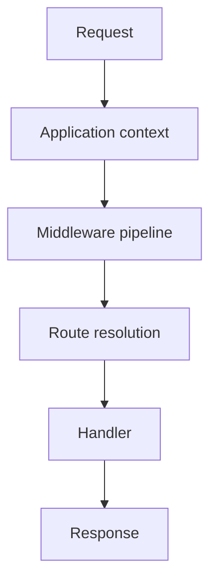

# 54 — Routing and Dispatch

Routing answers a simple question:

> **Given an incoming request, what application operation should run?**

In SPP, that question sits after application-context selection and alongside the middleware/request pipeline. The repository contains more than one route-definition paradigm, so this chapter teaches the common model first and the concrete choices second.

## 54.1 Routing is not context selection

These are different decisions:

```text
Request URI
   ↓
Which SPP application?
   ↓
Which route/page/API operation?
   ↓
Which handler?
```

The Scheduler selects the active application context. The routing layer then resolves an operation inside that application.

## 54.2 SPP supports multiple route-definition styles

The current repository contains at least these patterns:

- declarative page configuration such as `pages.yml`;
- PHP 8 `#[Route]` attributes;
- CLI/scaffold-generated route/page artifacts.

These are **route-definition mechanisms**, not three different request runtimes.

```mermaid
flowchart TD
    A[Route definition] --> B{Definition style}
    B --> C[pages.yml]
    B --> D[#[Route] attribute]
    B --> E[CLI-generated artifact]
    C --> F[Route discovery / loading]
    D --> F
    E --> F
    F --> G[Runtime route map]
    G --> H[Dispatch]
```

## 54.3 Attribute routing

SPP provides a `Route` PHP attribute. The current source places the attribute under the core attribute namespace and includes fields for path and HTTP method.

A conceptual example is:

```php
use SPP\Attributes\Route;

final class TaskController
{
    #[Route('/tasks', method: 'GET')]
    public function index()
    {
        // Task list operation.
    }
}
```

The exact controller base class, namespace, and return contract depend on the application/routing path being used.

## 54.4 `AttributeRouter`

The current SPPView routing implementation contains `AttributeRouter`. Its source builds a route cache under `var/cache/routes_<appName>.php` for the application.

Repository routing documentation describes reflection-based scanning of source/controller code for `#[Route]` attributes and combination with traditional page declarations.

The safe architectural statement is therefore:

> **Attribute routing is discovered into a runtime route map; caching can keep repeated route resolution from rescanning application source.**

Do not generalize this into a claim about a universal router used by every SPP execution path.

## 54.5 `pages.yml`

`pages.yml` remains an important declarative page configuration surface in the repository.

This can be useful when route/page definitions benefit from a central, data-oriented representation.

A simple conceptual configuration is:

```yaml
pages:
  - path: /tasks
    controller: TaskController::index
    method: GET
```

Treat the exact schema as repository-version dependent. Use the application's current examples and parser implementation as the authority.

## 54.6 Route generation versus route execution

CLI generation is not the router.

```text
CLI
 ↓
create route/controller/config artifacts
 ↓
route discovery/loading
 ↓
runtime route map
 ↓
request dispatch
```

This distinction is useful when debugging generated files: the fact that a command successfully generated a file does not prove that the runtime discovered or activated the route.

## 54.7 Middleware surrounds dispatch

A useful request model is:



Depending on the concrete execution path, route discovery may already have built a map before the request arrives. Middleware still matters because it can reject or transform a request before handler execution.

## 54.8 Route parameters

Dynamic routes commonly need parameters:

```text
/tasks/42
```

The route pattern identifies `42` as data for the handler.

The important security rule is that a route parameter is **input**, not permission.

For example:

```text
/tasks/42
```

must not imply that the caller is authorized to read task 42. Authorization remains a separate security decision.

## 54.9 HTTP methods

A route can be constrained by HTTP method.

Conceptually:

```text
GET  /tasks      → list
POST /tasks      → create
PATCH /tasks/42  → update
DELETE /tasks/42 → delete
```

The route definition tells the dispatcher what method/path combination is recognized. Validation and authorization still belong to their appropriate layers.

## 54.10 Route names

Named routes can help application code refer to an operation without duplicating URL strings.

Where the current routing path supports named routes, use them consistently within that path. Do not assume every route-definition style exposes identical naming APIs.

## 54.11 Route collisions

Two definitions can accidentally describe the same path/method combination.

A route audit should look for:

```text
same path
+ same method
+ overlapping route patterns
```

When a collision exists, determine the implemented precedence rules rather than assuming declaration order is always the answer.

## 54.12 Not-found versus forbidden

These errors are conceptually different:

```text
404 Not Found
→ no matching resource/route was resolved

403 Forbidden
→ request reached a protected boundary but authorization failed
```

An application may intentionally avoid revealing resource existence, so the exact response strategy can be application/security policy dependent.

## 54.13 Routing cache and invalidation

When route definitions are cached, source changes can appear ineffective until the relevant cache is refreshed.

A reliable diagnostic sequence is:

1. confirm the route exists in source/configuration;
2. confirm it belongs to the active application;
3. inspect the generated/cache route map if used;
4. refresh the relevant cache using the current repository procedure;
5. test dispatch again.

Do not invent a generic cache command. Use the current CLI help and subsystem documentation.

## 54.14 Testing routes with Parikshak

Routing is one of the best places to use Parikshak because the expected behavior is observable and small.

At minimum, test:

```text
valid method + valid path
invalid method + valid path
unknown path
parameter extraction
protected path authorization
```

Keep routing assertions separate from deep business assertions where possible. That makes failures easier to diagnose.

## 54.15 Failure lab

Take a working Task Desk route and introduce one failure at a time:

```text
wrong path
wrong method
missing controller
wrong namespace
invalid route parameter
stale route cache
```

For each failure record:

```text
Observed response:
Earliest failing boundary:
Relevant source:
Smallest repair:
Parikshak regression test:
```

This turns route debugging into a repeatable method rather than guesswork.

## 54.16 Coming from other frameworks

### Laravel

The nearest mental model is `routes/*` plus route attributes. SPP differs because it supports application context selection and multiple route-definition mechanisms within one broader runtime.

### Symfony

Attribute routing and centralized configuration are both familiar. The concrete scanner/cache/runtime implementation remains SPP-specific.

### Django

URL patterns map naturally to route definitions, while view dispatch follows a different framework architecture.

## 54.17 Kernel Hacker section

Useful current source landmarks include:

```text
spp/core/attributes/Route.php
spp/modules/spp/sppview/class.attributerouter.php
```

Also inspect:

```text
documentation/framework/routing-engine.md
documentation/handbook/37-routing-page-paradigms.md
```

Trace both **definition** and **consumer**:

```text
Route attribute / pages.yml
        ↓
AttributeRouter / page loader
        ↓
route map/cache
        ↓
dispatch
        ↓
handler
```

That source path is more trustworthy than inferring routing behavior from the attribute declaration alone.

## Summary

SPP routing is best understood as a pipeline of responsibilities:

```text
application context
      ↓
route definition/discovery
      ↓
route map
      ↓
middleware/request boundary
      ↓
dispatch
      ↓
handler
```

The current ecosystem supports both declarative and code-local route definitions, with CLI scaffolding as a creation tool. Parikshak should be used to make route behavior executable and regression-testable.
