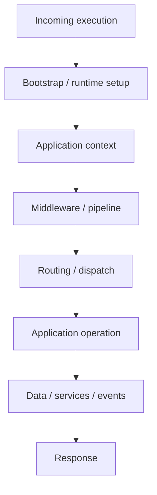
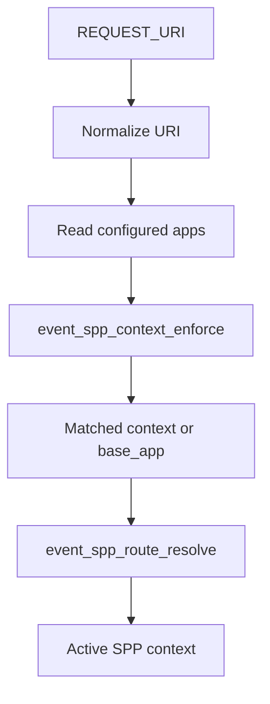

# 54. The SPP Request Lifecycle

A framework becomes much easier to understand once you can answer one question:

> **What happens between the incoming request and the final response?**

There is no single universal SPP path for every execution mode, but the core runtime provides a useful set of boundaries.

## 54.1 The conceptual pipeline



For an ordinary HTTP page, the operation may produce rendered HTML. For an API request it may produce an API response. A Live interaction has additional component-state and transport semantics.

## 54.2 Application context comes early

SPP maintains an active application context through `SPP\Scheduler`.

The current implementation can:

- register `SPP\App` processes;
- set and retrieve the active context;
- retrieve the active application object;
- detect a context from request URI/application configuration;
- execute a callback within another context and restore the previous context.

This makes context selection a runtime concern rather than merely a configuration label.

## 54.3 Context detection

The current scheduler's detection path loads shared registry state, registers context/route resolution events, normalizes the request URI, compares it with configured application base URLs, and selects a matched application or configured base application.



This diagram describes the verified scheduler path, not every later routing detail.

## 54.4 Middleware is a boundary, not the application

The middleware pipeline exists to run logic around request handling.

Typical responsibilities include request checks, security controls, normalization, and short-circuiting.

The architectural principle is:

```text
middleware
   ↓
application operation
   ↓
middleware unwinds
```

Do not put the whole business domain into middleware merely because middleware can execute before a handler.

## 54.5 Events add another dimension

SPP's event system can sit across the normal call path.

An event may have listeners with priorities and staged execution semantics. This allows cross-cutting behavior to be attached without making the primary operation directly invoke every consumer.

That means the actual execution graph can be broader than a simple controller call graph.

## 54.6 The response is also a boundary

An application operation may finish by producing:

```text
HTML
JSON/API response
LiveAction instructions
redirect
file/download response
streamed response
```

The correct response abstraction depends on the execution path.

A useful debugging question is therefore:

> **Did the business operation succeed but the response construction fail?**

## 54.7 CLI is a different execution path

Do not assume every SPP operation starts with an HTTP request.

The framework also has CLI tooling and background execution paths. Some reusable services/facades can be called programmatically without passing through the CLI command manager.

Therefore:

```text
HTTP request ≠ only SPP execution model
CLI command ≠ universal internal API
```

## 54.8 Live requests add state

A LiveComponent interaction introduces additional concerns:

```text
component identity
public state
hydration/dehydration
validation/security
LiveAction instructions
transport
browser update
```

The deeper lifecycle is covered in Chapters 45–47.

## 54.9 Debugging by boundary

When a request fails, walk from the outside inward:

1. Did SPP bootstrap?
2. Is an application context available?
3. Did middleware allow the request through?
4. Did routing/dispatch select the expected operation?
5. Did the application/service execute?
6. Did data access succeed?
7. Did events/listeners alter the outcome?
8. Was the response constructed correctly?
9. For reactive requests, did transport/browser handling complete?

This sequence is deliberately more useful than immediately searching the entire repository for an error string.

## 54.10 Source landmarks

Start tracing with:

```text
spp/core/class.app.php
spp/core/class.scheduler.php
spp/core/class.middlewarekernel.php
spp/core/class.pipeline.php
spp/core/class.sppevent.php
```

Then follow the route/handler type actually used by the failing request.

## 54.11 Source trace exercise

Take the Task Desk's `GET /tasks` operation.

Write down the actual files reached during one request. For each file record:

```text
input
output
side effects
next boundary
```

Do not infer a layer merely because its name sounds relevant. Confirm it from call sites.

## 54.12 What this chapter proves

The SPP runtime is a composition of execution boundaries, not one giant request handler. The exact path varies by execution mode, application configuration, routing mechanism, and enabled subsystems.

That variability is a feature of a framework architecture, but it also means source tracing matters.
