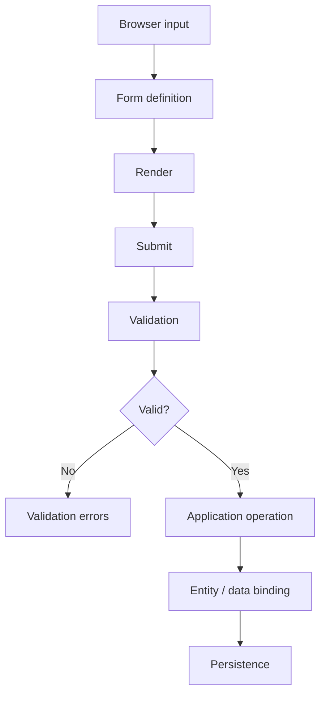
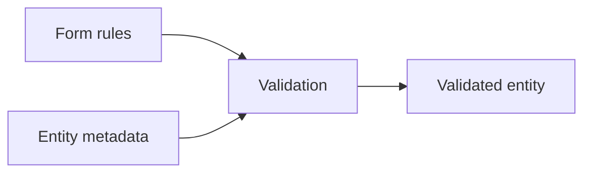

# 55 — Forms, Validation, and Data Binding

Forms sit at the boundary between **untrusted input** and **application behavior**. SPP's form system combines rendering, submission state, validation, and entity binding, but these remain distinct responsibilities.

## 55.1 The core model



The browser can provide immediate feedback, but the server remains the authoritative boundary for application decisions.

## 55.2 `Form` builder

The current SPPView module contains `Form` and a form builder API. The repository's current tutorial documents a fluent approach:

```php
use SPPMod\SPPView\Form;

$form = Form::create('login_form', '/login')
    ->addText('username', 'Username', ['required' => true, 'min' => 3])
    ->addPassword('password', 'Password', ['required' => true])
    ->addSubmit('login_btn', 'Login')
    ->build();

echo $form->render();
```

This is a **programmatic form-definition path**. It is different from the older/declarative YAML approach.

## 55.3 YAML forms

SPP also documents loading form configuration from YAML through `ViewFormBuilder`:

```yaml
name: login_form
action: /login.php
method: POST
controls:
  - name: username
    type: text
    label: Username
    required: true
  - name: password
    type: password
    label: Password
    required: true
```

The current documented construction path is:

```php
$config = \SPPMod\SPPView\ViewFormBuilder::loadConfig('forms/login.yml');
$form = \SPPMod\SPPView\ViewFormBuilder::fromArray($config);
echo $form->render();
```

Use the form parser/builder path supported by the current application rather than mixing snippets from different source generations.

## 55.4 Form submission

`ViewForm` exposes submission and validity checks. The current source contains `isSubmitted()` and `isValid()` methods.

A conceptual flow is:

```php
if ($form->isSubmitted()) {
    if ($form->isValid()) {
        // application operation
    }
}
```

The exact processing sequence can also be integrated with SPPView page/form processing mechanisms.

## 55.5 Validation

SPPView contains a `ViewValidator` and validation result model. `ResourceController` and related controllers also provide validation-oriented helpers.

The important design separation is:

```text
HTML validation
    ↓
server-side form validation
    ↓
domain/business validation
    ↓
authorization
    ↓
persistence constraints
```

These layers overlap in purpose but are not interchangeable.

## 55.6 Client-side validation is not authorization

The repository documents mapping some validation rules to HTML5 attributes such as:

```html
required
minlength
pattern
```

Some validators can also provide client-side scripts.

This improves user experience, but it does **not** remove the need to validate the submitted data on the server.

A malicious client can bypass browser validation completely.

## 55.7 Data binding

The repository's form documentation includes entity binding through methods such as:

```php
$form->bind($entity);
$form->fill($entity);
```

The conceptual difference is:

```text
bind()
→ entity → form

fill()
→ submitted form → entity
```

This is convenient because it reduces repetitive assignment code.

It also creates a security consideration: **never allow unrestricted form fields to overwrite every entity property merely because automatic binding is available.**

The application should control which fields are writable.

## 55.8 Forms and entities

`SPPEntity` contains metadata-driven validation support in the current SPPDB implementation.

That creates a useful composition:



Do not assume that form validation automatically covers every business invariant. Domain rules can still require explicit application logic.

## 55.9 Forms and controllers

The controller should coordinate the form rather than becoming the form implementation itself.

A clean conceptual structure is:

```text
Controller
   ↓
Form definition
   ↓
Validation
   ↓
Application service
   ↓
Entity/data
```

For large forms, move domain behavior out of the controller so the same application operation can be reused by an API, LiveComponent, or background job.

## 55.10 Authentication forms

Login forms deserve special treatment.

The form is responsible for:

- accepting the required input;
- validating shape;
- returning useful errors.

The authentication subsystem is responsible for:

- credential verification;
- guard state;
- session/token behavior;
- MFA or additional authentication state;
- security policy.

Do not put authentication policy into the form merely because the form collects the password.

## 55.11 CSRF and request security

A form is part of an HTTP request. The request may therefore need CSRF and other middleware-level protections depending on how the application authenticates state changes.

The form abstraction should not be treated as a universal security boundary. Inspect the middleware/request stack for the concrete application.

## 55.12 Validation errors

A useful user experience is:

```text
Submit
  ↓
Validate
  ↓
invalid
  ↓
return form + field errors
```

The error structure should be suitable for both human users and automated tests.

Avoid exposing internal exceptions or database messages directly in user-facing validation output.

## 55.13 Failure lab

Build a Task Desk create form with:

```text
Title: required
Priority: integer range
Status: controlled choices
```

Then deliberately submit:

1. empty title;
2. invalid priority;
3. an unexpected status value;
4. extra unexpected input;
5. a valid input set but unauthorized user.

For each failure, identify whether the earliest rejection belongs to:

```text
form validation
business validation
authorization
persistence
```

The goal is to avoid “validation” becoming one vague bucket for every rejection.

## 55.14 Parikshak test matrix

Use Parikshak as the primary SPP testing engine for the form behavior where practical.

A strong initial matrix is:

```text
renders expected controls
required field rejects empty value
minimum/maximum rules behave correctly
invalid choice is rejected
valid input reaches application operation
unauthorized operation is rejected
entity binding changes only intended fields
```

Then add a regression test for every bug discovered during the failure lab.

## 55.15 Coming from other frameworks

### Laravel

Forms are often split between request validation and frontend templates. SPP can integrate form rendering and validation more directly through SPPView.

### Symfony

The Form component mental model is familiar: form structure, transformation, validation, submission, and data mapping. SPP's concrete builder and binding APIs are different.

### Django

Think forms plus model validation, but keep SPP's `ViewForm`/builder/entity layering explicit.

### React/Vue

Client-side schemas can improve UX, but they are not the authoritative server-side validation or authorization boundary.

## 55.16 Kernel Hacker section

Useful source landmarks:

```text
spp/modules/spp/sppview/class.form.php
spp/modules/spp/sppview/class.viewform.php
spp/modules/spp/sppview/class.viewformbuilder.php
spp/modules/spp/sppview/class.viewvalidator.php
spp/core/class.resourcecontroller.php
spp/modules/spp/sppdb/class.sppentity.php
```

Trace the complete path for a submitted form:

```text
Form definition
  ↓
ViewForm
  ↓
submission detection
  ↓
validation
  ↓
fill/bind where used
  ↓
application operation
```

The expert question is always: **which layer is actually responsible for rejecting the bad input?**

## Summary

SPP forms combine several useful mechanisms:

- fluent programmatic construction;
- YAML-driven construction;
- server-side validation;
- client-side validation hints;
- entity data binding;
- rendering and submission state.

The correct architecture keeps **form UX, validation, business rules, authorization, and persistence constraints distinct**. Parikshak turns those boundaries into executable regression tests.
