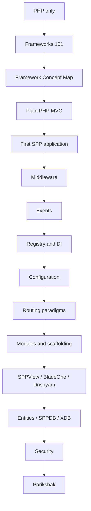

# 56. Choose Your SPP Learning Journey

The SPP handbook is large because SPP is large. A beginner should not read every chapter in a random order.

This chapter gives you a starting point based on what you already know and what you want to build.

## Journey A — I only know PHP

Use this when you understand PHP syntax but have never used a framework.



Do not skip the early chapters because the terminology will otherwise appear arbitrary.

## Journey B — I know another framework

Use this when you already know Laravel, Symfony, Django, Rails, ASP.NET, Spring, or another framework.

Start with:

1. Frameworks 101.
2. Framework Concept → SPP Feature Map.
3. Coming From Other Frameworks.
4. SPP Application + Context.
5. Routing paradigms.
6. Middleware.
7. Events.
8. Registry/DI.
9. Modules.
10. Your chosen feature branch.

The goal is not to translate every SPP concept into another framework's vocabulary. Learn where the analogy breaks.

## Journey C — I am building APIs

```text
Frameworks 101
→ SPP application
→ Routing paradigms
→ Middleware
→ SPPAPI
→ JWT/API authentication
→ Entities/SPPDB/XDB
→ Parikshak API tests
→ Queue/Cron
→ Observability
→ Polyglot integration
```

## Journey D — I am building server-rendered applications

```text
Frameworks 101
→ MVC
→ SPP application
→ Routing / pages.yml
→ Middleware
→ Events
→ SPPView
→ Extended BladeOne / ViewTags / Drishyam
→ Forms / validation
→ Entities / XDB
→ Auth / security
→ Parikshak
```

## Journey E — I want reactive UI

```text
Core SPP path
→ LiveComponent
→ SPP Live
→ SPPUX
→ Combined server/client lab
→ Production readiness
```

## Journey F — I am an enterprise architect

```text
Framework concepts
→ SPP runtime architecture
→ Multiple application contexts
→ Modules
→ Events / middleware
→ API
→ Workflow
→ Queue/Cron
→ Observability
→ Migration/transfer/promotion
→ Polyglot / IPC
→ Trust boundaries
→ Deployment
→ Enterprise capstone
```

## Journey G — I want to understand SPP itself

Use the Kernel Hacker path:

```text
Bootstrap
→ Scheduler
→ App/context
→ Registry/container
→ module discovery/compiled registry
→ middleware kernel/pipeline
→ event registry/dispatcher
→ routing discovery/cache
→ rendering/compiler
→ XDB factory/engine
→ LiveComponent runtime
→ transport layer
→ SPPUX runtime
```

## Rule for all journeys

Do not treat a chapter as complete until you can:

- explain the concept without framework terminology;
- build the smallest useful example;
- use the SPP implementation;
- test it with Parikshak where applicable;
- deliberately break it;
- diagnose the failure;
- explain where the implementation lives;
- explain when the feature should not be used.
