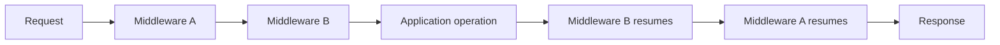

# 56. Middleware and the Pipeline

Middleware is one of the clearest examples of framework infrastructure: it places controlled behavior **around** an application operation.

## 56.1 The onion model

Conceptually:



A middleware can inspect input, reject it, modify processing, or perform work after the downstream operation returns.

## 56.2 SPP's actual pipeline

The current `SPP\Core\Pipeline` exposes three important operations:

```text
send($passable)
through($pipes)
then($destination)
```

`then()` builds the execution chain by reducing the pipes in reverse order. A string pipe is resolved through `SPP\Registry::make()`. An object implementing `MiddlewareInterface` receives `handle($passable, $stack)`; callable pipes are invoked directly.

This is a concrete implementation of the onion model.

## 56.3 MiddlewareKernel

`SPP\Core\MiddlewareKernel` provides the framework-facing bootstrap around that pipeline.

Its current boot sequence combines middleware from:

1. registry-registered global middleware;
2. the core `ApiAuthMiddleware` entry;
3. global `middleware.yml`;
4. application `middleware.yml` when a non-default context is active.

It then runs the pipeline with `$_REQUEST` as the passable and a final destination callback.

## 56.4 Dynamic registration

Modules can add global middleware programmatically through `addGlobalMiddleware()`.

The method initializes the kernel first and avoids adding the same class twice.

This is useful because framework bootstrapping and module activation do not always happen in one static configuration file.

## 56.5 Middleware versus events

These mechanisms solve related but different problems.

| Middleware | Events |
|---|---|
| Forms an ordered processing chain | Publishes an occurrence to listeners |
| Naturally surrounds a downstream operation | Can have multiple independent consumers |
| Can short-circuit request processing | Can use before/instead/inline/default/after semantics |
| Best for request/process gates | Best for decoupled reactions and extensibility |

A task-created audit listener does not become middleware merely because it runs during a request.

## 56.6 Middleware versus authorization

Authorization may be implemented through middleware, handlers, policies, or other boundaries depending on the application.

Do not equate:

```text
middleware = authorization
```

Middleware is the execution mechanism. Authorization is the security decision.

## 56.7 Failure lab

Create a middleware that deliberately rejects a request.

Observe that the downstream destination is not reached.

Then move the check after the downstream call and observe the difference.

The purpose is to learn the control-flow contract rather than memorize a middleware class template.

## 56.8 Parikshak exercise

Test at least:

```text
middleware executes
middleware can call downstream
middleware can stop downstream execution
middleware order is deterministic
registered middleware reaches the kernel
```

For security-sensitive middleware, test both the allowed and rejected paths.

## 56.9 Source trace

Start with:

```text
spp/core/class.middlewarekernel.php
spp/core/class.pipeline.php
```

Then trace:

```text
MiddlewareKernel::run()
    ↓
Pipeline::send()
    ↓
Pipeline::through()
    ↓
Pipeline::then()
    ↓
Registry::make() / MiddlewareInterface::handle()
```

This is a good first example of tracing a framework abstraction into executable control flow.

## 56.10 Trade-off

Do not turn every reusable function into middleware. Excessive middleware can make control flow difficult to see and debug.

Use it when the behavior genuinely belongs around a processing boundary.
