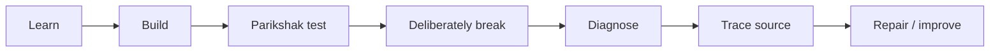
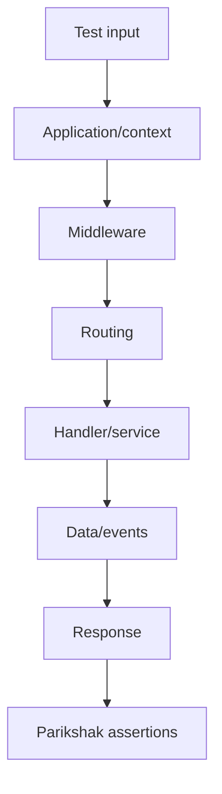
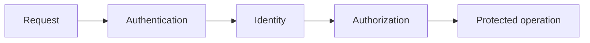
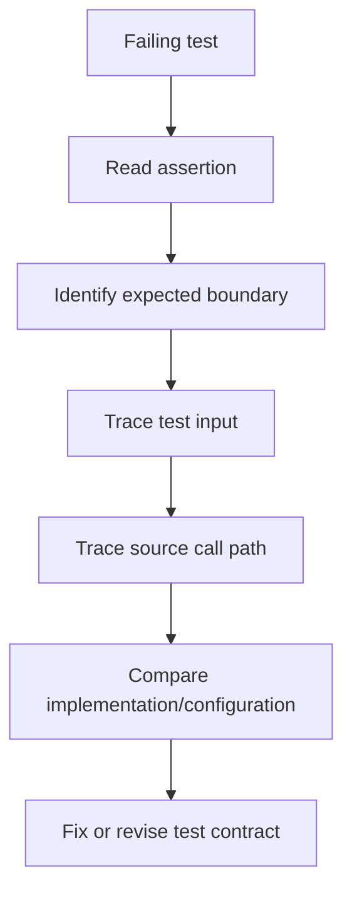

# 56 — Parikshak: The SPP Testing Engine

## Why this chapter exists

Testing is not a side chapter in SPP. **Parikshak is the primary SPP testing engine**, and the handbook should use it as the default testing model for framework-aware application development.

Other testing tools may still be useful for language-level or external-system concerns, but when the handbook teaches SPP behavior, the first question is:

> **How do we prove this behavior with Parikshak?**

## 56.1 What Parikshak is

Parikshak is SPP's testing framework/engine for expressing executable behavioral checks around application and framework capabilities.

The repository exposes core testing concepts including:

- `TestCase`;
- `TestRunner`;
- `SPPTestResponse`;
- `SPPFactory`;
- faker/data helpers and related testing utilities.

These are not merely assertion helpers. Together they provide a framework-aware testing surface.

## 56.2 Testing is part of the SPP architecture

The handbook's recurring development loop is:



This should be applied repeatedly, not postponed until the end of a project.

## 56.3 What should a Parikshak test prove?

A useful test proves an observable contract.

Weak:

```text
assert that TaskService::createTask() exists
```

Better:

```text
Given valid task data,
when the create operation runs,
then a task exists with the expected state.
```

Best for a framework handbook:

```text
Given valid task data,
when the request enters the SPP application,
then the expected application boundary is reached,
the task is persisted,
and the documented response contract is returned.
```

The appropriate test level depends on the claim being made.

## 56.4 The Parikshak test levels

| Level | Question |
|---|---|
| Unit-like | Does one isolated rule work? |
| Service/application | Do application components cooperate? |
| HTTP/API | Does the SPP request boundary behave correctly? |
| Persistence | Does the data contract behave correctly? |
| Live | Does the reactive server-side interaction behave correctly? |
| Full journey | Does the intended user/application scenario succeed? |

The repository's available test helpers and fixtures should determine the exact implementation of each level.

## 56.5 Test the architecture, not just the result

A response can be correct for the wrong reason.

Suppose `/tasks` returns the expected HTML because a fallback route happens to render it.

A route test should establish that the intended routing mechanism was actually selected.

Likewise, a secured endpoint should be tested for both:

```text
authenticated + authorized → allowed
unauthenticated/unauthorized → blocked
```

This turns tests into architecture evidence.

## 56.6 Task Desk: first Parikshak test

Start with the smallest behavior:

```text
create task
```

Record the contract:

```text
Input:
title = "Prepare report"

Expected:
- task is created
- status has expected initial value
- response indicates success
```

Then add the negative case:

```text
Input:
title = ""

Expected:
- operation is rejected
- no invalid task is persisted
```

Use the current repository's Parikshak APIs and fixtures when writing the concrete test. Do not copy signatures from historical examples without checking the current source.

## 56.7 Failure-first testing

A powerful Parikshak exercise is to create the failure deliberately.

### Routing failure

Change the route to an invalid URL.

### Dependency failure

Remove a required service binding.

### Configuration failure

Use an invalid setting or disable a required module/configuration path.

### Data failure

Provide an invalid entity value.

### Authorization failure

Attempt a protected operation using an identity without the required permission.

### Live failure

Corrupt the expected component state or interaction contract in a controlled test.

For each failure, answer:

```text
What failed?
At which boundary?
What evidence identifies the boundary?
What source implements that boundary?
```

## 56.8 Test the request lifecycle

For an ordinary SPP request, a useful conceptual test path is:



A test need not assert every internal step. Assert the steps that matter to the contract being documented.

## 56.9 Test multiple routing paradigms

SPP supports more than one routing-definition style, including centralized page configuration such as `pages.yml` and attribute-based routing through `#[Route]`, alongside CLI/scaffold generation.

Parikshak should treat them as separate implementation paths for the same externally observable operation.

For the Task Desk:

```text
GET /tasks
```

can be tested regardless of whether the route was declared centrally or via attributes.

Then add a source-tracing exercise explaining which route-definition mechanism produced the runtime route table.

## 56.10 Test middleware ordering and short-circuiting

A middleware test should establish both success and blocking behavior where appropriate.

For example:

```text
request allowed
    → next middleware/handler executes

request rejected
    → downstream handler does not execute
```

If ordering is a documented part of the behavior, add a test that distinguishes the orders.

Do not create brittle tests for implementation details that are not part of the contract.

## 56.11 Test events

Events should be tested for the behavior they promise:

- listener invocation;
- priority/order where contractual;
- payload mutation where supported;
- propagation stopping;
- before/main/after semantics where relevant.

A test should not assume that every event listener must run if the event system explicitly permits propagation to stop.

## 56.12 Test dependency injection

Use tests to distinguish:

```text
new Service()
```

from:

```text
container/Registry resolution
```

A useful test can assert that a configured binding resolves to the intended implementation and that a singleton returns the same managed instance when that behavior is part of the contract.

Do not turn the test into an implementation-detail check that blocks legitimate container improvements.

## 56.13 Test configuration

Configuration is part of runtime behavior.

Test, where applicable:

```text
setting exists
setting default applies
app override applies
runtime/persistent override applies
environment interpolation resolves
invalid configuration is rejected or safely handled
```

A configuration test should explain the precedence it intends to prove.

## 56.14 Test persistence

For the Task Desk, the persistence suite should eventually include:

```text
create
read
update
delete
validation rejection
authorization rejection
migration-related behavior
pagination/query constraints
concurrency-sensitive behavior where concretely supported
```

Do not use a green persistence test to claim distributed transaction semantics unless the test actually establishes them.

## 56.15 Test authentication and authorization separately



Tests should cover at least:

- no identity;
- valid identity;
- valid identity but insufficient permission;
- valid identity with required permission.

A UI test that merely checks whether a button is hidden is not an authorization test.

## 56.16 Test API behavior

For SPPAPI, useful contracts include:

```text
API request detected
valid token accepted
invalid token rejected
exposed entity reachable
non-exposed entity rejected
HTTP method dispatch correct
validation errors represented correctly
authorized operation allowed
unauthorized operation rejected
```

The exact response structures should follow the current SPPAPI implementation.

## 56.17 Test LiveComponent

A reactive component needs tests around state and lifecycle, such as:

```text
initial state
hydration
state update
action invocation
validation state
rendered result
invalid/stale state
authorization-sensitive action
```

Signed state should be treated as a security boundary, but the presence of signing does not automatically prove complete authorization.

## 56.18 Test SPP Live

Transport tests should distinguish:

```text
publish event
engine selection
delivery path
fallback behavior where implemented
authorization of live topics
reconnection behavior where implemented
```

Do not state that a transport test proves guarantees the transport does not implement, such as universal exactly-once delivery.

## 56.19 Test SPPUX

Browser/runtime tests should cover:

- initial mount;
- state update;
- event handling;
- DOM reconciliation;
- bridge calls where used;
- error boundaries;
- server/client contract mismatch.

Keep the server and browser failure domains separate in the test report.

## 56.20 Test queues and Cron

For background work, test behavior that survives the request boundary:

```text
job accepted
job executes
job succeeds
job fails
retry where implemented
idempotency behavior where required
scheduled job invokes the expected operation
```

Do not infer a particular distributed queue guarantee from the existence of a worker abstraction.

## 56.21 Test AI integrations carefully

An AI test should normally assert your application contract, not a specific model's creative text.

Prefer:

```text
input task
→ provider call/mock
→ structured application output
```

where the test controls the provider response or uses a deterministic test adapter.

Do not make the application test depend on a live model's exact wording unless that is explicitly the requirement.

## 56.22 Testing external boundaries

For polyglot/IPC or third-party integration, contract tests are usually more useful than assertions on every implementation detail.

Test:

- serialization format;
- authentication;
- authorization;
- timeout behavior;
- error mapping;
- idempotency where needed;
- correlation/diagnostic behavior where supported.

## 56.23 Test failure, not only success

A mature test suite describes the **failure contract**.

For each important capability, document:

```text
success
validation failure
authentication failure
authorization failure
missing dependency
configuration failure
storage failure
external dependency failure
```

Not every subsystem has every failure mode, but the absence should be deliberate.

## 56.24 Kernel Hacker workflow

When a Parikshak test fails:



Do not fix every failing test by weakening the assertion. First decide whether the implementation or the expectation is wrong.

## 56.25 What Parikshak changes about SPP development

The testing engine becomes part of framework literacy:

> **A framework feature is not fully understood until you know how to prove it and how to diagnose its failure.**

That is why Parikshak appears throughout the handbook instead of only in a chapter named “Testing.”

### Source map

Start with the current Parikshak source/test directories and its core testing classes, then follow the subsystem under test. The exact test runner and helper APIs should be copied only from the current branch.
