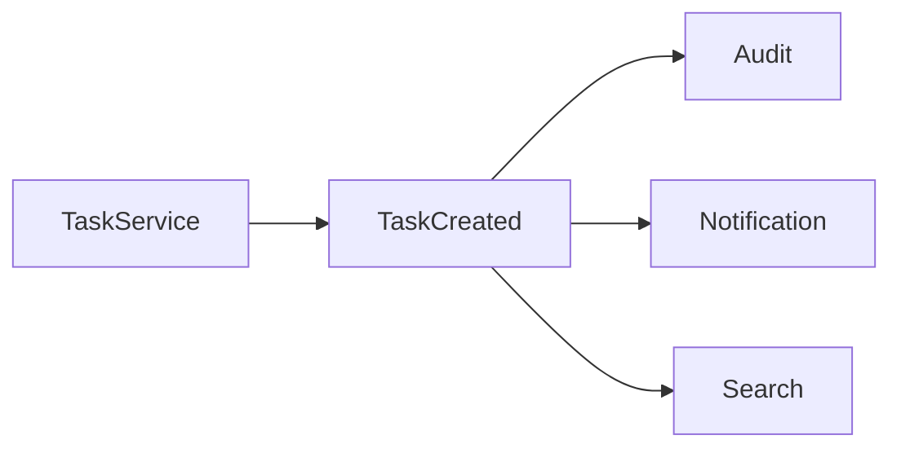
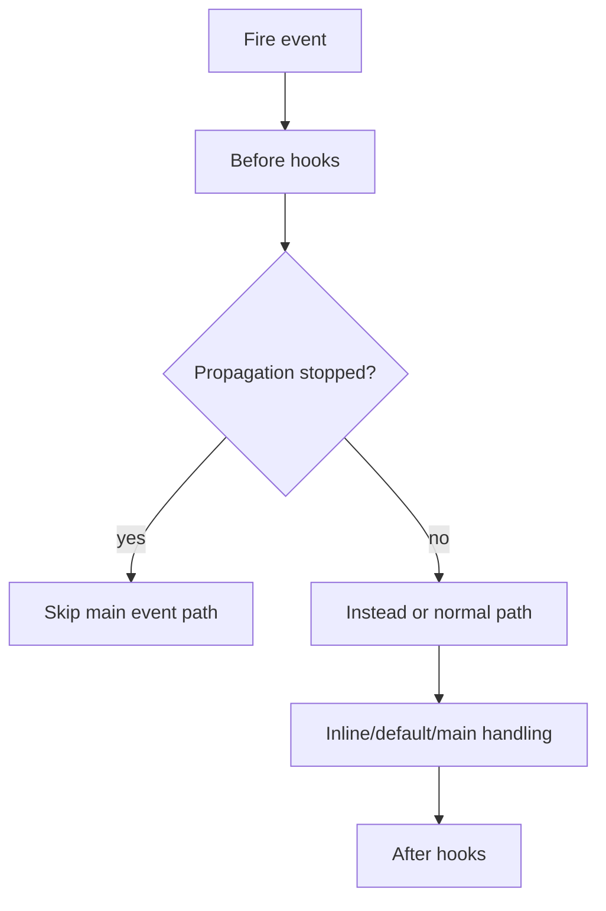

# 57. Events and Event-Driven Architecture

An event answers a different question from a direct method call:

> **Something happened; who needs to know?**

SPP's event system adds discovery, priorities, definitions, overrides, propagation control, and staged hooks around that basic idea.

## 57.1 Direct coupling versus events

Direct calls create an explicit dependency:

```text
TaskService → AuditService
           → NotificationService
           → SearchService
```

An event changes the relationship:



The publisher does not need to know every consumer.

## 57.2 SPPEvent in the current source

`SPP\SPPEvent` maintains listener and event-definition state.

The current implementation can load definitions from:

- core `events.yml`;
- application `events.yml`;
- context-specific application event files;
- module event files;
- `#[On(...)]` attributes discovered in application/module PHP files.

It also writes a compiled event cache for later startup use.

## 57.3 Listener priority

Listeners are stored with priorities and sorted in descending order.

Therefore:

```text
priority 1000
priority 500
priority 100
```

runs in that order.

Priority is a coordination mechanism, not proof that a listener is “more important” in a business sense.

## 57.4 Event definitions and overrides

SPP can define an event with a default handler and an `overridable` flag.

An override request is rejected when the event definition does not permit overriding.

This is useful for framework extension because it makes replacement behavior explicit instead of silently replacing arbitrary listeners.

## 57.5 Propagation control

Event parameters can stop propagation.

Conceptually:



The exact path depends on the event definition and registered hooks.

## 57.6 The staged event model

The current `fireEvent()` implementation visibly supports named hook stages including:

```text
before_<event>
instead_<event>
main/inline/default behavior
after_<event>
```

This gives SPP a richer event model than a minimal `emit()` function.

## 57.7 Configuration versus attribute discovery

SPP supports two different discovery ideas:

```text
explicit events.yml
        +
#[On(...)] attributes
```

These should not be confused.

Configuration is explicit and easy to inspect. Attribute discovery is convenient for colocating behavior with a class/method but requires source scanning and reflection.

## 57.8 Event cache

The event system attempts to load a compiled cache before parsing known event files and scanning attributes.

That means the architectural lifecycle is approximately:

```text
source/configuration
      ↓
discovery
      ↓
compiled event metadata
      ↓
runtime dispatch
```

Do not infer exact cache invalidation behavior without tracing the surrounding build/runtime code.

## 57.9 Event versus queue

These are not synonyms.

| Event | Queue/job |
|---|---|
| In-process notification/coordination mechanism | Deferred work mechanism |
| Listener runs as part of the event dispatch path unless it delegates elsewhere | Worker may execute later |
| Useful for extensibility | Useful for long-running or asynchronous work |
| Does not automatically imply durable delivery | Durability/retry depend on the queue implementation |

An event listener can enqueue a job, but the event itself is not automatically a durable queue.

## 57.10 Failure lab

Create three listeners:

```text
priority 1000 → records A
priority 500  → records B
priority 100  → records C
```

Fire the event and verify ordering.

Then add propagation stopping in the first listener and observe which later stages/listeners no longer execute.

## 57.11 Parikshak exercise

Test:

```text
listener registration
priority ordering
event definition
non-overridable event rejection
overridable event replacement
propagation stopping
```

The tests should assert observable dispatch behavior rather than internal array layout.

## 57.12 Source trace

Start with:

```text
spp/core/class.sppevent.php
```

Then inspect:

```text
SPPEvent::boot()
SPPEvent::listen()
SPPEvent::defineEvent()
SPPEvent::registerHandler()
SPPEvent::fireEvent()
```

Next trace the actual event name you care about into its `events.yml`, attributes, and listeners.

## 57.13 When not to use events

Use a direct method call when the caller genuinely owns and requires the callee's result.

For example:

```text
TaskService → TaskRepository
```

is normally a direct dependency.

Events are more appropriate when the relationship is “notify interested consumers that this occurred.”

## 57.14 Architectural takeaway

SPP's event system is not merely a notification helper. It is a configurable and discoverable execution mechanism that can participate in framework boot, application context selection, module integration, and application behavior.
