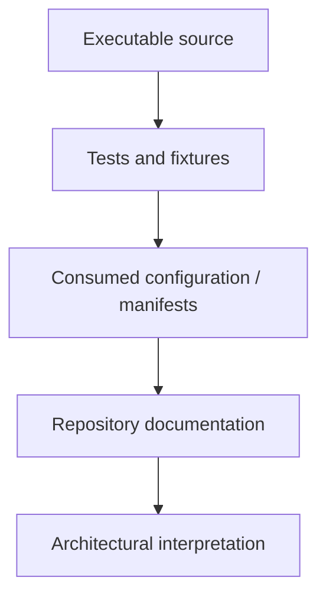

# 57. Feature Status and Evidence Model

A large framework repository can contain source files, generated API pages, examples, experimental modules, contributed applications, and old documentation at the same time. A beginner-friendly handbook must therefore answer two separate questions:

1. **Where is this feature documented?**
2. **What evidence shows that the feature is actually implemented and usable?**

This chapter defines the evidence model used throughout the SPP handbook.

## 57.1 Status categories

Every important feature should be understood as one of these categories:

| Status | Meaning |
|---|---|
| **Implemented** | Executable source and/or tests demonstrate the capability. |
| **Implemented but scoped** | Source exists, but only a particular module/app/runtime path exposes it. |
| **Source-present** | Relevant implementation exists, but the handbook has not yet established complete operational semantics. |
| **Documented** | Repository documentation describes it, but executable evidence has not yet been verified sufficiently. |
| **Derived** | The architecture follows from multiple verified implementation pieces. |
| **Guidance** | Recommended engineering practice, not a framework guarantee. |
| **Planned / unverified** | Mentioned or expected, but current implementation evidence is insufficient. |

Do not silently turn one category into another.

## 57.2 Evidence hierarchy

Use this order when resolving contradictions:



A class name is evidence that a class exists. It is **not automatically evidence** that every capability implied by its name is complete, production-safe, or universally available.

## 57.3 Examples of careful wording

Prefer:

> “The repository contains XDB locking classes; verify the engine-specific semantics before relying on them for a production concurrency guarantee.”

Over:

> “XDB provides production-grade distributed locking.”

Prefer:

> “SPPAI contains an abstraction for provider drivers and several concrete drivers in the repository.”

Over:

> “SPPAI guarantees availability of all listed AI providers.”

Prefer:

> “The repository contains a zero-downtime migration analyzer/tutorial; the exact deployment guarantee depends on the implementation and deployment procedure.”

Over:

> “SPP guarantees zero-downtime upgrades.”

## 57.4 Why this matters to beginners

Beginners often assume:

> “It is in the framework documentation, therefore it must work exactly as described.”

A serious engineering handbook must teach the opposite habit:

> **Read the contract, inspect the implementation, run the example, test the edge case, and only then generalize.**

This is part of becoming an SPP developer rather than merely an SPP API user.

## 57.5 Applying the model to the tutorial

Each tutorial branch should expose an evidence badge or section:

```text
Status: Implemented
Evidence: source + test + example
Scope: SPP core / optional module / contributed module
```

Or, when evidence is incomplete:

```text
Status: Source-present / needs verification
Evidence: source found; end-to-end semantics not yet established
```

That distinction prevents accidental over-documentation.

## 57.6 Kernel Hacker exercise

Choose one feature and trace it through all evidence levels:

```text
class / function
    ↓
registration or manifest
    ↓
boot/discovery path
    ↓
runtime invocation
    ↓
test/example
    ↓
observable result
```

Document what is proven and what remains an assumption.

## 57.7 Documentation QA rule

A chapter containing a strong architectural claim should not be considered complete until the claim has an explicit evidence classification.

This rule applies especially to:

- distributed systems behavior;
- transactions and locking;
- security guarantees;
- transport semantics;
- IPC/protocol behavior;
- AI recovery behavior;
- content-transfer guarantees;
- multi-application isolation;
- performance guarantees;
- production deployment guarantees.
