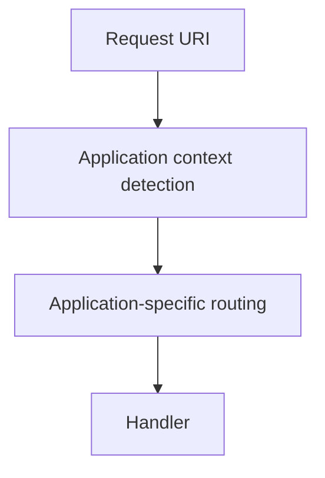

# 57 — Routing Paradigms and `pages.yml`

Routing is one of the most important parts of SPP, because it is the point where an external address becomes an application operation.

SPP should be learned as having **multiple routing-definition paradigms**, plus CLI tooling that creates or scaffolds those definitions.

## 57.1 Routing is not scaffolding

Separate these concepts:

```text
CLI/scaffold
    ↓
creates or edits route artifacts

Route definition
    ↓
provides metadata

Routing runtime
    ↓
resolves an incoming request

Handler/page/API operation
```

A CLI command can help create a route, but it is not itself the runtime router.

## 57.2 The major SPP routing paradigms

A useful model is:

```mermaid
flowchart TD
    A[Developer] --> B{Routing style}
    B --> C[pages.yml / page configuration]
    B --> D[#[Route] attribute]
    B --> E[CLI/scaffold]
    C --> F[SPP routing runtime]
    D --> F
    E --> G[Generated artifacts]
    G --> F
    F --> H[Page / controller / API handler]
```

These are not necessarily mutually exclusive. A mature application can use the mechanism that fits each area.

## 57.3 `pages.yml`

`pages.yml` is a declarative page-configuration mechanism used by SPP applications.

The key advantage is **centralized page metadata**. A reader can inspect one configuration surface and see the page definitions relevant to an application.

The architectural trade-off is that the route definition is separate from the handler implementation.

That can be valuable for page catalogs and application configuration, but less convenient when a route's metadata is most understandable next to the controller method that implements it.

## 57.4 Attribute routing

SPP has an attribute-oriented route mechanism using `#[Route]` and an `AttributeRouter` that scans application code.

The current implementation uses reflection and maintains an application-specific route cache.

Conceptually:

```mermaid
flowchart LR
    A[PHP class/method] --> B[#[Route] metadata]
    B --> C[AttributeRouter]
    C --> D[Compiled/cached route map]
    D --> E[Request resolution]
```

The important distinction is that **route declaration is now attached to the code that handles the route**.

## 57.5 Why route caching exists

Scanning PHP source on every request would be wasteful. The routing subsystem therefore has a cache/compiled representation.

The architectural idea is:

```text
source definitions
    ↓
scan
    ↓
route map
    ↓
cache
    ↓
fast lookup
```

Cache invalidation therefore becomes part of routing correctness. When changing routes, ensure the relevant cache is rebuilt or invalidated according to the current repository tooling.

## 57.6 CLI-driven routing

The SPP CLI includes route-related scaffolding/generator operations.

Use the CLI as a productivity mechanism:

```text
developer intent
→ command
→ generated route/controller/page artifacts
→ developer review
→ runtime discovery
```

The generated result should be inspected immediately.

For current syntax, use the checkout's command list/help output. Historical documentation may contain command examples that no longer match the current command implementation.

## 57.7 One endpoint, three declaration styles

For a Task Desk list page:

```text
GET /tasks
```

you can conceptually have:

### Central configuration

```yaml
# conceptual example
/tasks:
  page: tasks.index
```

### Attribute metadata

```php
#[Route('/tasks', method: 'GET')]
public function index()
{
    // render the page
}
```

### CLI scaffold

```text
CLI command
  ↓
creates the controller/route/page structure
  ↓
developer fills in the behavior
```

These are three different concerns:

- declaration;
- declaration embedded in code;
- artifact generation.

## 57.8 Application context precedes application routing

In a multi-application SPP runtime, request handling has at least two distinct selection questions:



Do not describe `/school/tasks` as being selected by a route alone. The runtime first needs to know which application context owns the request.

## 57.9 Routing and middleware

Routing and middleware are related but separate.

A conceptual request path is:

```text
request
 → context detection
 → middleware/pipeline
 → route resolution
 → handler
```

The exact placement of each stage depends on the runtime path, so the handbook should describe the concrete implementation when teaching execution order.

## 57.10 Route parameters

A routed resource often needs variable data:

```text
/tasks/42
```

The router can map route parameters into the handler according to the active routing mechanism.

A useful design rule is to distinguish:

```text
route parsing
```

from:

```text
resource validation/authorization
```

Matching `/tasks/42` proves that the URL shape matched. It does not prove that task 42 exists or that the current user may read it.

## 57.11 Method constraints

Route methods such as GET and POST are part of the contract.

A useful failure matrix is:

| Request | Expected routing result |
|---|---|
| `GET /tasks` | route matches |
| `POST /tasks` | different/create route or method-specific behavior |
| `PUT /tasks` | not the GET route |
| unknown path | not found |

Do not rely on the UI alone to enforce HTTP method semantics.

## 57.12 Routing errors versus application errors

The handbook should distinguish:

```text
404 / no matching route
```

from:

```text
route matched + application rejected operation
```

and from:

```text
route matched + authorization rejected operation
```

This distinction is invaluable during debugging.

## 57.13 Parikshak routing tests

For every important route, test the external contract:

```text
path
method
parameters
context/application
authentication requirement
authorization requirement
expected response
not-found behavior
```

Then add one deliberate failure by changing one route property.

The point is to verify routing independently from the page's visual output.

## 57.14 Routing cache failure lab

Where route caching is active:

1. add a route;
2. confirm it works;
3. alter its path;
4. observe whether the existing route cache affects behavior;
5. invalidate/rebuild the cache using the repository's current mechanism;
6. confirm the new route.

Do not assume a generic `cache:clear` command is the correct route-cache operation unless the current CLI exposes it for routing.

## 57.15 When to choose which paradigm

| Situation | Often useful |
|---|---|
| central page catalog/configuration | `pages.yml` |
| route closely tied to controller method | `#[Route]` |
| fast creation/learning conventions | CLI scaffold |
| large mixed application | combination, with clear conventions |

There is no architectural requirement that every route use one declaration style. Consistency within a subsystem is often more valuable than forcing one style across all applications.

## 57.16 Kernel Hacker section

Trace routing in this order:

```text
request URI
  ↓
application context detection
  ↓
page configuration / attribute discovery
  ↓
route cache
  ↓
method/path matching
  ↓
handler invocation
```

Useful source landmarks include:

```text
spp/core/class.scheduler.php
spp/modules/spp/sppview/class.attributerouter.php
spp/core/attributes/Route.php
documentation/framework/routing-engine.md
```

Then follow the actual page/router caller for the route you are investigating.

## Summary

SPP routing is best understood as a **family of definition mechanisms feeding a runtime route resolver**:

- `pages.yml` for declarative page metadata;
- `#[Route]` for code-local route metadata;
- CLI scaffolding for creating route artifacts;
- route caching for efficient lookup;
- application context selection before/around application routing;
- middleware and authorization surrounding execution;
- Parikshak for route-contract testing.

That model is more accurate and more useful than teaching routing as one configuration file or one router class.
