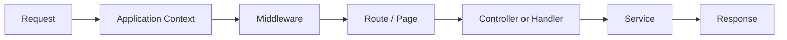
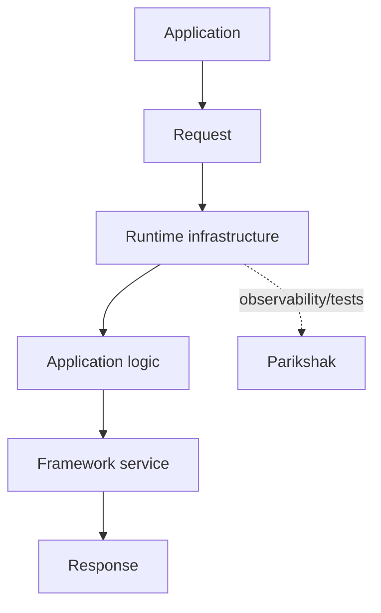

# 57. SPP in 30 Minutes

This is the fastest useful path through SPP.

It deliberately avoids the advanced architecture until the learner has experienced one complete framework loop.

## Goal

At the end of this exercise you will have:

- an SPP application context;
- one route/page;
- one service;
- one middleware layer;
- one event;
- one rendered view;
- one test.

## Minute 0–5: understand the problem

Plain PHP can serve a page perfectly well. A framework becomes useful when the application repeatedly needs the same infrastructure:

```text
request handling
routing
security
object construction
configuration
rendering
data access
testing
logging
```

SPP provides those mechanisms as a coordinated runtime.

## Minute 5–10: create the application

Follow the repository's application-development convention:

```text
src/yourapp/
  etc/
    app.yml
  init.php
  serv/
  services/
  events/
  resources/views/
  tests/
  var/
```

A minimal `app.yml` defines the base URL and application paths. The framework discovers the application and the active request context.

Inspect the context with:

```php
$context = \SPP\Scheduler::getContext();
$app = \SPP\App::getApp();
```

## Minute 10–15: request → middleware → route → service

The core runtime idea is:



Create one focused middleware. It should implement `SPP\Core\MiddlewareInterface` and call `$next($request)` when the request is allowed to continue.

Create one small service and resolve it through the application container.

## Minute 15–20: render a page

Create a view under the application resources and connect the route/page to it using the routing/rendering paradigm chosen for the application.

At this point ask:

> Which framework subsystem handled each step?

```text
context → Scheduler/App
middleware → MiddlewareKernel/Pipeline
routing → routing/page subsystem
service → App/Registry/container
view → SPPView/rendering subsystem
```

## Minute 20–25: add one event

Fire an application event at a meaningful extension point and register one listener.

The event should have a visible effect such as logging, audit metadata, or adding derived information.

The point is to experience the difference between:

```text
Direct call = I know who must run.
Event = I announce what happened.
```

## Minute 25–30: test it

Create a Parikshak test for the most important application behavior.

Then deliberately break one thing:

- remove middleware registration;
- misspell the route;
- stop the event from being discovered; or
- make the service binding unavailable.

Diagnose the failure from the outside in.

## What you just learned

You have experienced the core framework loop:



This small exercise is not the end of the tutorial. It is the mental anchor for everything that follows.

## Continue

Next move to the full core tutorial. Do not jump directly to LiveComponent or SPPUX until routing, middleware, events, DI, configuration, modules, views, and persistence make sense.