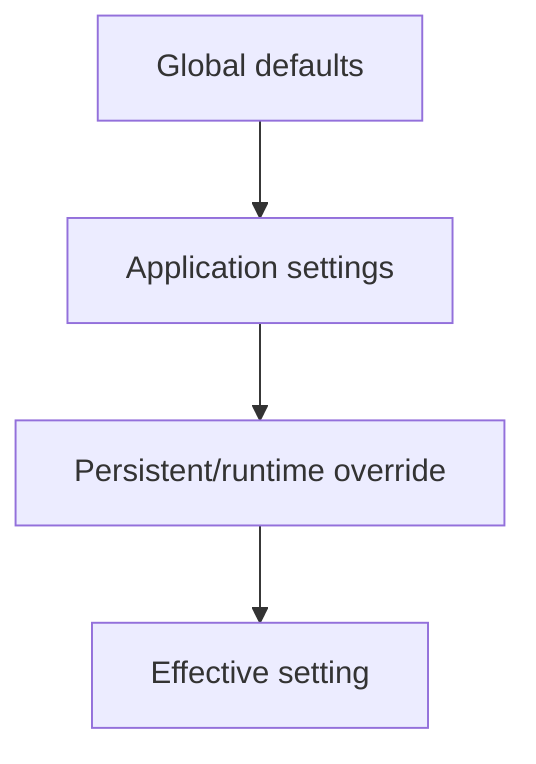

# 58 — Configuration, Settings, and Environment Management

Configuration is one of the framework features beginners notice least and depend on most. It decides how the runtime behaves without hard-coding deployment-specific choices into application classes.

## 58.1 Three different kinds of configuration

Keep these concepts separate:

```text
Static application/module configuration
        ↓
Runtime settings
        ↓
Environment/deployment secrets and values
```

SPP's configuration implementation provides a common authority for reading and writing settings, while application/global configuration files and environment values provide different sources of information.

## 58.2 `SPPConfig`

The current source identifies `SPPConfig` as the core authority for reading and writing setting variables across the framework. It standardizes global settings into `global-settings.yml` and per-application settings into `settings.yml`, and maintains a configuration cache.

The key architectural idea is:

```text
application code
      ↓
SPPConfig
      ↓
configured setting source
```

Application code should ask the configuration subsystem for configuration instead of parsing YAML files directly throughout the codebase.

## 58.3 `app.yml` versus `settings.yml`

These files should not be treated as interchangeable merely because both contain YAML.

A useful conceptual distinction is:

| Source | Purpose |
|---|---|
| `app.yml` | Application definition/default structure and application-level metadata |
| `settings.yml` | Application runtime settings |
| `global-settings.yml` | Framework-wide/global defaults |
| environment values | Deployment-specific values/secrets |

The exact keys and merge behavior are source-defined and should be checked against the current application/configuration implementation.

## 58.4 Settings precedence

Repository documentation describes a cascading model in which persistent/database settings can override application defaults, which in turn can override global defaults.

Conceptually:



Treat the exact precedence order as a version-sensitive implementation detail. The handbook should update this section whenever the configuration resolver changes.

## 58.5 Environment interpolation

The current modernization documentation describes `env:` interpolation in settings/module configuration, allowing configuration values to be resolved from `.env` or the operating-system environment.

The architectural benefit is:

```text
repository-safe configuration
        +
deployment-specific secret/value
        ↓
effective runtime configuration
```

Do not commit credentials simply because the framework can read them from configuration files.

## 58.6 Configuration versus dependency injection

These mechanisms solve different problems.

### Configuration

Answers:

> “What value/choice should the runtime use?”

### Dependency injection

Answers:

> “Which object should satisfy this dependency, and how should it be constructed?”

For example:

```text
cache.driver = redis
```

is configuration.

A binding such as:

```php
$app->singleton(CacheStore::class, RedisCacheStore::class);
```

is dependency management.

The two often work together, but should not be conflated.

## 58.7 Configuration versus application context

An application context answers:

> “Which application is active?”

Configuration answers:

> “How should that application/runtime behave?”


Changing context may therefore change which application settings are relevant.

## 58.8 Build a configurable Task Desk

Start with a setting:

```text
Task Desk page size = 25
```

Then read it through the configuration subsystem in the application service/controller rather than hard-coding `25`.

Next add an application-specific override and verify the effective value.

Then add an environment-provided deployment value if the current configuration path supports it.

## 58.9 Configuration caching

SPPConfig keeps cached settings in memory during the current process and the application runtime may also use persisted/generated configuration caches.

This means configuration debugging should distinguish:

```text
source file changed
```

from:

```text
runtime effective configuration changed
```

When a setting change appears ignored, inspect the actual cache/invalidation path rather than immediately changing application code.

## 58.10 Exporting and importing configuration

The repository contains configuration-oriented CLI functionality, including application configuration and configuration export/import surfaces.

Treat these as tooling interfaces. Before using them operationally, confirm the current command's exact arguments and understand which settings it modifies.

Never assume that exporting configuration is equivalent to exporting secrets safely.

## 58.11 Group/shared configuration

The repository also exposes a `group:create` concept for shared resource groups. This indicates that SPP can describe shared database entities/tables/configuration across applications/modules.

This is architecturally significant in multi-application systems because it creates a controlled form of shared-resource coupling.

Use shared groups deliberately and document ownership.

## 58.12 Configuration failure lab

Take the Task Desk page-size setting.

Break one layer at a time:

1. delete the setting;
2. put the setting in the wrong scope;
3. supply an invalid value;
4. change the environment value;
5. invalidate/rebuild the relevant cache if needed.

For each case record:

```text
source value
→ resolved value
→ consumer
→ observed behavior
```

This teaches configuration as a runtime pipeline rather than a collection of YAML files.

## 58.13 Parikshak configuration tests

Test the configuration contract where it matters:

```text
setting exists
expected default applies
application override wins where specified
persistent override wins where specified
environment interpolation resolves
invalid value is rejected/handled correctly
cache refresh produces new effective value
```

Keep tests focused on the effective contract rather than the exact internal cache structure unless that structure is itself the feature being tested.

## 58.14 Security considerations

Configuration frequently contains the most sensitive material in an application.

Review:

- database credentials;
- API keys/tokens;
- encryption keys;
- session-related secrets;
- external service credentials;
- debug settings;
- environment-specific URLs.

A good architecture keeps deployment secrets outside ordinary source-controlled application code.

## 58.15 Configuration and modules

Modules can contribute configuration, but a module's setting names and defaults should be treated as part of its public contract only when the module actually consumes them.

A useful source trace is:

```text
module config
  ↓
SPPConfig
  ↓
module/service consumer
```

Do not document a setting merely because it appears in a YAML file. Search for the code that consumes it.

## 58.16 Coming from other frameworks

### Laravel

Think `.env` + config files + config repository. SPP uses its own configuration source and runtime APIs.

### Symfony

Think parameter/configuration containers and environment processors. Again, the conceptual separation is useful, but APIs and precedence are SPP-specific.

### Django

Django settings are conceptually similar, but SPP can add application-context and persistent/runtime setting layers around configuration.

## 58.17 Kernel Hacker section

Start with:

```text
spp/core/class.sppconfig.php
```

Then trace:

```text
settings loader
→ environment interpolation
→ merge/precedence
→ cache
→ consumer
```

Also inspect the application/global configuration documentation and any command implementation that writes or exports configuration.

## Summary

Configuration in SPP is best understood as a **resolved runtime value pipeline**, not just YAML parsing:

```text
global/app/module/environment sources
        ↓
configuration resolver
        ↓
cache/effective settings
        ↓
application or framework consumer
```

The framework's job is to centralize that resolution. The application's job is to use the effective configuration without hard-coding deployment choices into business logic.
