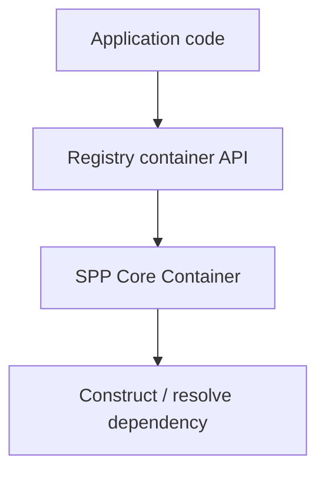

# 58. Registry and Dependency Injection

SPP has an important distinction that beginners should learn early:

> **The Registry's key/value hierarchy and its IoC container are related infrastructure, but they are not the same thing.**

## 58.1 Two problems

A registry answers questions such as:

```text
What was registered under this framework key?
Which directories/classes/functions are known?
What shared state has been loaded?
```

Dependency injection answers:

```text
How should this service be constructed?
Which implementation should satisfy this abstraction?
Should the same instance be reused?
```

These responsibilities should not be collapsed.

## 58.2 Registry hierarchy

The current `SPP\Registry` maintains a hierarchical data store.

Keys can be expressed using separators such as:

```text
__mods=>module_name
__apps=>app=>status
__dirs=>category
__classes=>category
__functions=>category
```

The registry resolves these names into nested storage.

## 58.3 Registry locking

The registry supports locking an entity tree.

Once a key is locked, modification of that key or a descendant is rejected.

This can protect configuration-like registry state from accidental later modification.

It should not be described as a general security boundary: application authorization is a separate concern.

## 58.4 The IoC container

`Registry::container()` lazily creates a `SPP\Core\Container`.

The Registry exposes convenience methods:

```text
bind()
singleton()
make()
```

These delegate to the container.

The important architectural relationship is:



## 58.5 Binding a service

Conceptually:

```php
Registry::bind(NotifierInterface::class, EmailNotifier::class);
```

The application can then resolve the abstraction rather than constructing a concrete implementation everywhere.

Use the exact constructor/binding semantics supported by the current `SPP\Core\Container` implementation when writing production code.

## 58.6 Singleton is a lifecycle choice

A singleton binding means the container reuses the bound service according to its container semantics.

It does **not** mean:

```text
one instance across every PHP request
```

PHP web execution, worker processes, and application runtimes have different lifetimes.

This distinction matters when discussing caches, database connections, mutable state, and concurrency.

## 58.7 Registry versus container

| Registry store | IoC container |
|---|---|
| Hierarchical values and framework registrations | Service construction/resolution |
| Fast lookup of known framework state | Dependency graph |
| Can store directories/classes/functions | Can bind implementations |
| Supports registry-tree locking | Supports shared/singleton resolution |
| Shared-storage integration exists for `__shared` state | Container lifecycle is local to the container |

## 58.8 Shared Registry storage

The current Registry can synchronize `__shared` state through a shared-storage abstraction.

It prefers Redis when enabled and available, with a file-storage fallback. If a Redis-backed save/load operation fails, the current code also contains a fallback path to file storage.

This demonstrates an important source-first rule:

> **A fallback implementation is evidence of a fallback path, not proof of distributed consistency or high availability.**

## 58.9 Dependency injection in the Task Desk

Instead of:

```php
$repository = new TaskRepository();
$service = new TaskService($repository);
```

move toward:

```text
TaskController
      ↓
TaskService abstraction/dependency
      ↓
TaskRepository abstraction/dependency
```

The container can assemble the object graph while the application keeps business responsibilities in the service layer.

## 58.10 Failure lab

Create a binding to an implementation whose dependency cannot be resolved.

Observe the container failure.

Then bind the dependency correctly and repeat.

This teaches the difference between:

```text
application logic failure
```

and:

```text
dependency graph / construction failure
```

## 58.11 Parikshak exercise

Test the observable contract of your bindings:

```text
abstract resolves to expected implementation
singleton returns the expected reused instance within the container lifetime
missing dependency fails clearly
registry value is retrievable
locked registry subtree rejects modification
```

Do not test private container arrays unless you are specifically writing a framework-internals regression test.

## 58.12 Source trace

Start with:

```text
spp/core/class.registry.php
spp/core/class.container.php
```

Then trace a real call to `Registry::make()` from an SPP subsystem.

That final step matters because framework infrastructure can expose APIs that are not equally important in every execution path.

## 58.13 When not to use DI

A dependency injection container is not mandatory for every function.

For a tiny pure function:

```php
function add(int $a, int $b): int { return $a + $b; }
```

adding a container would increase complexity without benefit.

Use DI where object lifetime, substitutability, configuration, testing, or dependency graphs justify it.

## 58.14 Architectural takeaway

The Registry is part of SPP's runtime coordination infrastructure. Its container facade provides IoC capabilities, while its hierarchical store supports framework registrations and shared state.

Learning that distinction prevents a large class of architectural misunderstandings later.
